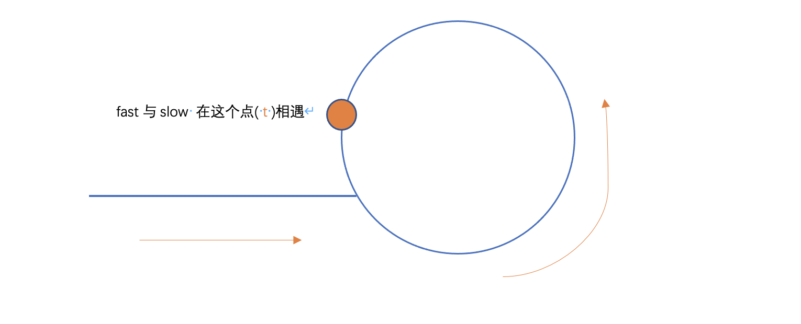

# 寻找重复数
[题目](https://leetcode.cn/leetbook/read/top-interview-questions-hard/xwz4lj/)  

###### 解题思路一，暴力双循环
- 时间复杂度 O(n2)
- 空间复杂度 O(1)

###### 解题思路二，二分法
- 计算 n 的中值 const mid = Math.ceil(n/2)
  - 如果 start === end 返回 start，并结束循环
  - n 为 奇数
    - 遍历 数组，统计 大于 mid 的元素数量 rightCount、小于 mid 的元素数量, leftCount 和 等于 mid 的元素 midCount.
    - 如果 midCount 大于 1，则该mid元素是重复的
    - 如果 lefCount >= mid 则 重复的数在左边。继续二分 (star + mid)/2
    - 如果 rightCount >= mid 则 重复的数在右边。继续二分 (mid + end)/2
  - n 为 偶数
    - 遍历 数组，统计 大于 mid 的元素数量 rightCount、小于等于 mid 的元素数量, leftCount.
    - 判断 lefCount > mid 还是 rightCount > mid，然后继续二分遍历
- 时间复杂度 O(n log n)
- 空间复杂度 O(1)

###### 解题思路三，快慢指针
[环形链表II的方法解题](https://leetcode.cn/problems/find-the-duplicate-number/solution/287xun-zhao-zhong-fu-shu-by-kirsche/) 解决本题   
[环形链表II的方法解题](https://leetcode.cn/problems/find-the-duplicate-number/solution/kuai-man-zhi-zhen-de-jie-shi-cong-damien_undoxie-d/)  解决本题 

- 假设有这样一个样例：[1,2,3,4,5,6,7,8,9,5]。如果我们按照上面的循环下去就会得到这样一个路径: 1 2 3 4 5 [6 7 8 9] [6 7 8 9] [6 7 8 9] . . .这样就有了一个环，也就是6 7 8 9。
- 同时同位置出发  
- 慢指针，在环形链中走一步是 slow.next，在数组中走一步 是 nums[slow]
- 快指针，在环形链中走两步是 fast.next.next，在数组中走两步 是 nums[nums[fast]]
  - 先假设一些量
    - slow 和 fast 在环中相遇，slow 走一步，fast 走两步，那么 fast 走的距离是slow 的2倍
    - 假设起点到环的距离是m，环的周长是c。
    - 那么当 slow 走了 **m+c** 时，则 fast 走了 **2(m + c)**,但是 fast 的其中一个m是在环上走的。
    - 假设 fast 与 slow 在 t 点相遇
    - 
    - 那么 slow 走过的路 是 **m + nc + t**，其中 **n** 表示圈数**t**是周长的一部分，fast 则 走的距离是 **2(m + nc + t)**，其中 一个m 是用在转圈上的，那么 slow的转圈距离是 **nc + t**而 fast的转圈距离是 **m + 2nc + 2t**，两个点相遇于t，那么说明，fast 多余的 **m + 2t** 会等于 某个 **xc + t**，x 表示**完整的圈有x圈**，化简两个公式，可得 **m + t** 是完整的圈(**c的完整倍数**)。
    - t 到 入口点的 距离是 c - t
    - 如果这时，一个**新的指针 new** 从头开始走，则走到 入口点的距离是 m, slow 需要走的距离是 m，而 slow 是从 t 点开始走的，可以假设 **slow 已经走了t，再继续走 m**，所以转圈的 距离是 **m + t** 刚好是 c 的整数倍，所以 slow 又回到了  入口出 与 new相遇。

```js
var findDuplicate = function(nums) {
    let slow = 0;
    let fast = 0;
    slow = nums[slow];  // 慢指针先走一步
    fast = nums[nums[fast]]; // 快指针先走两步
    while(slow != fast){ // 如果存在环，则 快慢指针会在某一个节点相遇
        slow = nums[slow];
        fast = nums[nums[fast]];
    }
    // 相遇之后就可以暂停循环了
    // 新的指针从开头走，当它走到某个点 m 时 会与slow相遇，这个点就是入口点
    let newId = 0;
    while(newId != slow){
        newId = nums[newId];
        slow = nums[slow];
    }
    return newId;
};
```
- 时间复杂度是 O(xn), x是常量，主要是x 全循环，所以 化简得到 时间复杂度是 O(n)
- 空间复杂度 O(1)