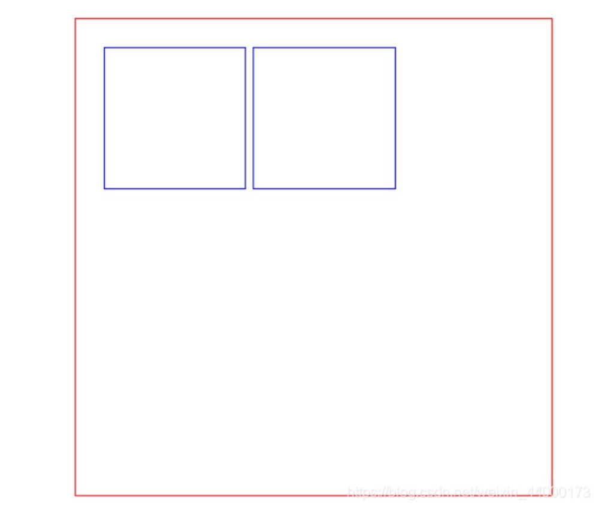
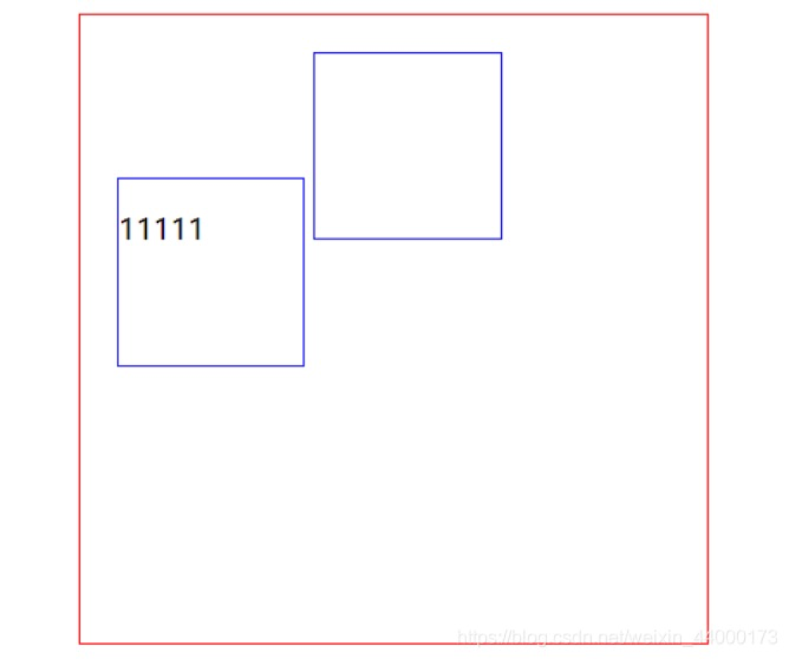
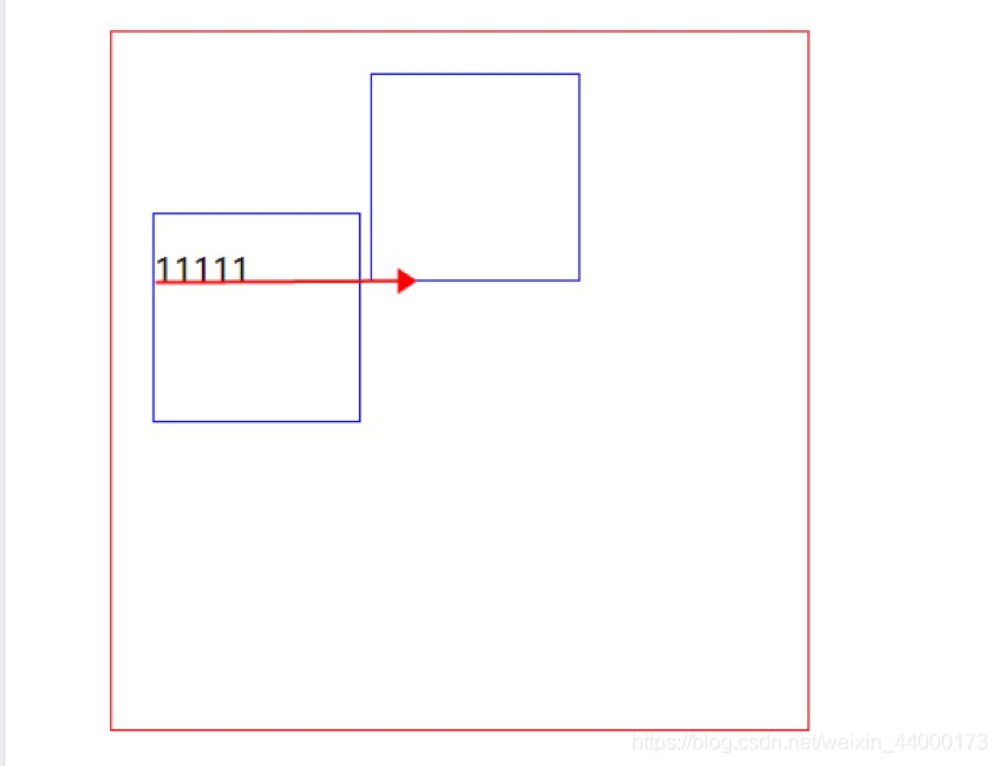

# inline-block 元素出现下移现象

### 解决方案
设置vertical-align:top  
```css
button {
    display: inline-block;
    vertical-align: top;
}
```

### 原因分析

在包裹层里嵌套的两个div设置display: inline-block时，正常情况下两个div会并排显示，如图


但是如果在其中一个div里面加上一些内容，神奇的事发生了，第一个div出现了下移，如图


**注意**  

- 在将元素display设置为inline-block的时候，元素即同时具有内联元素和块级元素的属性，既排列在同一行又可以设置宽高。  
- 对于内联元素，都具有vertical-align属性，那这里就牵涉到vertical-align的默认对齐方式。 它的默认方式是baseline，基线对齐。基线指内容的下边缘



第一个div里有元素，基线为元素也就是p元素的下边缘，第二个div内没有元素，默认的基线是margin下边缘，那么怎么解决这个问题，让div并排对齐？**改变vertical-align默认对齐方式**就可以了，在这里将其设置为top就可以了。