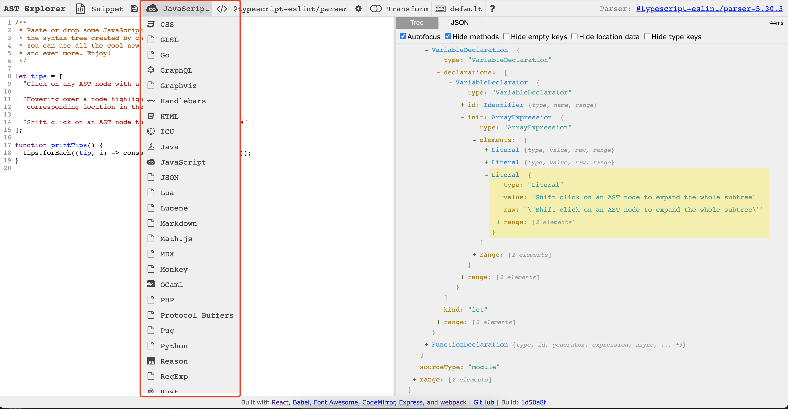
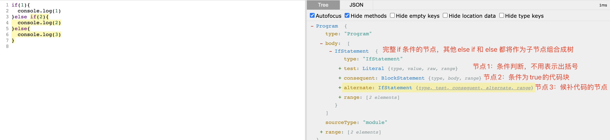
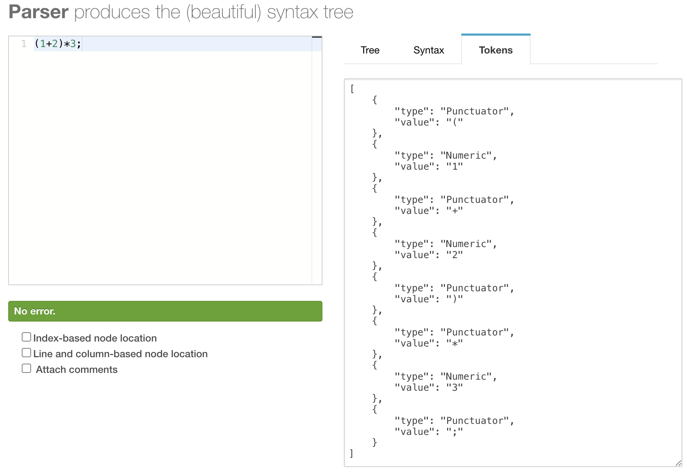
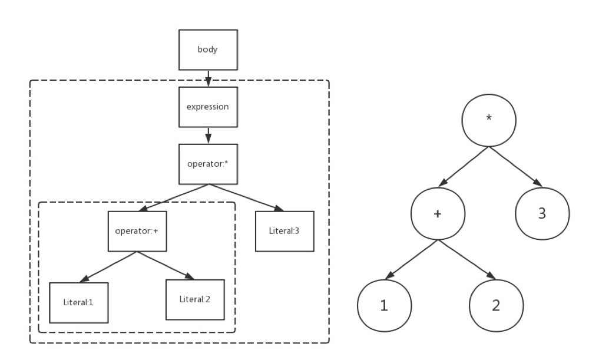
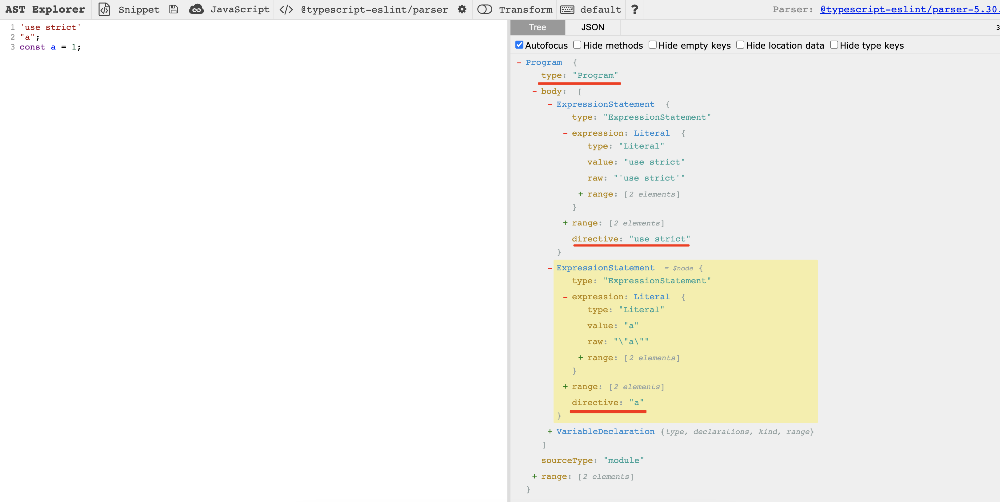
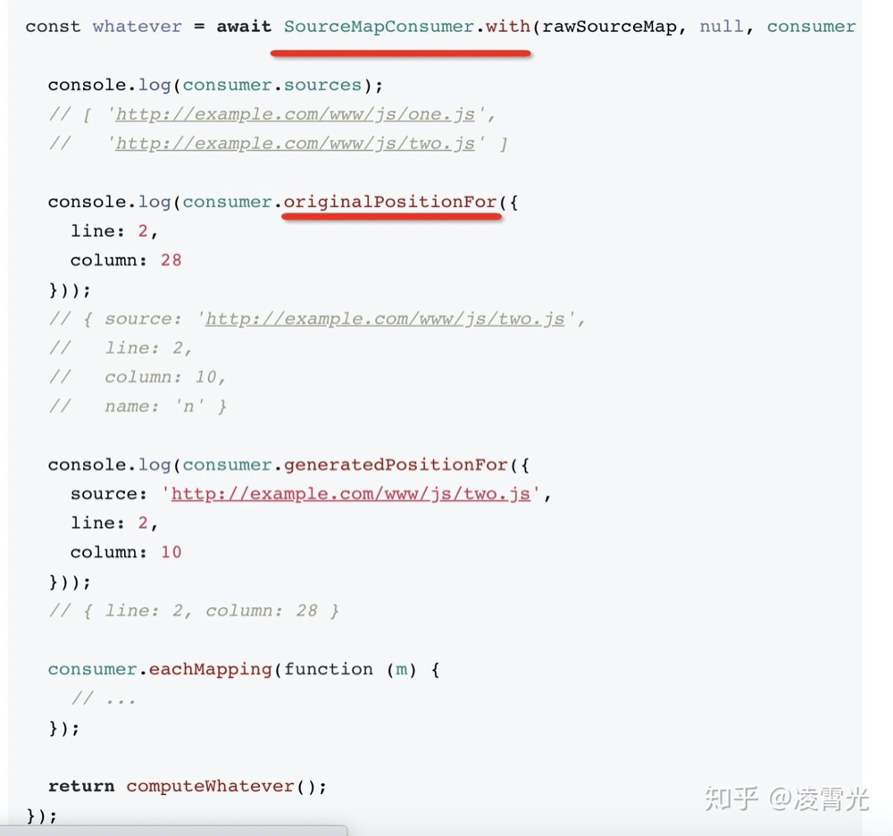
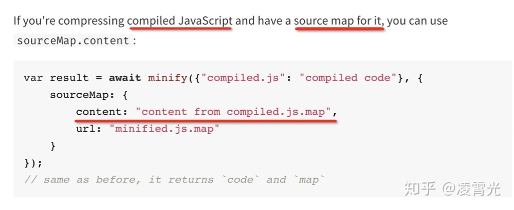
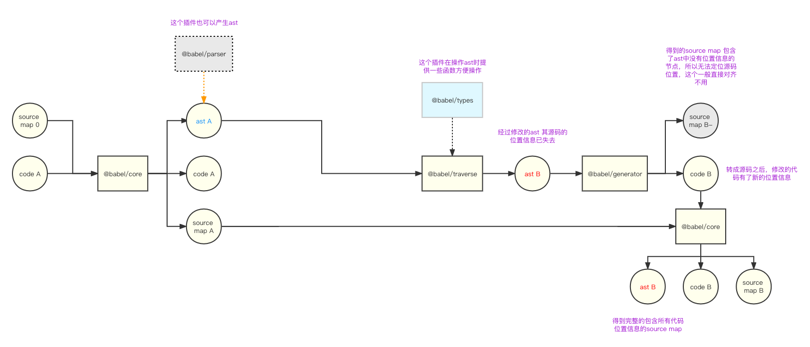

<TitleList></TitleList>

# AST抽象语法树

## 简介
AST([Abstract Syntax Tree](https://zh.wikipedia.org/wiki/%E6%8A%BD%E8%B1%A1%E8%AA%9E%E6%B3%95%E6%A8%B9))抽象语法树,或简称语法树(Syntax tree). 是源代码语法结构的一种抽象表示. 它以树状的形式表现编程语言的语法结构, 树上的每一个节点都表示源代码中的一种结构。  

AST与编程语言的种类无关，所有高级编程语言都可以使用AST来抽象表示 。

###### 在线AST工具
在线代将代码转换为可视化的AST树网址：[https://astexplorer.net/](https://astexplorer.net/)   
  
支持非常多的语言在线转换AST

###### 为什么说是抽象语法
之所以说语法是“抽象”的，是因为这里的语法并不会表示出真实语法中出现的每个细节。  
比如，`嵌套括号`被隐含在树的结构中，并没有以节点的形式呈现；而类似于 `if(){}` 这样的条件跳转语句，可以使用带有三个分支的节点来表示。  

*如图所示，没有表示出`()`和`{}`的节点，直接拆解代码逻辑*  
  

和抽象语法树相对的是具体语法树（通常称作[分析树](https://zh.wikipedia.org/wiki/%E5%88%86%E6%9E%90%E6%A0%91)）。一般的，在源代码的翻译和[编译](https://zh.wikipedia.org/wiki/%E7%B7%A8%E8%AD%AF%E5%99%A8)过程中，[语法分析器](https://zh.wikipedia.org/wiki/%E8%AF%AD%E6%B3%95%E5%88%86%E6%9E%90)创建出分析树，然后从分析树生成AST。一旦AST被创建出来，在后续的处理过程中，比如语义分析阶段，会添加一些信息。

## AST能做什么
- 语法检查、代码风格检查、格式化代码、语法高亮、错误提示、自动补全等.
- 代码混淆压缩.
- 优化变更代码,改变代码结构等.
- 代码裁剪.

## JavaScript AST
javascript parser： 把JS代码转换成 抽象语法树的解析器.  

浏览器在执行JS之前会把源码通过解析器转化成抽象语法树,再进一步转换成字节码甚至机器码.

###### 常用的javascript parser
- [Esprima](https://github.com/jquery/esprima)
- [UglifyJS2](https://github.com/mishoo/UglifyJS) webpack将这个工具作为插件(plugin)，对es5代码进行压缩。
- [Traceur](https://github.com/google/traceur-compiler)
- [Acorn](https://github.com/acornjs/acorn)
- [Espree](https://github.com/eslint/espree)
- [Shfit](https://github.com/shapesecurity/shift-parser-js)

### AST解析过程
分类两部分
- **词法分析**: 将整个代码字符串分割成最小**语法单元**数组
- **语法分析**: 在词法分析基础上建立分析**语法单元**之间的关系

###### 语法单元
**语法单元**: 被解析语法中具备实际意义的**最小单元**.  

例如:“2019年是祖国70周年”. 这句话拆成最小单元是: “2019年”,“是”,“祖国”,“70”,“周年”. 这些语法单元再进行拆分就失去了它本来要表达的意思.  

**javascript代码中的语法单元主要包含一下几种**  

- 关键字: `let`,`const`,`var`
- 标识符: 没有被括号引起的连续字符串,可能是变量,也可能是`if`,`else`这些关键字
- 数字运算符: `+`、`-`、`*`、`%`
- 数字: 十六进制、十进制、八进制等以及科学表达式等语法
- 空格: 连续的空格、换行、制表符等
- 注释: 行注释和大块的块注释作为最小的语法单元
- 其他: 大括号,小括号,分号,冒号等.

###### 语法单元示例
在线词法分析工具:[esprima/parser](https://esprima.org/demo/parse.html#)分析一下代码
```js
(1+2)*3;
```
###### 词法分析
词法分析的过程就是读取代码，识别每一个单词及其种类，将它们按照预定的规则合并成一个个的标识，也叫 token，同时，它会移除空白符，注释，等，最终产出一个token数组。即词法分析阶段把会字符串形式的代码转换为 令牌（tokens） 流  

通过**词法分析**,我们得到一下内容:


###### 语法分析
语法，是词法之间的<Te d>组合方式</Te>。我们写的**源程序**是按照一定的**格式**组织的**描述逻辑**的**文本**，而所谓<Te d>描述逻辑的格式</Te>就是指**语法**。语法分析的任务就是用由词法分析得到的令牌流，在上下文无关文法（一般指某种程序设计语言上的语法）的约束下，生成树形的中间表示（便于描述逻辑结构），该中间表示给出了令牌流的结构表示，同时验证语法，语法如果有错的话，抛出语法错误。  

经过词法、语法分析之后就产生了AST，用一棵**树形的数据结构**来描述源代码，从这里开始就是**计算机可以理解**的了。有了AST，就可以根据不同需求进行不同操作  
如：
- 编译器会将AST转换成线性中间代码，生成汇编代码，最后生成机器码。
- 解释器会将AST解释执行或转成线性的中间代码再解释执行。
- 转译器则会将AST转换为另一个AST，再生成目标代码，
  - 例如Babel就是一个典型的Javascript转译器，其主要能力是将ES6+代码转换成兼容旧的浏览器或环境的js代码，我们今天也会利用Babel的能力进行AST操作，关于编译的后续步骤如语义分析，代码优化，代码生成等。  
- 字节码解释器，将字节码转为机器码。


总之，**词法分析**后得到一个个独立的**语法单元**, 这些语法单元需要建立其实际的关系才有意义. 建立语法单元的这个过程就是**语法分析**,这个一般是**递归**过程  

[astexplorer](https://astexplorer.net) 在线可视化 AST工具.  

`(1+2)*3;` 最后的语法分析结果是:
```js
{
  "type": "Program",
  "body": [
    {
      "type": "ExpressionStatement",
      "expression": {
        "type": "BinaryExpression",
        "operator": "*",
        "left": {
          "type": "BinaryExpression",
          "operator": "+",
          "left": {
            "type": "Literal",
            "value": 1,
            "raw": "1",
            "range": [ 1, 2 ]
          },
          "right": {
            "type": "Literal",
            "value": 2,
            "raw": "2",
            "range": [ 3, 4 ]
          },
          "range": [ 1, 4 ]
        },
        "right": {
          "type": "Literal",
          "value": 3,
          "raw": "3",
          "range": [ 6, 7 ]
        },
        "range": [ 0, 7 ]
      },
      "range": [ 0, 8 ]
    }
  ],
  "sourceType": "module",
  "range": [ 0, 8 ]
}
```
`body`表示程序体，而程序体中包含了一则表达式`ExpressionStatement`, 表达式体里包含了操作符 `*`,以及左右两边表达式，其中右边是数字`3`,而左边表达式还包含一层表达式，里面是一个`+` 操作符，以及左右两边分别为`1`和`2`的数字。  



### AST节点
AST 的每一个**节点**都拥有近乎相同的结构，都有一个type属性以及一系列描述属性，type属性用来表示节点的类型（CallExpression,Identifier,MemberExpression等等）。  

一个 AST 可以由单一的节点或是成百上千个节点构成。 抽象语法树有一套约定的规范：[GitHub - estree/estree: The ESTree Spec](https://github.com/estree/estree)，社区称为 estree。借助这个约定的 AST 规范，整个前端社区，生产类工具<Te d>统一产出</Te>该格式的数据结构而<Te d>无需关心</Te>下游，消费类工具统一使用该格式进行处理而<Te d>无需关心</Te>上游。

#### AST节点类型
AST的所有节点类型可分为以下几个大类：字面量、标识符、表达式、语句、模块语法，每个大类下又分类多个子类，下面介绍一些基本且开发常用的节点类型 ，更全面的信息可以查文档或者在ASTExplorer中具体查看。

###### Literal 字面量
- StringLiteral 字符串字面量（"foo"）
- NumericLiteral 数值字面量（123）
- BooleanLiteral 布尔字面量 （true）
- TemplateLiteral 模板字面量 （${obj}）
- ...

###### dentifier 标识符
标识符即各种声明与引用的名字，js中的**变量名**，**函数名**，**属性名**等都是标识符。如下面代码中的bar,foo,num都是标识符。
```js
const bar = foo(num);
```

###### Statement 语句
它就是一段可以<Te d>独立执行</Te>的代码。下面代码的每一行都是一条语句。
```js
const a = 1;
console.log(a);
export default a;
```
Statement 分为众多子类型，下面举几个例子。
- **ReturnStatement**
  ```js
  return a; 
  ```
- **TryStatement**
  ```js
  try {} catch (error) {}
  ```
- **ForStatement**
  ```js
  for (let index = 0; index < array.length; index++) {
    const element = array[index];
  }
  ```
- **WhileStatement**
  ```js
  while (condition) {}
  ```

###### Declaration 声明语句
他是一种特殊的语句，用于在作用域内声明变量、函数、class、import、export 等，同样有众多子类型。
- **VariableDeclaration**
  ```js
  const a = 1;
  ```
- **FunctionDeclaration**
  ```js
  function b(){} 
  ```
- **ClassDeclaration**
  ```js
  class C {}
  ```

###### Expression 表达式
表达式与语句的区别是表达式执行后会<Te d>有返回结果</Te>，举例：
- **AssignmentExpression**
  ```js
  a = 1;
  ```
- **BinaryExpression**
  ```js
  a+b;
  ```
- **ThisExpression**
  ```js
  this;
  ```

###### Modules ES module模块语法
- **ImportDeclaration**
  ```js
  import name from 'name';
  ```
- **ExportNamedDeclaration**
  ```js
  export const newName = 'newName';
  ```
- **ExportDefaultDeclaration**
  ```js
  export default name;
  ```
- **ExportAllDeclaration**
  ```js
  export * from 'name';
  ```

###### Program & Directive
**program** 是代表整个程序的节点，它包裹了所有具体执行语句的节点，而**Directive**则是代码中的指令部分。


### AST操作工具
- `@babel/core`：提供基础的转换功能
  - `transform`：传入源码，返回 `code源码`, `sourceMap代码`, `ast对象`，这个方法可以通过`option`参数的`inputSourceMap`属性，将之前的sourceMap组合成可溯源的sourceMap
  - `parse`：基本的AST解析行为，如果有babel的`presets 预设`或者`plugin 插件`，将引用他们参与解析。一般情况下也可以使用`@babel/parser`进行替代
- `@babel/parser`： 将js源码转为AST，通过配置项可支持ts，jsx，tsx等代码
- `@babel/traverse`： 深度遍历AST节点
- `@babel/generator`：将AST代码转化为js源码
- `@babel/types`：AST节点辅助工具，提供一系列的节点类型判断方法(根据AST节点的某些属性判断)，或者AST节点生成方法(通过简单的参数，可以创建符合AST规范的AST节点插入AST)  

[Babel基本知识](./babel.md)  

###### 访问者模式
在访问者模式（Visitor Pattern）中，我们使用了一个访问者类，它改变了目标元素的执行算法。通过这种方式，元素的执行算法可以随着访问者改变而改变。而在当前场景下，访问者即是一个用于 AST 遍历的模式， 简单的说它就是一个对象，定义了用于在一个树状结构中获取具体节点的方法。当访问者把它用于遍历中时，**每当在树中遇见一个对应类型，都会调用该类型对应的方法**。  

示例，当ast被遍历时，遇到类型为`CallExpression`的节点，就会调用 `CallExpression(opath) {...}`函数对节点进行处理。
```js
const traverse = require('@babel/traverse').default;

traverse(ast, {
  CallExpression(opath) {...}
})
```
这里的访问者模式的 map 就是 `{ CallExpression(opath) {...} }`。  

**为什么要用访问者模式？**  

首先要明确我们的需求场景是对一个对象结构中的不同对象进行**不同**且**互不相关**的操作。如果使用普通的遍历方法，则会不可避免的在这个方法中进行判断，处理。必然会**导致众多**if..else逻辑嵌套，**可读性差**且**难以维护**。而访问者模式对不同对元素类型调用相应的遍历方法，不和具体遍历方式耦合易于复用，结构更加清晰、灵活性更高。  

因此我们只需根据需求，针对我们需要修改的节点类型去定义相应的遍历方法并指定相应的回调函数即可。回调函数的参数是path，它代表**节点与节点之间的关系**，每个 path关联父节点和当前节点，path 对象构成一条从当前节点到根结点的路径，我们可以通过 path的一系列增删改查 AST 的 api 来完成具体操作。


###### sourceMap基本知识
[JavaScript Source Map 详解](https://www.ruanyifeng.com/blog/2013/01/javascript_source_map.html)  

Source map就是一个`信息文件`，里面储存着`位置`信息。也就是说，`转换后`的代码的每一个位置，所对应的`转换前`的位置。有了它，出错的时候，除错工具将直接显示原始代码，而不是转换后的代码。  

**重点知识**：在webpack loader中，每个loader都会产生code 和 sourcemap，一般情况下，每个loader除了会接收 源码code之外，还会接收上一个loader产出的sourcemap，通过与自己产生的sourcemap `合并`，生成一个完整的sourcemap，这样，sourcemap记录的信息就可以`追溯`到上一个loader的源码位置，不断的往上溯源，即可还原最初的代码。  

webpack的`ts-loader`没有处理其他loader输出的sourcemap信息。如果要开发loader，则需要将loader放在ts-loader之后执行，否则loader修改代码之后，输出的最终sourcemap将无法准确复原源码

[webpack loader执行流程](./webpack-loader.md#loader执行流程)

###### 多级sourceMap可追溯
[babel从AST生成目标代码和(多级)sourcemap的过程](https://zhuanlan.zhihu.com/p/308516099)  

**transform阶段**是对ast做增删改，比如注入一些代码，对结构做转换。被处理的节点会<Te d>丢失位置信息</Te>（因为不再是源码中的位置了），没有被处理的节点依然保留位置信息（<Te d>node.loc属性</Te>）。  

**generate阶段**会递归打印ast，每个nodeType(节点类型：CallExpression、ConditionalExpression 等)会对应一个打印方法，输出代码到文件。
- 打印的过程中会生成**sourcemap**，使用火狐官方提供的source-map这个包。
- 打印的过程中目标文件中的<Te d>位置能够计算</Te>出来，如果节点还<Te d>保留</Te>着源码中的<Te d>位置信息</Te>，那就能关联上。
- 中间插入的节点就**没有对应的源码位置**，那<Te d>相对位移</Te>就是0，会返回上一个位置（因为sourcemap存储的是相对位置）。  

**source-map**有consumer的api（[originalPositionFor](https://www.npmjs.com/package/source-map#sourcemapconsumerprototypeoriginalpositionforgeneratedposition)）可以从生成的代码查找源码位置，所以多个sourcemap是<Te d>能够一级一级往上查</Te>的。  

terser和babel都是利用了mozilla的`source-map`这个包，所以研究sourcemap可以去看一下这个包提供的api。

###### 多级sourceMap可追溯示例
  
这个有两个主要的应用，一个是terser，因为terser主要是做压缩混淆，他处理的代码一般是babel或其他工具编译后的代码，需要<Te d>两次sourcemap</Te>，而source-map支持传入[content的options](https://www.npmjs.com/package/terser#source-map-options)，来做<Te d>两级的查找</Te>。


  
还有一处是<Te d>多个sourcemap之间的关联</Te>，当我们编译的过程有很多次parse、transform、generate的流程，那么也就对应着多个sourcemap，就需要一级一级关联。所以尽可能把编译的过程通过一个parse、transform、generate的流程做完。这样的sourcemap是<Te d>直接可用</Te>的。

###### AST修改代码流程
以`babel 7.x`为例：


###### 流程说明
1. `@babel/core` 接收**源码 A**和之前产生的，或者其他工具产生的**sourceMap 0**信息，生成当前代码的**ast A对象**和记录`当前代码`和`前代码`的**sourceMap A**
2. `@babel/traverse` 遍历ast对象节点，并修改ast节点，产生**ast B对象**
3. `@babel/generator` 将**ast B对象**转化为**源码 B**和**sourceMap B-**(因为是不完整信息的sourceMap所以且称为B-，因为ast A中新增加的ast节点是没有位置信息的，所以直接生成的sourceMap没法映射新增的源码)
4. `@babel/core` 再次接收**源码 B**和**sourceMap A**，产生一个完整的信息**sourceMap B**，这个sourceMap B信息记录着code B的信息和code A的信息。先溯源code B 再溯源code A

###### AST裁剪代码示例
**场景**  

业务代码中有很多定制化的功能，使用 isBelongCustomer("客户")进行判断，决定前端代码逻辑是否要执行。当源码交付给baidu时就有可能包含不属于baidu的代码逻辑  
```ts
const map = {
  baidu: true,
  ali: false,
}

function isBelongCustomer(customer: string): boolean {
  return map[customer];
}
```
**ast裁剪代码步骤**
1. 使用`fs-extra`、`globby` 等工具获取想要裁剪的项目文件代码 **code A**
2. 将 **code A** 传给`@babel/core`的`transform`方法进行ast转换，同时整合其他工具产出的`sourceMap`信息，获得 `ast A` 和 `sourceMap B`。
  ```js
  const babelCore = require('@babel/core');

  const sourceMap0 = '...'; // 其他工具产生的sourceMap信息

  const codeA = ''; // 代码

  const babelCoreOptions = {
    filename: filePath,
    sourceMaps: true, // 生成sourceMap
    // 因为代码中含有 react 和 ts 所以需要这两个预设插件集合
    presets: ['@babel/preset-react', '@babel/preset-typescript'], 
  };
  // code A、sourceMap A、ast A
  const { code, map, ast } = babelCore.transformSync(codeA, { ...babelCoreOptions, inputSourceMap: sourceMap0 });
  ```
3. 将 `ast A` 传给 `@babel/traverse` 进行深度遍历，找出所有 `isBelongCustomer('baidu')`的调用方法，并转为**boolean**，处理之后变为`ast B`
  ```js
  const traverse = require('@babel/traverse').default;
  const t = require('@babel/types');

  const map = {
    baidu: true,
    ali: false,
  }

  // 深度遍历操作ast A 获得ast B
  traverse(ast, {
    CallExpression(opath) { // 所有调用函数表达式节点
      const path = opath;
      // 过滤名为 isBelongCustomer 的节点
      if (t.isIdentifier(path.node.callee, { name: 'isBelongCustomer' })) { 
        // 获取函数的参数，从而获取到map对应属性的开关
        const value = map[path.node.arguments[0].value] === true;
        let { parentPath } = path;
        // 判断父节点是否 非 ! 的 一元运算表达式，true 就结束转换流程
        if (!(t.isUnaryExpression(parentPath) && parentPath.node.operator === '!')) {
          // 将当前节点替换成 boolean节点，经过替换之后，这个节点的行列位置消失了，@babel/types 创建的节点没有行列信息
          return path.replaceWith(t.booleanLiteral(value));
        }
        // 父节点是 ! 的一元运算表达式，且直联祖先有可能都是，即：!!!!isBelongCustomer('xxx')
        let count = 0;
        // 循环计算多少个 !
        while (t.isUnaryExpression(parentPath) && parentPath.node.operator === '!') {
          count = count + 1;
          parentPath = parentPath.parentPath;
        }
        // 找到先近的祖先非一元运算符的节点
        const rootUnaryExpression = path.find((path) => !path.parentPath.isUnaryExpression());
        // 多个! 可以简化为 一个 或 0个 ! 进行运算，
        // 比如 !!isBelongCustomer('xxx') === isBelongCustomer('xxx'); !!!isBelongCustomer('xxx') === !isBelongCustomer('xxx')
        const remainder = count % 2;
        if (remainder === 0) {
          // 正常替换为 boolean 节点
          return rootUnaryExpression.replaceWith(t.booleanLiteral(value));
        }
        // 取反替换 boolean 节点
        return rootUnaryExpression.replaceWith(t.booleanLiteral(!value));
      }
    },
  });
  ```
4. 将`ast B`传给`@babel/generator`获得`code B`（ast B 直接生成的 sourceMap B- 没有新boolean节点的位置信息，所以sourceMap B- 是不可用的信息）
  ```js
  const generate = require('@babel/generator').default;

  const { code } = generate(ast);
  ```
5. 将`code B` 和 `souceMap A` 传给 `@babel/core`的`transform`方法，获得 `code B` 和 `sourceMap B`(当ast B 生成code B之后，code B的变动代码就有了新的位置信息，于是code B 转化的新的 ast b 每个节点都有了 行列位置信息，sourceMap B 也就包含了新代码的位置信息。)
6. 将生成的`code B`代码再覆盖原文件，或者放到某个目录下，结束  

*tips*：ast 的处理能力很强大，甚至可以识别出块级作用域内的变量引用情况，并标记出来。