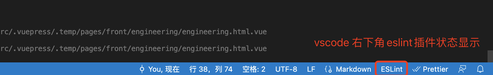
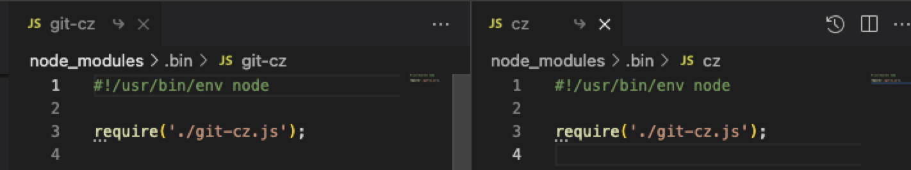

<TitleList></TitleList>

# 前端工程化

### vscode 快捷设置
[vscode的设置settings.json](https://juejin.cn/post/7087515141197004813)  

`项目根目录/.vscode/settings.json` 文件会覆盖vscode编辑器的全局设置，配置只会作用于当前项目。  

以下是常用配置  
```json
{
  "eslint.validate": [  // 用 eslint 插件检测以下几种语言，如果vscode 没有按照eslint插件则不起作用
    "javascript",
    "javascriptreact",
    "typescript",
    "typescriptreact"
  ],
  "editor.formatOnSave": false, // 设置保存文件时是否自动格式化，true表示自动格式化,需要配置格式化器(formatter)才可使用
  "eslint.alwaysShowStatus": true, 
  "editor.codeActionsOnSave": {  // 设置保存时要做的事情
    "source.fixAll.eslint": true // 保存时自动修复eslint规则错误的那部分代码
  },
  // tab 大小为2个空格
  "editor.tabSize": 2,
}
```

显示vscode eslint 插件的状态
```json
"eslint.alwaysShowStatus": true,
```


`项目根目录/.vscode/launch.json` vscode用于调试时使用，一般node下作用比较大。  
[【VScode】里的launch.json是干什么用的](https://juejin.cn/post/7063655822965866527)   
[vscode调试入门](https://juejin.cn/post/6956832271236071431)  

### 项目代码规范
#### eslint 静态js检查工具
[eslint 文档](https://cn.eslint.org/)  

- `npm install eslint` 代码包的eslint，提供eslint检查的功能和规则。 
- `vsCode eslint 插件` 根据 npm eslint 包自动检查代码，并将错误高亮显示，提供可视化的eslint 操作代码功能(边写，边看，边修复，没有这个插件，则只有在运行 eslint命令之后才能看到问题并修复)。优先识别项目本地的 eslint npm 包，没有再识别全局的 eslint 包。

###### eslint配置文件
在根目录创建eslint配置文件的三种方法  
- `.\node_modules\.bin\eslint --init ` 用本地eslint包初始化配置文件
- `eslint --init` 用全局eslint包初始化配置文件
- `npx eslint --init` 用本地eslint模块，没有就远程下载个临时包执行

::: danger eslint配置错误问题
- 'plugins' doesn't add plugins to configuration to load. Please use the 'overrideConfig.plugins' option instead.  
- 通常是vscode哪个地方默认传了错误参数的格式，多见于vcCode插件已经废弃了，版本落后导致的，一般重新装插件，或者重装vsCode可解决。
:::
###### eslint 配置文件字段
eslint有extends和plugins两个配置。  
- **plugins**要引入对应的插件模块，然后配置相对应的规则**rules**才会生效。
- 而**extends**是已经配置好的规则，**后面的**extends会**覆盖前面的**extends。

[ESLint 配置文件字段解释](https://juejin.cn/post/7012798266089668645#heading-6)

[eslint 命令行参数](https://cn.eslint.org/docs/user-guide/command-line-interface)

常见命令行参数  
- `--init` 初始化eslint配置文件
- `--debug` 输出调试信息
- `--ext [String]` 指定文件扩展名 - 默认: .js
- `--cache`  仅检查更改的文件
- `--fix` 自动修复问题
- `-c`, `--config path::String` 指定配置文件 如果存在`.eslintrc.*`配置，则覆盖

###### --ext 检查文件
```bash
# 检查多个文件
npx eslint file1.js file2.js

# 使用 glob 正则，检查目录下所有文件
npx eslint lib/**

# --ext用于指定检测的文件范围。以下命令表示检测src文件夹下的js和vue结尾的文件。
npx eslint --ext .js,.vue src/
```

###### --fix
自动修复可修复的问题
```bash
# index.js 中可自动修复的问题会被修复并忽略
npx eslint --fix index.js
```
#### css 规范

`stylelint`为css的lint工具。可格式化css代码，检查css语法错误与不合理的写法，指定css书写顺序等  

[配置styleling](https://juejin.cn/post/7118294114734440455#heading-19)

#### 代码风格 prettier
执行了`eslint index.js --fix`之后，js文件只是增加了**分号**，**双引号**。但是代码的格式该怎么乱还是怎么乱，即不美观，也不工整。并且eslint只能作用于js文件，像html，css，json，vue文件，eslint都处理不了他们的代码格式的问题。此时prettier认为代码的格式也很重要，于是prettier诞生了。  

- `prettier` 项目代码风格包。
- `vsCode prettier` prettier的vscode插件。每次执行npx prettier --write .才会修改格式。想要在我写代码的时候，一Ctrl+S保存就能自动格式化代码，就需要安装该插件。

`vsCode prettier` 安装完后再配置一下prettier自动保存：
.vscode/settings.json
```json
{
  ...

  "[javascript]": {
      "editor.defaultFormatter": "esbenp.prettier-vscode"
  },
  "[html]": {
      "editor.defaultFormatter": "esbenp.prettier-vscode"
  },
}
```
上面是针对不同类型的文件指定不同的formatter，也可以一次性执行所有类型文件的formatter  
```json
{
  "editor.defaultFormatter": "esbenp.prettier-vscode"
}
```


###### 统一代码风格
```bash
npm i prettier -D
npx prettier --write index.js index.css
```

###### prettier 常见命令参数
- `npx prettier src` 格式化src/目录下的所有文件并输出到标准输出
- `npx prettier "src/*.js"` 格式化src/目录下的 js 代码文件并输出到标准输出
- `npx prettier --write "src/*.js"` 格式化src/目录下的 js 代码文件并写入
- `npx prettier --check "src/*.js"` 检查src/目录下哪些 js 代码文件需要格式化
- `npx prettier --list-different "src/*.js"` 检查src/目录下哪些 js 代码文件需要格式化
- `npx prettier --find-config-path "src/*.js"` 查看有效的配置文件
- `npx prettier --config prettier.config.js "src/*.js"` 手动指定配置文件
- `npx prettier --ignore-path .prettierignore "src/*.js"` 手动指定忽略配置文件
- `npx prettier --no-config "src/*.js"` 不读取配置文件并使用默认配置进行格式化
- `npx prettier --no-editorconfig "src/*.js"`  忽略.editorconfig。如果项目根目录下存在.editorconfig，那么默认情况下，Prettier 在解析配置文件的时候，也会解析.editorconfig。  

注意：.editorconfig的优先级比 Prettier 配置文件的优先级低。


###### 自定义代码风格
*vscode IDE prettier插件 快捷键  shift + option + f*  

`项目根目录/.prettierrc.js`(或 `prettier.config.js`)  
```js
module.exports = {
  // 一行最多 120 字符
  printWidth: 120,
  // 使用 2 个空格缩进
  tabWidth: 2,
  // 不使用缩进符，而使用空格
  useTabs: false,
  // 行尾需要有分号
  semi: true,
  // 使用单引号
  singleQuote: true,
  // 对象的 key 仅在必要时用引号
  quoteProps: 'as-needed',
  // jsx 不使用单引号，而使用双引号
  jsxSingleQuote: false,
  // 末尾需要逗号
  trailingComma: 'all',
  // 大括号内的首尾需要空格
  bracketSpacing: true,
  // jsx 标签的反尖括号需要换行
  jsxBracketSameLine: false,
  // 箭头函数，只有一个参数的时候，也需要括号
  arrowParens: 'always',
  // 每个文件格式化的范围是文件的全部内容
  rangeStart: 0,
  rangeEnd: Infinity,
  // 不需要写文件开头的 @prettier
  requirePragma: false,
  // 不需要自动在文件开头插入 @prettier
  insertPragma: false,
  // 使用默认的折行标准
  proseWrap: 'preserve',
  // 根据显示样式决定 html 要不要折行
  htmlWhitespaceSensitivity: 'css',
  // 换行符使用 lf
  endOfLine: 'lf',
};
```
###### prettier 与 eslint 冲突
prettier的配置与eslint的配置冲突，会导致代码保存时，一会是 prettier 风格，一会又是 eslint 风格

**四种解决办法**
- eslint和prettier的配置要统一，不能冲突
- 把eslint插件的自动保存配置删除了，只要prettier的自动保存。这时候eslint fix 需要通过命令操作。
- `eslint-plugin-prettier`： 基于 prettier 代码风格的 eslint 规则，使eslint使用pretter规则来格式化代码。`eslint-config-prettier`： 禁用所有与格式相关的 eslint 规则，解决 prettier 与 eslint 规则冲突，确保将其放在 extends 队列最后，这样它将覆盖其他配置
- `lint-staged` 删除 vscode prettier 依靠 git hooks 的 pre-commit 生命周期 执行 npx prettier 和 eslint 对代码进行格式化。  

```bash
npm i -D prettier eslint-config-prettier
```
**修改项目 .eslintrcs 文件**
```json
{
  plugins: ["prettier"], // eslint-plugin-prettier
  extends: [
    // 各种你需要继承的配置列在前面
    // prettier 规则列在最后
    "prettier", // eslint-config-prettier 可简写成 prettier
  ],
  rules: {
    "prettier/prettier": "error" // 开启规则
  }
}
```  
eslint-config-prettier 下还有 @typescript-eslint.js, babel.js, react.js, prettier.js, vue.js 等文件，其内容是禁掉与它搭配使用的插件中创建的与 Prettier 冲突的规则。  

例如：当我们想校验 ts 文件时，需要引入 @typescript-eslint/eslint-plugin，这个插件中存在一些与 Prettier 冲突的规则，prettier/@typescript-eslint.js 就是禁掉这些规则。  

```json
{
  extends: [
    "plugin:@typescript-eslint/recommended", // 引入相关插件
    "prettier", // 禁用 ESLint 中与 Prettier 冲突的规则
    "prettier/@typescript-eslint" // 禁用插件中与 Prettier 冲突的规则
  ]
}
```

### Git 规范

###### 分支管理规范
团队使用 git 分支的形式基本符合 git-flow 的规范。
###### commit规范
- 团队之间遵守同一套 commit message 规范， Angular 规范。
- 搭配使用：commitizen + cz-conventional-changelog + commitlint + husky
- 凡是用到 `git commit` 命令，一律改为使用 `git cz` 。这时，交互式commit模板，用来生成符合格式的 Commit message。并且在每次 commit 时执行 commitlint 检查我们输入的 message。

#### git commit 规范工具
###### git生命周期工具 husky
类似于前端框架中的**生命周期钩子**，git在某些特定事件发生前或后也会有某些执行特定功能的钩子，githooks就是在git执行特定事件（如commit、push、receive等）时触发运行的脚本。  

githooks 保存在 .git 文件夹中  

`husky` 是一个让配置 git 钩子变得更简单的工具。支持所有的git钩子。

husky 8.x 使用教程
- 安装husky `npm install husky --save-dev`
- 要在安装后自动启用钩子，我们需要执行`npm set-script prepare "husky install"`
- 执行完上一步的命令之后可以在package.json 文件的scripts配置项中看到如下代码：
  ```json
  {
    "scripts": {
      "prepare": "husky install"
    }
  }
  ```
- 初始化 husky `npx husky-init` 或 `npm run prepare`
- 创建钩子，比如我们创建一个commit-msg钩子 `npx husky add .husky/commit-msg 'npx --no-install commitlint --edit "$1"'`(在 commit-msg 时 执行 npx --no-install commitlint --edit "$1")
  - 安装其他 git 钩子只需要执行 `husky add .husky/钩子名字 "npm test"`就行了
###### commit 校验工具 commitlint
- `commitlint`: 可以帮助我们 lint commit messages, 如果我们提交的不符合指向的规范, 直接拒绝提交  
- `@commitlint/cli`: [使用方式](https://www.npmjs.com/package/@commitlint/cli)。命令行校验文本信息是否符合 `commitlint`规则。(可装可不装)
- `@commitlint/config-angular` angular 规范的规则  

创建commitlint校验规则配置文件
项目根目录下创建 commitlint.config.js
```bash
npm install --save-dev @commitlint/config-angular
echo "module.exports = {extends: ['@commitlint/config-angular']};" > commitlint.config.js
```

经过husky的commit-msg配置好钩子，并且配置好commit之后，git commit -m "xxx" 就会进行文案是否符合angular规范的校验了。  

但是规范有时候很难写，可以提供一下互动式命令行。
###### commit 模板 commitizen 
- `commitizen` 一个帮助撰写规范 commit messages 的工具，只有纯命令行文本显示。
- `cz-conventional-changelog` 交互式commit适配器，通过交互式命令提供约定的commit格式，不同的需求，可以使用不同的适配器。  

初始化Conventional Commits规范适配器
```bash
npx commitizen init cz-conventional-changelog --save-dev --save-exact

npm set-script commit "cz"
```
`cz`与`git-cz`是相同的命令，cz-conventional-changelog 的启动命令

在package.json会生成以下信息
```json
{
  "scripts": {
    "prepare": "husky install",
    "commit": "git-cz"
  },
  ...
  "config": {
    "commitizen": {
      "path": "./node_modules/cz-conventional-changelog"
    }
  }
}
```
通过`npm run commit` 可以代替 `git commit -m "feat:xxx"`  

有些人熟悉模板格式，可以直接 `git commit -m "feat:xxx"` ，不熟悉模板格式的 可以使用 `npm run commit`。是一种推荐的方式。

###### 强制git-cz
即 强制 git commit -m ""时，进行交互式命令，这种方式不推荐。  

注册 prepare-commit-msg 钩子
```bash
npx husky add .husky/prepare-commit-msg 'exec < /dev/tty && node_modules/.bin/cz --hook || true'
```
这样就可以刪除 package.json的属性 script 中的 commit 命令了  

控制终端(/dev/tty)  

###### cz-customizable
[自定义提交规范 提示文案](https://juejin.cn/post/6844903831893966856#heading-14)
### lint-staged

`lint-staged`：一个仅仅过滤出 Git 代码暂存区文件(被 git add 的文件)的工具；这个很实用，因为我们如果对整个项目的代码做一个检查，可能耗时很长，如果是老项目，要对之前的代码做一个代码规范检查并修改的话，这可能就麻烦了，可能导致项目改动很大。所以这个 lint-staged，对团队项目和开源项目来说，是一个很好的工具，它是对个人要提交的代码的一个规范和约束。

###### 代码增量检测
安装lint-staged（实现代码增量检测，只检测添加到git缓存区的文件）
```bash
npm i lint-staged -D
```
在 package.json 中添加lint命令
```json
{
  "script": {
    "lint": "lint-staged"
  }
}
```
添加lint-staged配置  
- 方法一：在package.json中添加
- 方法二：创建.lintstagedrc 文件
- 方法三：创建lint-staged.config.js 文件并进行配置  

以package.json中添加为例  
```json
{
  "lint-staged": {
    "src/**/*.{js.vue}": [
      "eslint --cache --fix",
      "prettier --write"
    ]
  }
}
```
在 commit 之前，将暂存区的内容做一次 代码检查 和 代码美化，然后再添加到暂存区；然后再 commit。按**数组顺序**执行命令。

###### cz日志生成器
conventional-changelog

###### 自动生成变更日志
release-it  