<TitleList></TitleList>

# git常用命令

[深入理解Git实现原理](https://zhuanlan.zhihu.com/p/45510461)  

### 常用git命令清单
[常用git命令清单](https://www.ruanyifeng.com/blog/2015/12/git-cheat-sheet.html)  

###### clone 克隆
- 全量clone
  - `git clone git@github.com:tancolo/MOOC.git`
  - `git clone https://github.com/tancolo/MOOC.git`
- 克隆单分支
  - `git clone -b mvp-dev-more --single-branch git@github.com:tancolo/MOOC.git` 只克隆 **mvp-dev-more** 分支
- 浅层克隆(克隆最近几次提交)
  - `git clone --depth 10 git_仓库_url` 只会获取最近 xx（10条提交记录的）代码，默认是**master**分支， 如果想要指定分支，可以结合 **-b --single--branch** 使用！
- 部分克隆(克隆时过滤)
  - 按文件大小筛选
    - `git clone --filter=blob:limit=1m git@gitlab.com:gitlab-com/www-gitlab-com.git` 克隆存储库 不包括大于 1 MB的文件 
  - 按对象类型筛选
    - `git clone --filter=blob:none --no-checkout git@gitlab.com:gitlab-com/www-gitlab-com.git`
    - `--filter=blob:none` 不克隆 blob，但是仓库中的历史commit、tree会被下载
    - `--no-checkout` 不自动检出
    - `--filter=tree:<depth>` 比blob更省空间，但是treeless模式的克隆在开发的场景下会更加频繁的触发缺失对象的下载


### merge 与 rebase
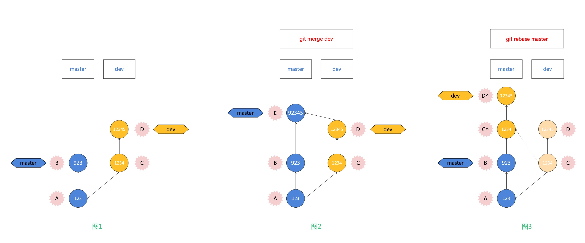
###### merge
```bash
git merge dev
```
**解释**：当前分支为master分支，将dev分支上的所有的改变内容都合并到master分支上来，对dev分支没有影响。  

**<Te w>从图2可以看到</Te>**   

- master(当前分支)分支上`git merge dev`之后，是在master分支上创建一个新的merge commit 节点E，并将master 的 HEAD 指向最新节点E。
- dev分支则什么都没有变化，也没有影响。
###### rebase
```bash
git branch
```
\* <Te s>dev</Te>  
master  

在dev分支上rebase(变基)到master
```bash
git rebase master
```
- dev：待变基分支、当前分支
- master：基分支、目标分支

**官方解释**：当执行rebase操作时，git会从两个分支的**共同祖先**开始提取**待变基分支**上的修改，然后将待变基分支指向**基分支**的最新提交，最后将刚才**提取的修改**应用到基分支的**最新提交**的后面。  

**<Te w>从图3可以看到</Te>**  

- 当在**dev分支**上执行`git rebase master`时，git会从master和dev的**共同祖先A**开始<Te d>提取dev分支上的修改</Te>，也就是**C**和**D**两个提交，先提取到。
- 然后将**dev分支**指向master分支的最新提交上，也就是**B**。最后把提取的C和D接到B后面，但这个过程是<Te d>删除原来的C和D</Te>，生成新的**C^**和**D^**，他们的<Te d>提交内容一样</Te>，但<Te d>commit id不同</Te>。dev自然最后也是指向D^。    

sourceTree 上显示 rebase后的 两条分支情况，是重叠在一起。
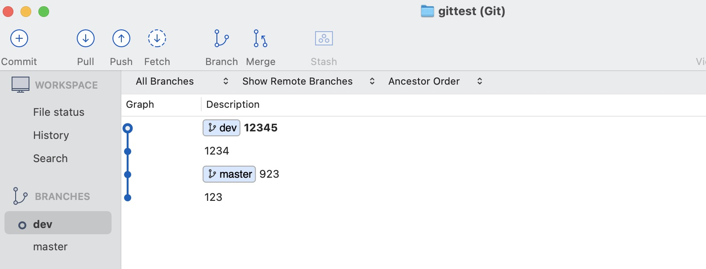

- 此时，dev分支和master分支都相同且重叠(两条线的节点重叠)，<Te d>master分支落后</Te>dev分支两个节点，  
- 此时，如果在dev分支上进行`git rebase master`操作是无效的，会输出`已经是最新的`的反馈。
- **需要**在master分支上`git merge dev` 将master分支的最新节点同步到dev分支的最新节点，两条分支对齐。
  - **否则** <Te d>删除</Te> dev 分支时，rebase部分的代码都将<Te d>丢失</Te>，因为dev分支没有了，而master分支还没同步。
  - `merge`成功之后再删除dev，就不会影响rebase过来的历史节点了，（merge 不会再有冲突，有冲突在rebase时已解决了）


### git commit 回退
###### git reset 撤销最近多次提交
三种方式对工作空间的改动不一样
```bash
git reset --soft HEAD~1
# 撤销最近一次的commit(撤销commit，不撤销git add)

git reset --mixed HEAD~1
# 撤销最近一次的commit(撤销commit，撤销git add)

git reset --hard HEAD~1 
# 撤销最近一次的commit
# (撤销commit，撤销git add，工作区的代码改动将丢失。操作完成后回到上一次commit状态)
```
::: tip
**HEAD~1**的意思是最近一个版本，也可以写成**HEAD^** 如果需要撤回<Te d>最近两次提交的commit，可以使用HEAD~2</Te>，依次类推  

`git reset --soft commitId` 则相当于 回撤到该节点`commitId`，该节点之后的所有节点都删除
:::

::: warning 撤销后，后悔了
如果使用git reset --hard 撤销了commit，而且也推送到了远端，后悔了想要找回已撤销commit的代码变更，不用担心，**git reflog** 完全可以做到。
:::
###### git rebase 撤销某个提交
如果不是撤销最近的一个或多个commit，而是撤销某个commit呢？  
例如，只撤销第二个节点「d9a16cc」，最新的「dd55e5e」则不撤销。  
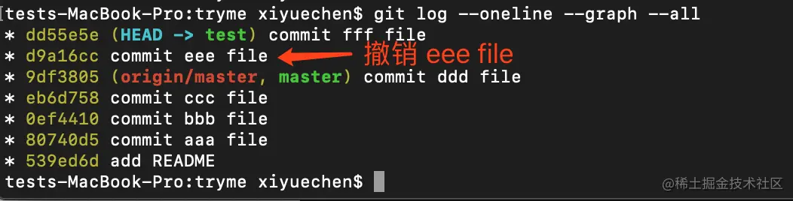

`git reset --soft/--mixed/--hard commitId`无法做到   
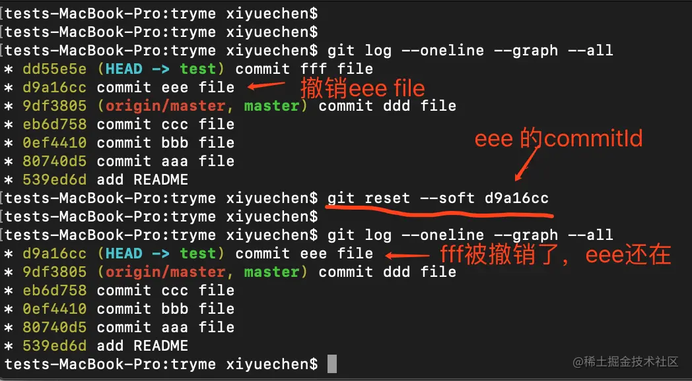
可以看到 「d9a16cc」节点还在，「d9a16cc」之后的节点被撤销了

用**git rebase**可以做到撤销某个commit  

如果要撤销“commit eee file”{cid:d9a16cc}这个提交，使用`git rebase -i 9df3805`，其中「9df3805」是eee的上一次提交的commitId。当然，也可以使用`git rebase -i HEAD~2`。   

执行 `git rebase -i 9df3805` 之后，会出现下面的交互式vim编辑框
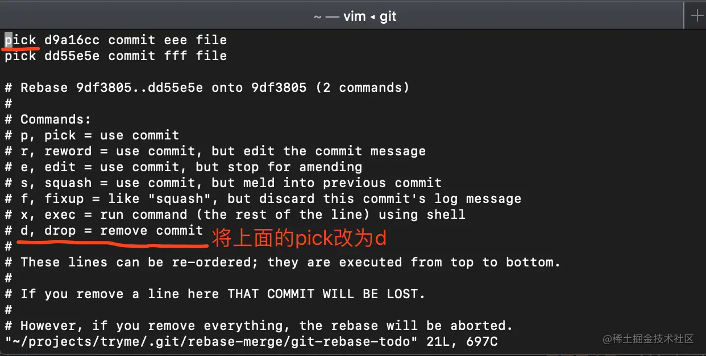
按照图示将 "commit eee file" 左侧的pick改为d或者drop后，会丢掉对应的commit。从而达到撤销的目的。
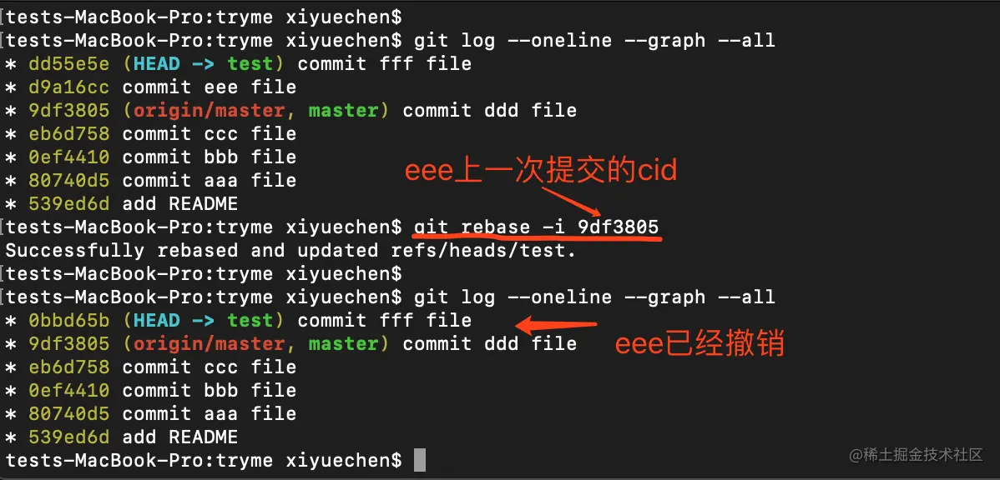
用 git rebase 实现撤销和 git reset --hard 的效果类似，即「删除已撤销commit的代码变更，撤销git add，工作空间回到上一次commit状态」。如果被撤销commit的代码还有用，使用时须谨慎。

::: tip  git rebase tips
git rebase命令可以做很多工作，例如优化本地分支的提交记录，分支线性化处理(避免过多的merge出现)等等。
:::
###### 强制提交
`git push  origin feature/dev -f`强制覆盖远端`feature/dev`分支    

主要思路就是在本地分支撤销了commit之后，将变更推送到远端。但必须用git push -f强制提交，否则会提交失败，原因是：本地的版本号低于远端的版本号。

`git push origin master -f` 可能会有如下错误
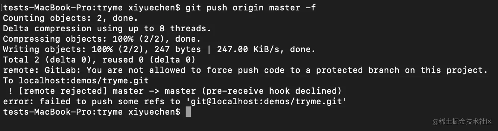
意思就是master分支是“protected branch”，不允许强制变更。解决方法是登录GitLab，进入项目的设置页面，选择Repository，找到Protected Branches，对分支进行「Unprotect」即可。

###### git revert 回退
git revert 是一个很安全也很好用的命令，不同于git reset的重置，它是通过**反向操作**来完成撤销的。先来看用法。  

需求：撤销“commit eee file”{cid:d9a16cc} 的变更。
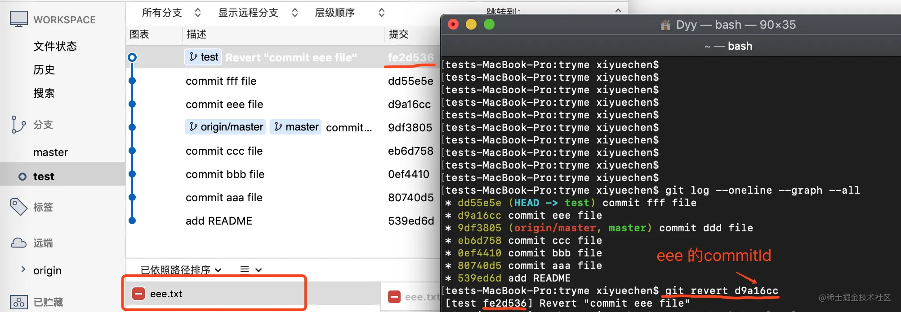

git revert 后面一般跟commitId, 是你想回退的commit的id。例如在上图示例中，我想回退eee的提交，则commitId即是「d9a16cc」。  

git revert 执行后会自动生成一个类似「Revert "commit message"」的新的commit。该commit的内容和需要revert的内容相反。若回退前新增了一个文件，revert后会将该文件删除；若会提前删除了一个文件的一行代码，revert后会将该文件的该行代码补回来。


### commit 合并
```bash
git rebase -i  [startpoint]  [endpoint]
```
- `-i` 的意思是--interactive，即弹出交互式的界面让用户编辑完成合并操作
- [startpoint] [endpoint]则指定了一个编辑区间，如果不指定[endpoint]，则该区间的终点默认是当前分支HEAD所指向的commit(注：该区间指定的是一个前开后闭的区间)。  

 在查看到了log日志后，我们运行以下命令：
 ```bash
 git rebase -i 36224db
 # 或者
 git rebase -i HEAD~3 
 ```
 然后我们会看到如下界面:
 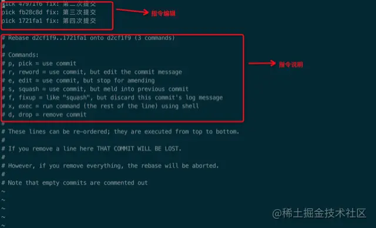
 上面未被注释的部分列出的是我们本次rebase操作包含的所有提交，下面注释部分是git为我们提供的命令说明。每一个commit id 前面的pick表示指令类型，git 为我们提供了以下几个命令:  

- `pick`：保留该commit（缩写:`p`）
- `reword`：保留该commit，但我需要修改该commit的注释（缩写:`r`）
- `edit`：保留该commit, 但我要停下来修改该提交(不仅仅修改注释)（缩写:`e`）
- `squash`：将该commit和前一个commit合并（缩写:`s`）
- `fixup`：将该commit和前一个commit合并，但我不要保留该提交的注释信息（缩写:`f`）
- `exec`：执行shell命令（缩写:`x`）
- `drop`：我要丢弃该commit（缩写:`d`）  

根据我们的需求，我们将commit内容编辑如下:  
```bash
pick d2cf1f9 fix: 第一次提交

s 47971f6 fix: 第二次提交

s fb28c8d fix: 第三次提交
```
上面的意思就是把第二次、第三次提交都合并到第一次提交上  

然后wq保存退出后是注释修改界面:
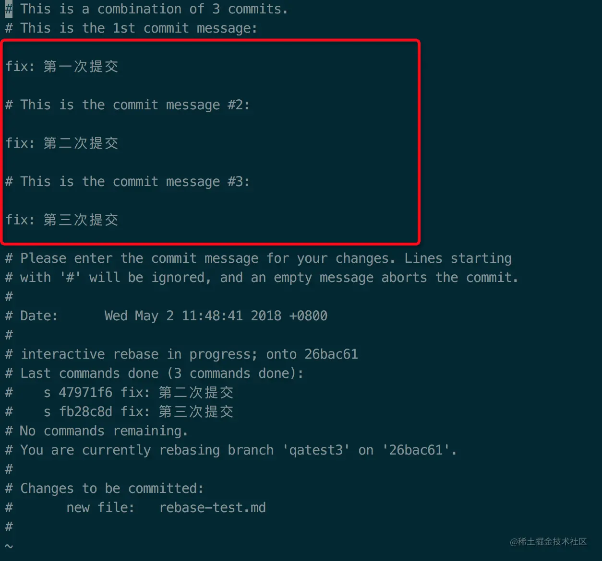
可以再浏览态 按下两个dd可以删除一行  
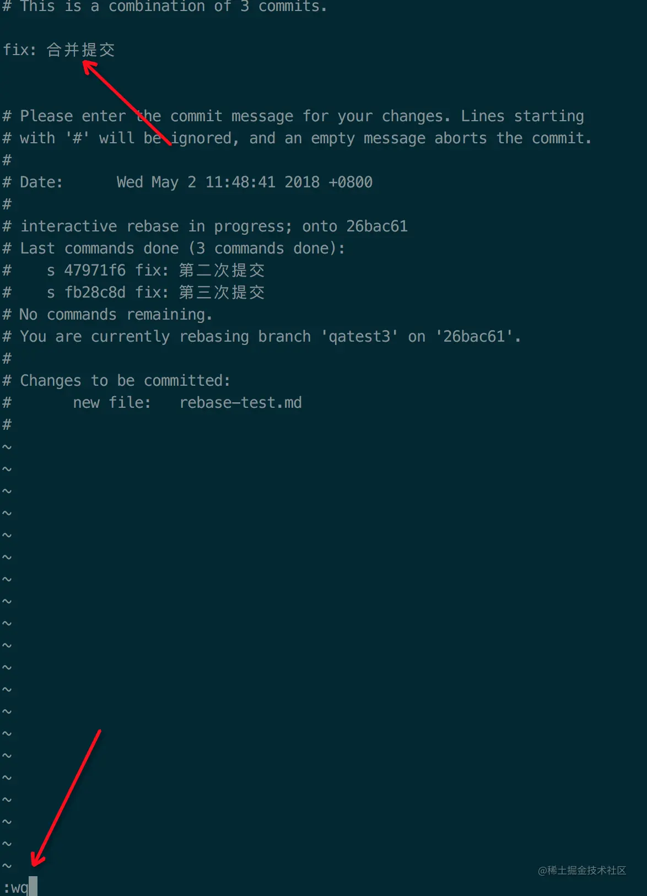
编辑完保存即可完成commit的合并了：
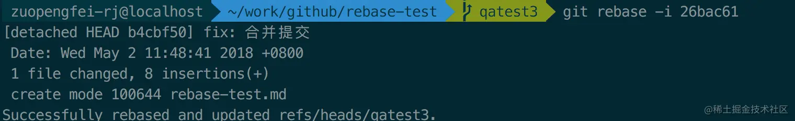
最后查看log可以发下提交合并了
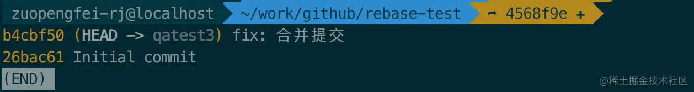

### cherry pick
`git cherry-pick [commit]` 选择一个commit，合并进当前分支  

[git cherry-pick 教程](https://www.ruanyifeng.com/blog/2020/04/git-cherry-pick.html)


### MR 与 PR 

#### 日常协作的说法

###### Pull Request

我们如果要给别人的**公开仓库(github)**贡献代码，一般是要 `fork` 一个仓库，在自己的仓库改完后，给原仓库提交 `PR` 请求，请求原仓库主人把你的代码拉（`pull`）回去。  

下图是一般的 Github 工作流程。  
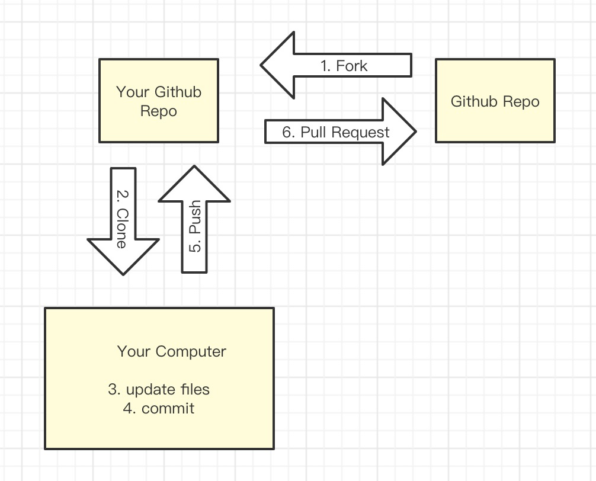

Gitlab 一般是`私有库`，一个团队维护一个仓库，通常大家会`新建自己的分支`，开发完成后，请求`合并回主干分支`。  

下图是一般的 Gitlab 工作流程。  
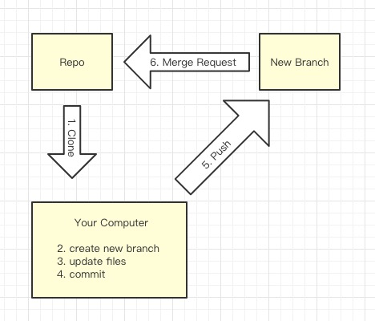


#### 官方说法 

Merge Request 和 Pull Request 是同一个东西，仅仅只是名字不一样  

一般我们执行分支合并，需要执行下面两个命令：  
```bash
git pull // 拉回需要合并的分支
git merge // 合并进目标分支
```
- Github 选择了第一个命令来命名，叫 Pull Request。
- Gitlab 选择了最后一个命令来命名，叫 Merge Request。


### git冲突
冲突可以说是<Te d>两个分支</Te>的冲突
###### 冲突的产生
**原因**： 对两个已经提交的分支的 相同文件相同位置 的 不同操作 进行了合并  

很多命令都可能出现冲突，但从根本上来讲，都是<Te d>merge</Te> 和 <Te d>patch</Te>（应用补丁）时产生冲突。  
###### merge 常见误区
::: danger git merge 是用时间先后决定merge结果的，后面会覆盖前面的?
答 ：git 是分布式的文件版本控制系统，在分布式环境中时间是不可靠的，git是靠<Te d>三路合并算法</Te>进行合并的。
:::
::: danger git merge 只要两行不相同就一定会报冲突，叫人工解决?  
答：git 尽管两行内容不一样，git 会进行取舍，当git无法进行取舍的时候才会进行人工解决冲突
:::

###### merge原理
git 合并文件是**以行为单位**进行一行一行进行合并的，但是有些时候并不是两行内容不一样git就会报冲突，因为smart git 会帮我们自动帮我们进行取舍，分析出那个结果才是我们所期望的，如果smart git 都无法进行取舍时候才会报冲突，这个时候才需要我们进行人工干预。

### 二路合并算法
**二路合并算法**：两个文件进行逐行对别，如果行内容不同就报冲突。
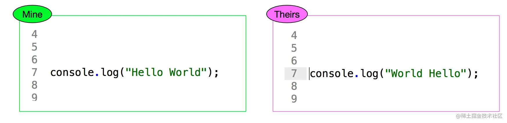
- Mine 代表你本地修改 
- Theirs 代表其他人修改
- 假设对于**同一个文件**，出现你和其他人**一起修改**
- 此时如果git来进行合并，git就懵逼了，因为Git既不敢得罪你(Mine)，也不能得罪他们(Theirs) 
- git无法自动确认，合并只能自己搞了。开发中需要合并的情况太多了，每次都要人工合并太麻烦了

### 三路合并
三路合并就是先找出一个**基准**，然后以基准为Base 进行合并，如果2个文件相对基准(base)都发生了改变，那git 就报冲突，然后让你人工决断。否则，git将取相对于基准(base)变化的那个为最终结果。
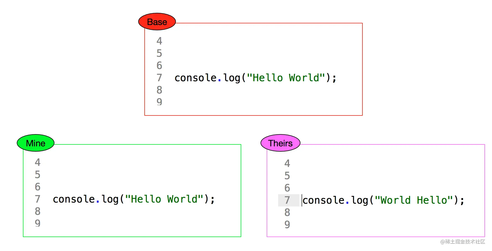
- Base 代表上一个版本，即公共祖先 
- Mine 代表你本地修改
- Theirs 代表其他人修改
- 当git进行合并的时候，git就知道是其他人修改了，本地没有更改
- git就会自动把最终结果变成如下：
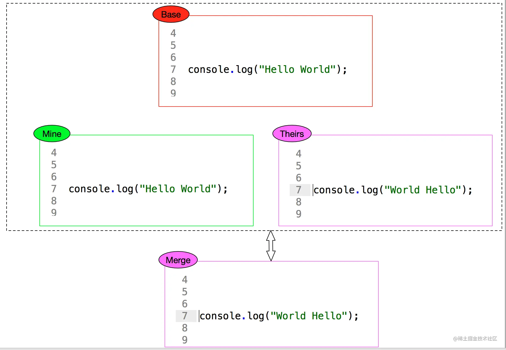  

**人工解决**：如果换成下面的这样，就需要人工解决了
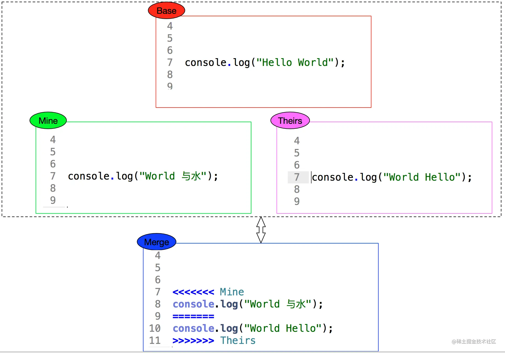
mine 和 Theirs 都修改了 `console.log('Hello World');`，所以需要人工确认

### 冲突的类型
###### 逻辑冲突
git自动处理（合并/应用补丁）成功，但是逻辑上是有问题的。  

比如另外一个人修改了文件名，但我还使用老的文件名，这种情况下自动处理是能成功的，但实际上是有问题的。
###### 树冲突
文件名修改造成的冲突，称为树冲突。  

比如，a分支把文件改名为A，b分支把同一个文件改名为B，那么将这两个commit合并时，会产生冲突。
###### 内容冲突
两个分支修改了同一个文件的同一块区域，git会报告内容冲突。我们常见的都是这种，后面的解决办法也主要针对这种冲突。

### 内容冲突的解决办法
###### 发现冲突
- 命令行模式
  - 命令行模式下进行代码合并时，一般来讲，出现冲突时都会有“CONFLICT”字样：
  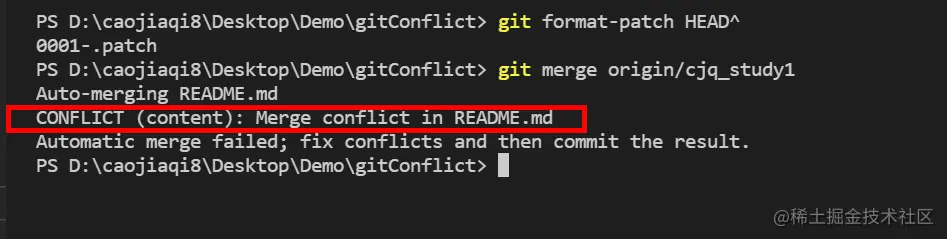
- sourceTree
  - 当拉完代码出现冲突时，sourceTree会出现提示，可以在文件状态中查看是哪个文件出现了冲突，然后进入VScode中手动解决冲突。
  
###### 手动解决冲突
解决冲突：把Git合并失败的文件手动编辑为我们希望的内容，再提交。  
- 直接编辑冲突文件
  - 冲突产生后，文件系统中冲突了的文件里面的内容会显示为类似下面这样：
  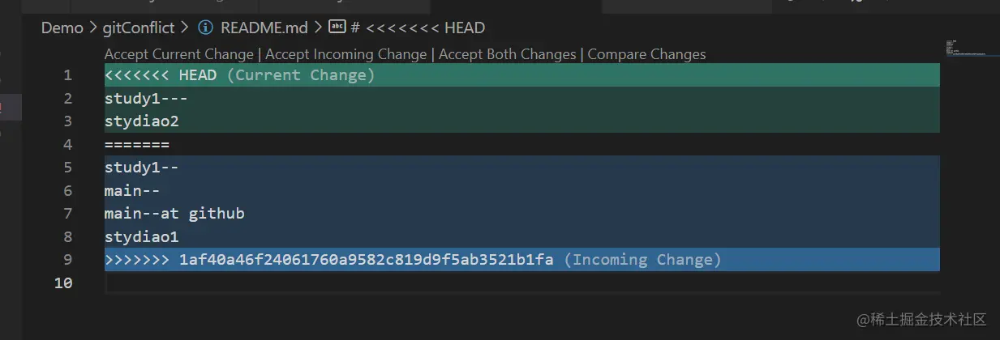
  其中：冲突标记<<<<<<< （7个<）与=======之间的内容是之前的，=======与>>>>>>>之间的内容是新合进来的。  

  最简单的办法，就是直接编辑冲突了的文件，把冲突标记删掉，把想要保留的代码留下，把冲突解决。
- VScode提供的选项
  - 分别对应3种解决方案：保留当前的改变、保留引入的改变、保留全部
  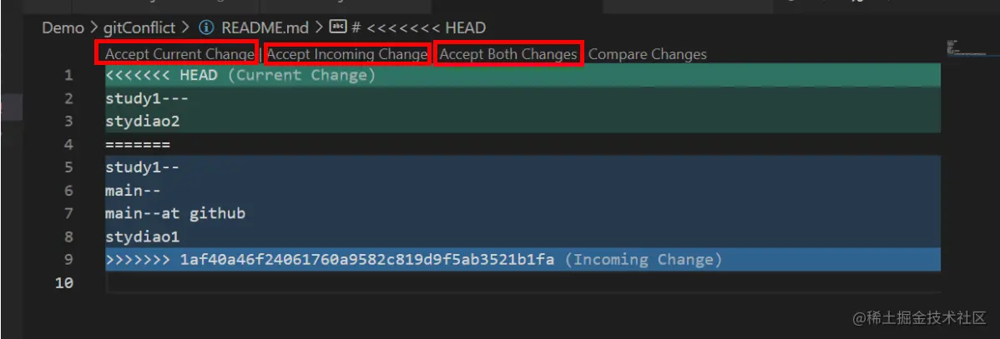


