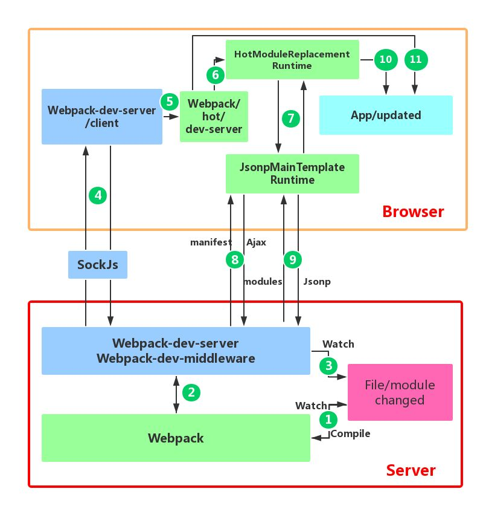

# Webpack热更新原理解析

Hot Module Replacement（以下简称 HMR）  
[Webpack HMR 原理解析](https://zhuanlan.zhihu.com/p/30669007)

## 为什么需要HMR
在 webpack HMR 功能之前，已经有很多 live reload 的工具或库，比如 live-server，这些库监控文件的变化，然后通知浏览器端刷新页面，那么我们为什么还需要 HMR 呢？  
- live reload 工具并不能够保存应用的状态（states），当刷新页面后，应用之前<Te d>状态丢失</Te>，例如，点击按钮出现弹窗，当浏览器刷新后，弹窗也随即消失，要恢复到之前状态，还需再次点击按钮。而 webapck HMR 则不会刷新浏览器，而是运行时对模块进行热替换，保证了应用状态不会丢失，提升了开发效率。
- 在古老的开发流程中，我们可能需要手动运行命令对代码进行打包，并且打包后再手动刷新浏览器页面，而这一系列重复的工作都可以通过 HMR <Te d>工作流</Te>来自动化完成，让更多的精力投入到业务中，而不是把时间浪费在重复的工作上。
- HMR 兼容市面上大多前端框架或库，比如 React Hot Loader，Vue-loader，能够监听 React 或者 Vue 组件的变化，实时将最新的组件更新到浏览器端。

## 疑问
1. 使用webpack HMR (即通常的npm run dev模式) 进行开发的过程中，bundle 文件或者几个 chunk 文件<Te d>没有在 dist 目录</Te>中找到，它们去哪呢？
2. 通过查看 webpack-dev-server (作为本地静态资源服务器使用) 的 package.json 文件，我们知道其依赖于 webpack-dev-middleware 库，那么 webpack-dev-middleware 在 HMR 过程中扮演什么角色？(<Te d>webpack-dev-middleware 干嘛的</Te>)
3. 使用 HMR 的过程中，通过 Chrome 开发者工具我知道浏览器是通过 websocket 和 webpack-dev-server 进行通信的，但是 websocket 的 message 中并没有发现新模块代码。打包后的新模块又是通过什么方式发送到浏览器端的呢？为什么新的模块不通过 websocket 随消息一起发送到浏览器端呢？(<Te d>浏览器是怎么拿到最新的模块代码的</Te>)
4. 浏览器拿到最新的模块代码，HMR 又是怎么将老的模块替换成新的模块，在替换的过程中怎样处理模块之间的依赖关系？(<Te d>浏览器是怎么更新模块代码的</Te>)
5. es6 转化为es5 的 import 和 export 是怎么转化的。[es6模块化代码转es5代码的模样](./es6toes5.md)
6. 当模块的热替换过程中，如果替换模块失败，有什么<Te d>回退机制</Te>吗？

## 流程总结
1. webpack-dev-server 的 webpack-dev-middleware 通过 webpack 监听 文件代码，webpack-dev-server 监听静态资源文件；
2. 静态资源文件变化，webpack-dev-server 通知浏览器进行刷新；
3. 文件代码变化，webpack-dev-middleware 则通知webpack重新编译构建，并存以对象形式到内存中；
4. webpack-dev-server 使用webSocket通知HMR runtime 需要热更新；
5. HMR运行时通过ajsx请求一个 json，该 json 包含了所有要更新的模块的 hash 值；
6. HMR运行时通过jsonp请求要更新的模块代码；
7. HMR运行时替换更新中的模块，如果确定这些模块无法更新，则触发整个页面刷新。

## HMR 工作流程图解
webpack 配合 webpack-dev-server 进行应用开发的模块热更新流程图
- **底部红色**框内是服务端
- **橙色框**是浏览器端
- **绿色的方框**是 webpack 代码控制的区域
- **蓝色方框**是 webpack-dev-server 代码控制的区域
- **洋红色的方框**是文件系统，文件修改后的变化就发生在这
- **青色的方框**是应用本身
  

## HMR 工作流程图解详解
1. **第一步**，在 webpack 的 watch 模式下，文件系统中某一个文件发生修改，webpack 监听到文件变化，根据配置文件对模块重新编译打包，并将打包后的代码通过简单的 JavaScript 对象保存在内存中。
   > 1. webpack <Te d>监听</Te>文件
   > 2. 文件被<Te d>修改</Te>，<Te d>通知</Te>webpack
   > 3. webpack对模块(一模块一文件)进行<Te d>重新编译打包</Te>
   > 4. 将打包后的代码以js对象<Te d>保存在内存</Te>中，格式：key: value，key是文件路径，value是闭包函数，函数内容是eval('编译后的模块代码')。
2. **第二步**是 webpack-dev-server 和 webpack 之间的接口交互，而在这一步，主要是 dev-server 的中间件 webpack-dev-middleware 和 webpack 之间的交互，webpack-dev-middleware 调用 webpack 暴露的 API对代码变化进行监控，并且告诉 webpack，将代码打包到内存中。
   > 1. webpack-dev-middleware 调用 webpack 暴露的 API对代码变化进行<Te d>监控</Te>
   > 2. 代码变化时，告诉 webpack，将代码<Te d>打包到内存</Te>中

   > *webpack 对文件进行监听和打包的指令发起于webpack-dev-middleware*
3. **第三步**是 webpack-dev-server 对文件变化的一个监控，这一步<Te d>**不同于第一步**</Te>，并不是监控代码变化重新打包。当我们在配置文件中配置了devServer.watchContentBase 为 true 的时候，Server 会监听这些配置文件夹中<Te d>静态文件的变化</Te>(静态资源文件变化，devServer.contentBase 指定的文件夹)，变化后会通知浏览器端对应用进行 live reload。注意，这儿是浏览器刷新，和 HMR 是两个概念（不是热更新，是直接刷新浏览器）。
   > 1. webpack-dev-server <Te d>监听</Te>静态资源文件变化
   > 2. 有变化时<Te d>通知</Te>浏览器刷新 
4. **第四步**也是 webpack-dev-server 代码的工作，该步骤主要是通过 sockjs（webpack-dev-server 的依赖）在浏览器端和服务端之间建立一个 websocket 长连接，将 webpack 编译打包的各个阶段的状态信息告知浏览器端，同时也包括第三步中 Server 监听静态文件变化的信息。浏览器端根据这些 socket 消息进行不同的操作。当然服务端传递的最主要信息还是新模块的 hash 值，后面的步骤根据这一 hash 值来进行模块热替换。
   > 1. webpack-dev-server 与 浏览器之间<Te d>建立 websocket 长连接</Te>
   > 2. webpack-dev-server <Te d>通知</Te>浏览器 webpack 编译打包的各个阶段的状态信息 和 server中静态资源文件的变化信息。服务端传递的最主要信息还是新模块的 hash 值
   > 3. 浏览器将根据这些信息进行live reload 或者 hmr
5. **第五步**webpack-dev-server/client 端并不能够请求更新的代码，也不会执行热更模块操作，而把这些工作又交回给了 webpack，webpack/hot/dev-server 的工作就是根据 webpack-dev-server/client 传给它的信息以及 dev-server 的配置决定是刷新浏览器呢还是进行模块热更新。当然如果仅仅是刷新浏览器，也就没有后面那些步骤了。
   > webpack/hot/dev-server(在浏览器端的功能，注意与webpack-dev-server区分)根据信息信息<Te d>决定是live reload 还是 hmr</Te>

   > 如果是live reload 则没有接下来的步骤了

   > 如果是hmr 则往下继续走
6. **第六、七、八、九 步骤** HotModuleReplacement.runtime 是客户端 HMR 的中枢，它接收到上一步传递给他的新模块的 hash 值，它通过 JsonpMainTemplate.runtime 向 server 端发送 Ajax 请求，服务端返回一个 json，该 json 包含了所有要更新的模块的 hash 值，获取到更新列表后，该模块再次通过 jsonp 请求，获取到最新的模块代码。
   > 1. webpack/hot/dev-server <Te d>通知</Te> HotModuleReplacement.runtime 新模块的hash值
   > 2. HotModuleReplacement.runtime 通过 JsonpMainTemplate.runtime 向 server 端发送 <Te d>Ajax 请求</Te>，服务端返回一个 json，该 json 包含了所有要更新的模块的 hash 值
   > 3. HotModuleReplacement.runtime 通过<Te d> jsonp 请求</Te>，获取到最新的模块代码
7. **第十步**是决定 HMR 成功与否的关键步骤，在该步骤中，HotModulePlugin 将会对<Te d>新旧模块</Te>进行对比，决定是否更新模块，在决定更新模块后，检查模块之间的依赖关系，更新模块的同时更新模块间的依赖引用。
8. **最后一步**，当 HMR 失败后，<Te d>回退</Te>到 live reload 操作，也就是进行浏览器刷新来获取最新打包代码。

### 补充解惑
##### 1. 为什么 webpack 没有将文件直接打包到 output.path 目录(dist)下呢？文件又去了哪儿？
webpack 将 bundle.js 文件打包到了内存中，不生成文件的原因就在于访问内存中的代码比访问文件系统中的文件更快，而且也减少了代码写入文件的开销，这一切都归功于memory-fs，memory-fs 是 webpack-dev-middleware 的一个依赖库，webpack-dev-middleware 将 webpack 原本的 outputFileSystem 替换成了MemoryFileSystem 实例，这样代码就将输出到内存中。