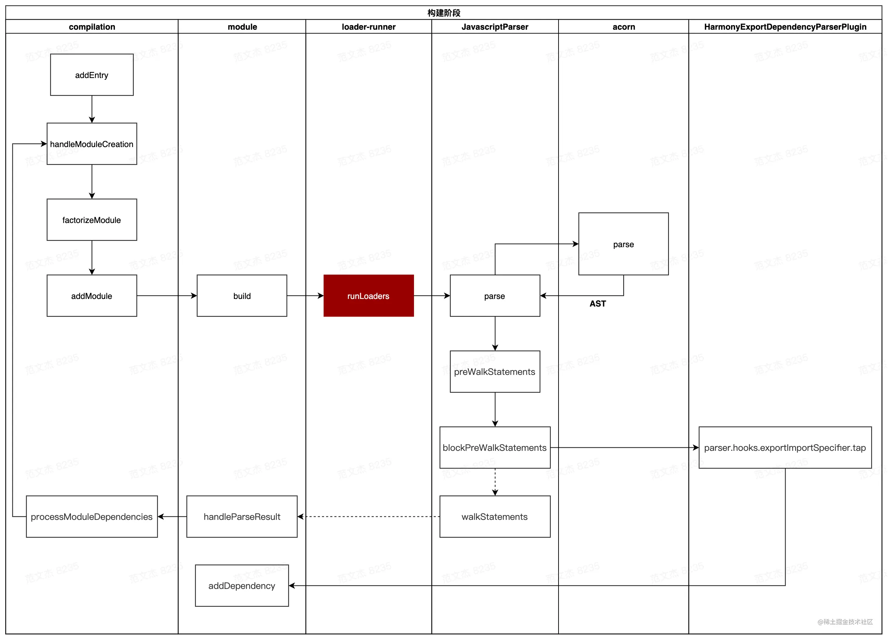

# webpack loader

### 生效的位置
loader在编译流程中的生效的位置  

流程图中， `runLoaders` 会调用用户所配置的 loader 集合读取、转译资源，此前的内容可以千奇百怪，但转译之后理论上应该输出标准 JavaScript 文本或者 AST 对象，webpack 才能继续处理模块依赖。  

loader 的职责不外乎是将内容 A 转化为内容 B，但是在具体用法层面还挺多讲究的，有 pitch、pre、post、inline 等概念用于应对各种场景。

### 案例
[Webpack 案例 —— vue-loader 原理分析](https://juejin.cn/post/6937125495439900685)

### loader执行流程