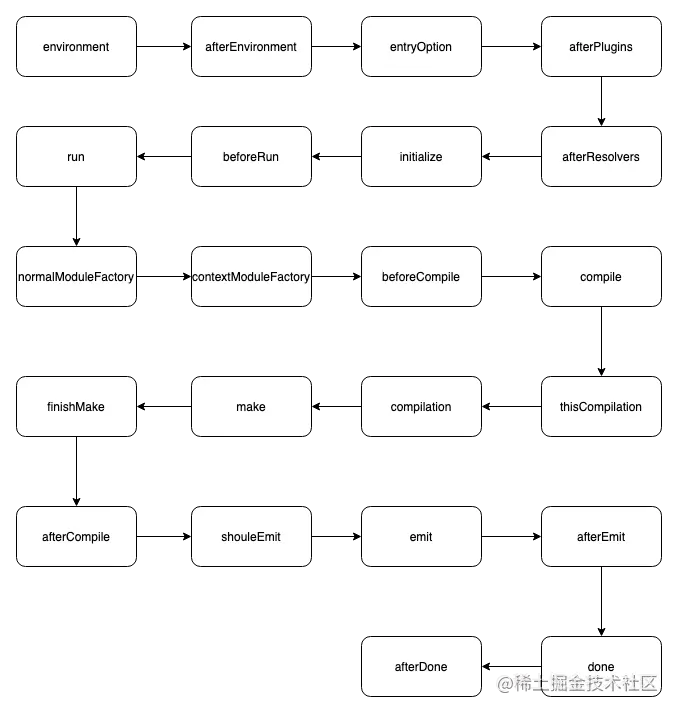
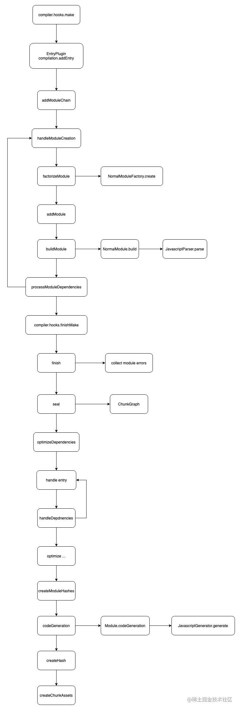

<TitleList></TitleList>

# webpack plugin插件

### 插件三问
- WHAT: 什么是插件
- WHEN: 什么时间点会有什么钩子被触发
- HOW: 在钩子回调中，如何影响编译状态

### 什么是插件
webpack 的插件架构类似“事件/订阅”模式，但又不完全一样。  

订阅模式是一种**松耦合架构**，发布器只是在特定时机发布事件消息，订阅者并不或者很少与事件直接发生交互，**很少调用上下文**操作。  

webpack 的钩子体系是一种**强耦合架构**，它在特定时机触发钩子时会**附带**上足够的**上下文信息**，插件定义的钩子回调中，能也只能与这些上下文背后的数据结构、接口交互**产生 side effect**，进而**影响到编译状态和后续流程**。
###### 插件的形态
从形态上看，插件通常是一个带有 apply 函数的类
```js
class SomePlugin {
  apply(compiler) {
  }
}
```

`apply` 函数运行时会得到参数 `compiler` ，以此为<Te d>起点</Te>可以调用 hook 对象<Te d>注册(监听)</Te>各种钩子回调，例如： `compiler.hooks.make.tapAsync` ，这里面 make 是钩子名称，tapAsync 定义了钩子的调用方式，webpack 的插件架构基于这种模式构建而成，插件开发者可以使用这种模式在钩子回调中，插入特定代码。  

webpack 各种内置对象都带有 hooks 属性，比如 `compilation` 对象(<Te d>不止compiler带有hooks属性</Te>)
```js
class SomePlugin {
  apply(compiler) {
      compiler.hooks.thisCompilation.tap('SomePlugin', (compilation) => {
          compilation.hooks.optimizeChunkAssets.tapAsync('SomePlugin', ()=>{});
      })
  }
}
```
钩子的核心逻辑定义在 [Tapable](https://github.com/webpack/tapable) 仓库，内部定义了如下类型的钩子
```js
const {
  SyncHook,
  SyncBailHook,
  SyncWaterfallHook,
  SyncLoopHook,
  AsyncParallelHook,
  AsyncParallelBailHook,
  AsyncSeriesHook,
  AsyncSeriesBailHook,
  AsyncSeriesWaterfallHook
 } = require("tapable");
```
不同类型的钩子根据其并行度、熔断方式、同步异步，调用方式会略有不同，插件开发者需要根据这些的特性，编写不同的交互逻辑

### 什么时候会触发钩子
源码里面有237个钩子，但官网只介绍了不到100个，且官网对每个钩子的说明都太简短   

###### 钩子示例 

- `compiler.hooks.compilation` ：
  - 时机：启动编译创建出 compilation 对象后触发
  - 参数：当前编译的 compilation 对象
  - 示例：很多插件基于此事件获取 compilation 实例
- `compiler.hooks.make`：
  - 时机：正式开始编译时触发
  - 参数：同样是当前编译的 compilation 对象
  - 示例：webpack 内置的 EntryPlugin 基于此钩子实现 entry 模块的初始化
- `compilation.hooks.optimizeChunks` ：
  - 时机： seal 函数中，chunk 集合构建完毕后触发
  - 参数：chunks 集合与 chunkGroups 集合
  - 示例： SplitChunksPlugin 插件基于此钩子实现 chunk 拆分优化
- `compiler.hooks.done`：
  - 时机：编译完成后触发
  - 参数： stats 对象，包含编译过程中的各类统计信息
  - 示例： webpack-bundle-analyzer 插件基于此钩子实现打包分析

### 钩子学习三要素
- 触发时机
- 传递参数
- 示例代码

#### 触发时机
触发时机与 webpack 工作过程紧密相关，大体上从启动到结束，compiler 对象逐次触发如下钩子
###### compiler钩子触发顺序 

###### compilation钩子触发顺序 
而 compilation 对象逐次触发

###### compiler与compilation顺序
从上图可以看到，`compiler.hooks.make` 执行之后，就进入 `compilation.addEntry` 入口 直到 `compilation.processModuleDependencies` 退出 **compilation 阶段** 将执行权交还给 **compiler**， compiler 从 `compiler.hooks.finishMake` 开始执行剩下的生命周期。  

`compilation.processModuleDependencies` 依据上下文情况有可能调用 `compilation.addEntry` 进入 **compilation 阶段**的<Te d>循环</Te>  

#### 参数
传递参数与具体的钩子强相关  

**示例**  

`compilation.hooks.optimizeTree`  可以在 webpack 源码中搜索 hooks.optimizeTree.call 关键字，就可以找到调用代码
```js
// lib/compilation.js#2297
this.hooks.optimizeTree.callAsync(this.chunks, this.modules, err => {
});
```
结合代码所在的上下文，可以判断出此时传递的是经过优化的 **chunks** 及 **modules** 集合。

#### 找到示例
Webpack 的钩子复杂程度不一，我认为最好的学习方法还是带着目的去查询其他插件中如何使用这些钩子。例如，在 `compilation.seal` 函数内部有 **optimizeModules** 和 **afterOptimizeModules** 这一对看起来很对偶的钩子，optimizeModules 从字面上可以理解为用于优化已经编译出的 modules ，那 afterOptimizeModules 呢？  

从 webpack 源码中唯一搜索到的用途是 ProgressPlugin ，大体上逻辑如下
```js
compilation.hooks.afterOptimizeModules.intercept({
  name: "ProgressPlugin",
  call() {
    handler(percentage, "sealing", title);
  },
  done() {
    progressReporters.set(compiler, undefined);
    handler(percentage, "sealing", title);
  },
  result() {
    handler(percentage, "sealing", title);
  },
  error() {
    handler(percentage, "sealing", title);
  },
  tap(tap) {
    // p is percentage from 0 to 1
    // args is any number of messages in a hierarchical matter
    progressReporters.set(compilation.compiler, (p, ...args) => {
      handler(percentage, "sealing", title, tap.name, ...args);
    });
    handler(percentage, "sealing", title, tap.name);
  }
});
```
基本上可以猜测出，**afterOptimizeModules** 的设计初衷就是用于通知优化行为的结束  

**apply** 虽然是一个函数，但是从设计上就只有输入，webpack <Te d>不 care 输出</Te>，所以在插件中<Te d>只能通过</Te>调用**类型实体**的各种**方法**来或者更改实体的**配置信息**，变更编译行为。例如  

- compilation.addModule ：添加模块，可以在原有的 module 构建规则之外，添加自定义模块
- compilation.emitAsset：直译是“提交资产”，功能可以理解将内容写入到特定路径

### 如何影响编译状态
webpack 的插件体系与平常所见的 订阅/发布 模式差别很大，是一种非常强耦合的设计，hooks 回调由 webpack 决定何时，以何种方式执行；而在 hooks 回调内部可以通过修改状态、调用上下文 api 等方式对 webpack 产生 <Te d>side effect</Te>。
###### 示例
EntryPlugin 插件
```js
class EntryPlugin {
  apply(compiler) {
    compiler.hooks.compilation.tap(
      "EntryPlugin",
      (compilation, { normalModuleFactory }) => {
        compilation.dependencyFactories.set(
          EntryDependency,
          normalModuleFactory
        );
      }
    );

    compiler.hooks.make.tapAsync("EntryPlugin", (compilation, callback) => {
      const { entry, options, context } = this;

      const dep = EntryPlugin.createDependency(entry, options);
      compilation.addEntry(context, dep, options, (err) => {
        callback(err);
      });
    });
  }
}
```
上述代码片段调用了两个影响 compilation 对象状态的接口：  
- compilation.dependencyFactories.set
- compilation.addEntry  

操作的具体含义可以先忽略，这里要理解的重点是，webpack 会将上下文信息以<Te d>参数</Te>或 <Te d>this (compiler 对象)</Te> 形式**传递**给钩子回调，在回调中可以调用上下文对象的方法或者直接修改上下文对象属性的方式，对原定的流程产生 side effect。所以想纯熟地编写插件，除了要理解调用时机，还需要了解我们可以用哪一些api  

**例如**  

- compilation.addModule：添加模块，可以在原有的 module 构建规则之外，添加自定义模块
- compilation.emitAsset：直译是“提交资产”，功能可以理解将内容写入到特定路径
- compilation.addEntry：添加入口，功能上与直接定义 entry 配置相同
- module.addError：添加编译错误信息