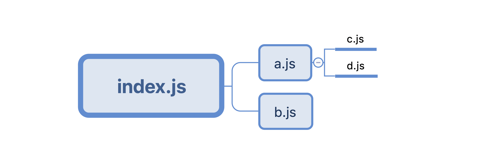
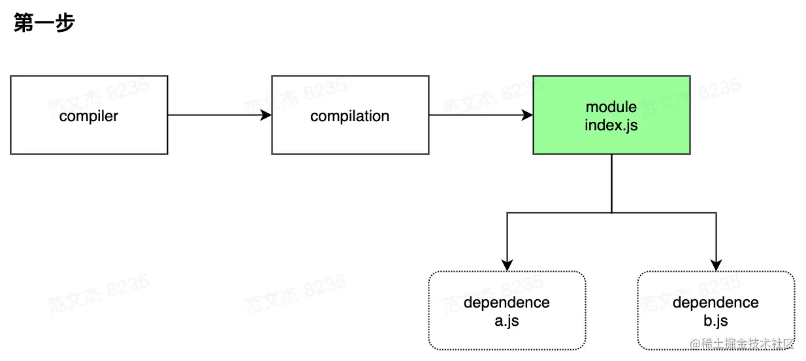
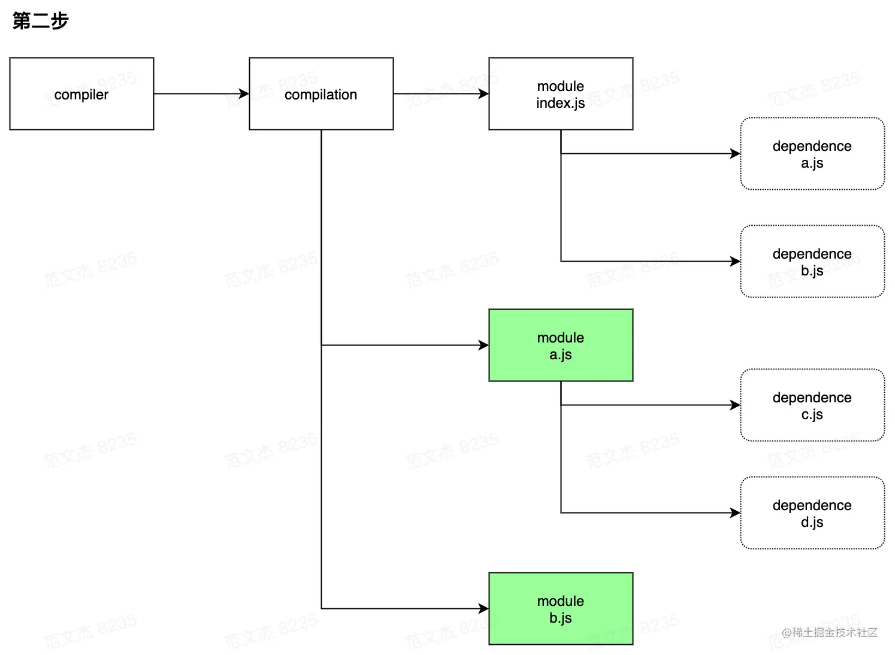
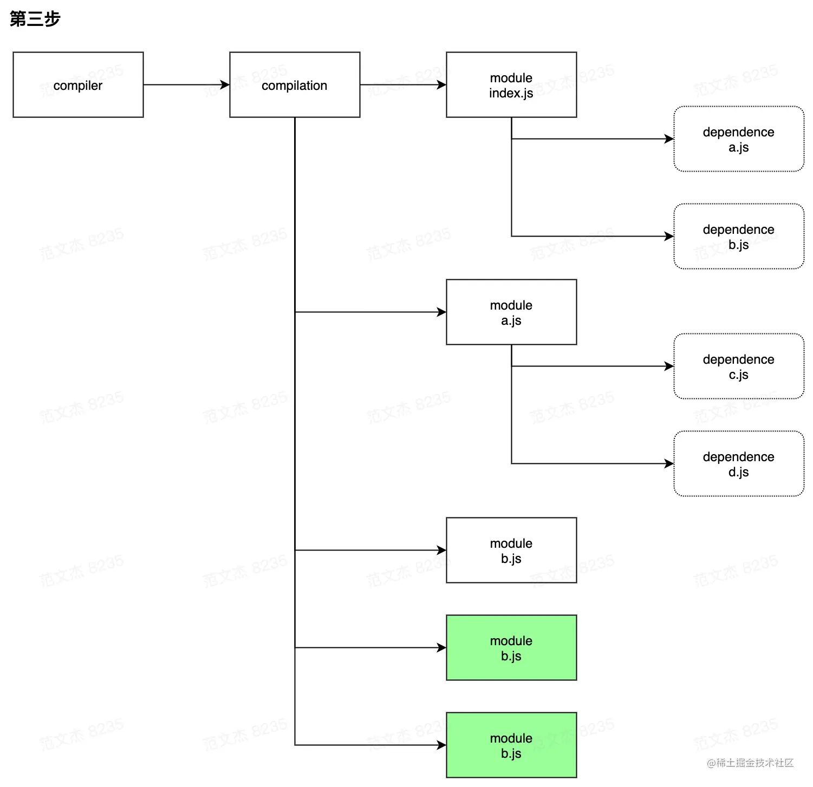
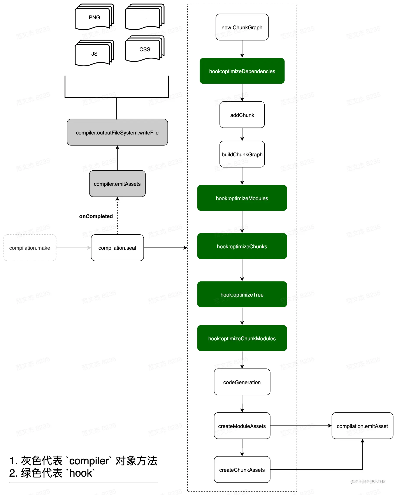
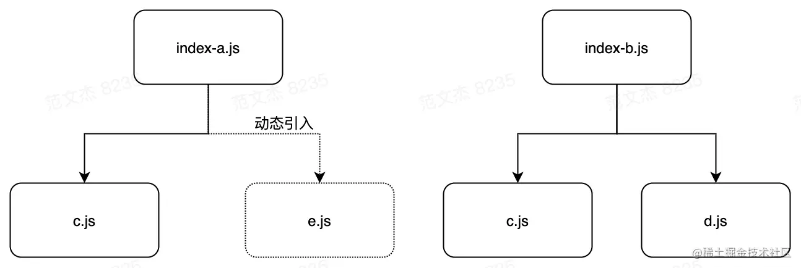
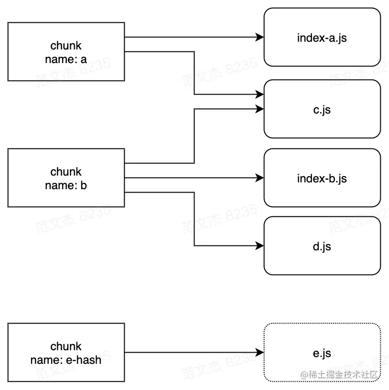
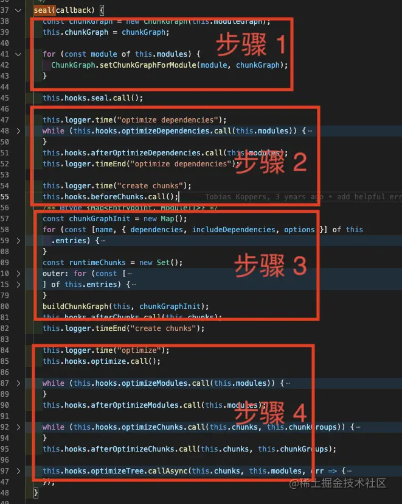
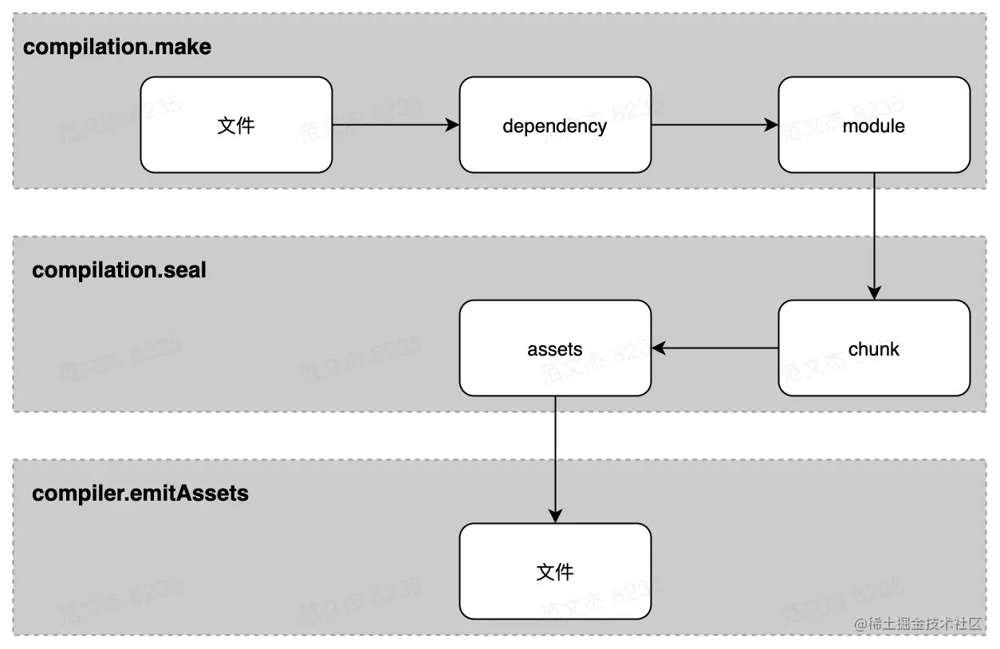

<TitleList></TitleList>

# Webpack基本知识

### 背景
5.0版本之后，webpack的功能集变得非常庞大，包括：模块打包、代码分割、按需加载、HMR、Tree-shaking、文件监听、sourcemap、Module Federation、devServer、DLL、多进程等等。为了实现这些功能，webpack 的代码量已经到了惊人的程度：
- 498 份JS文件
- 18862 行注释
- 73548 行代码
- 54 个 module 类型
- 69 个 dependency 类型
- 162 个内置插件
- 237 个hook

在这个数量级下，源码的阅读、分析、学习成本非常高，加上 webpack 官网语焉不详的文档，导致 webpack 的学习、上手成本极其高。为此，社区围绕着 Webpack 衍生出了各种手脚架，比如 vue-cli、create-react-app，解决“用”的问题。

### webpack的主体框架
- 构建的核心流程
- loader 的作用
- plugin 架构与常用套路  

以上三者协作构成webpack的主体框架：


### webpack核心流程
###### 最核心的功能
将各种类型的资源，包括`图片`、`css`、`js`等，转译、组合、拼接、<Te d>生成 JS 格式的 bundler 文件</Te>
功能如他的图片所示：

这个过程核心完成了 `内容转换` + `资源合并` 两种功能，实现上包含三个阶段：  

###### 执行的三个阶段

**<Te w>单次构建过程自上而下按顺序执行</Te>**  

- 初始化阶段
  - 「初始化参数」：从配置文件、 配置对象、Shell 参数中读取，与默认配置结合**得出最终的参数**
  - 「创建编译器对象」：用上一步得到的参数创建 <Te d>Compiler</Te> 对象
  - 「初始化编译环境」：包括注入内置插件、注册各种模块工厂、初始化 RuleSet 集合、加载配置的插件等
  - 「开始编译」：执行 compiler 对象的 <Te d>run</Te> 方法
  - 「确定入口」：根据配置中的 <Te d>entry</Te> 找出所有的入口文件，调用 <Te d>compilition.addEntry</Te> 将入口文件转换为 <Te d>dependence</Te> 对象
- 构建阶段
  - 「编译模块(make)」：根据 **entry** 对应的 **dependence** 创建 <Te d>module</Te> 对象，调用 <Te d>loader</Te> 将模块转译为标准 JS 内容，调用 JS 解释器将内容转换为 AST 对象，从中找出该模块依赖的模块，再 递归 本步骤直到所有入口依赖的文件都经过了本步骤的处理
  - 「完成模块编译」：上一步递归处理所有能触达到的模块后，得到了每个模块**被翻译后**的内容以及它们之间的 **依赖关系图**
- 生成阶段
  - 「输出资源(seal)」：根据入口和模块之间的依赖关系，组装成一个个**包含多个模块**的 <Te d>Chunk</Te>，再把每个 Chunk 转换成**一个单独的文件**加入到输出列表，这步是可以修改输出内容的最后机会
  - 「写入文件系统(emitAssets)」：在确定好输出内容后，根据配置确定输出的路径和文件名，把文件内容写入到文件系统  

###### 技术名词简介
- `Entry`：编译入口，webpack 编译的起点
- `Compiler`：编译管理器，webpack 启动后会创建 compiler 对象，该对象<Te d>一直存活</Te>直到结束退出
- `Compilation`：单次编辑过程的管理器，比如 watch = true 时，运行过程中只有一个 compiler 但每次文件变更触发重新编译时，都会创建一个新的 compilation 对象
- `Dependence`：依赖对象，webpack 基于该类型记录模块间依赖关系
- `Module`：webpack 内部所有资源都会以“module”对象形式存在，所有关于资源的操作、转译、合并都是以 “module” 为基本单位进行的
- `Chunk`：编译完成准备输出时，webpack 会将 module 按特定的规则组织成一个一个的 chunk，这些 chunk 某种程度上跟最终输出一一对应
- `Loader`：资源内容转换器，其实就是实现从内容 A 转换 B 的转换器
- `Plugin`：webpack构建过程中，会在特定的时机广播对应的事件，插件监听这些事件，在特定时间点介入编译过程  

#### 初始化阶段
###### webpack的初始化过程

**流程解释**  

- 将 `process.args` + `webpack.config.js` 合并成用户配置
- 调用 `validateSchema` 校验配置
- 调用 `getNormalizedWebpackOptions `+ `applyWebpackOptionsBaseDefaults` 合并出最终配置
- 创建 `compiler` 对象
- 遍历用户定义的 `plugins` 集合，执行插件的 `apply` 方法
- 调用 `new WebpackOptionsApply().process` 方法，加载各种内置插件  

主要逻辑集中在 `WebpackOptionsApply` 类，webpack <Te d>内置了</Te>数百个**插件**，这些插件并<Te d>不需要</Te>我们手动配置，WebpackOptionsApply 会在初始化阶段根据配置内容<Te d>动态注入</Te>对应的**插件**，包括：  
- 注入 `EntryOptionPlugin` 插件，处理 `entry` 配置
- 根据 `devtool` 值判断后续用那个**插件**处理 `sourcemap`，可选值：
  - EvalSourceMapDevToolPlugin
  - SourceMapDevToolPlugin
  - EvalDevToolModulePlugin
- 注入 RuntimePlugin ，用于根据代码内容动态注入 webpack 运行时  

到这里，`compiler` 实例就**被创建**出来了，相应的**环境参数**也预设好了，紧接着开始调用 `compiler.compile` 函数：
```js
// 取自 webpack/lib/compiler.js 
compile(callback) {
  const params = this.newCompilationParams();
  this.hooks.beforeCompile.callAsync(params, err => {
    // ...
    const compilation = this.newCompilation(params);
    this.hooks.make.callAsync(compilation, err => {
      // ...
      this.hooks.finishMake.callAsync(compilation, err => {
        // ...
        process.nextTick(() => {
          compilation.finish(err => {
            compilation.seal(err => {...});
          });
        });
      });
    });
  });
}
```
Webpack 架构很灵活，但代价是牺牲了源码的直观性，比如说上面说的**初始化流程**，从创建 `compiler` 实例到调用 `make` 钩子，逻辑链路很长：  

- 启动 webpack ，触发 lib/webpack.js 文件中 `createCompiler` 方法
- `createCompiler` 方法内部调用 `WebpackOptionsApply` 插件
- `WebpackOptionsApply` 定义在 lib/WebpackOptionsApply.js 文件，内部根据 `entry` 配置决定注入 `entry` 相关的插件，包括：`DllEntryPlugin`、`DynamicEntryPlugin`、`EntryPlugin`、`PrefetchPlugin`、`ProgressPlugin`、`ContainerPlugin`
- `Entry` 相关插件，如 lib/EntryPlugin.js 的 `EntryPlugin` 监听 `compiler.make` 钩子
- lib/compiler.js 的 `compile` 函数内调用 `this.hooks.make.callAsync`
- 触发 `EntryPlugin` 的 `make` 回调，在回调中执行 `compilation.addEntry` 函数
- `compilation.addEntry` 函数内部经过一坨与主流程无关的 `hook` 之后，再调用 `handleModuleCreate` 函数，正式开始构建内容

###### 初始化流程总结
这个过程**需要**在 webpack 初始化的时候**预埋下**各种插件，经历 4 个文件，7次跳转才开始进入主题，前置流程非常长。

#### 构建阶段
###### 思考题
- Webpack 编译过程会将源码解析为 AST 吗？webpack 与 babel 分别实现了什么？
- Webpack 编译过程中，如何识别资源对其他资源的依赖？
- 相对于 grunt、gulp 等流式构建工具，为什么 webpack 会被认为是新一代的构建工具？  

##### 基本流程
构建阶段从 `entry` 开始递归解析资源与资源的依赖，在 `compilation` 对象内逐步构建出 `module` 集合以及 `module` 之间的依赖关系  

###### 构建阶段核心流程

**流程解释**  
构建阶段从入口文件开始：  

- 调用 `handleModuleCreate` ，根据文件类型构建 `module` 子类
- 调用 `loader-runner` 仓库的 `runLoaders` 转译 `module` 内容，通常是从各类资源类型转译为 JavaScript 文本
- 调用 `acorn` 将 JS 文本解析为AST
- 遍历 AST，触发各种钩子
  - 在 `HarmonyExportDependencyParserPlugin` 插件监听 `exportImportSpecifier` 钩子，解读 JS 文本对应的资源依赖
  - 调用 `module` 对象的 `addDependency` 将依赖对象加入到 `module` 依赖列表中
- AST 遍历完毕后，调用 `module.handleParseResult` 处理模块依赖
- 对于 module 新增的依赖，调用 `handleModuleCreate` ，控制流回到第一步
- 所有依赖都解析完毕后，构建阶段结束  

这个过程中数据流  
**module => ast => dependences => module** 先转 AST 再从 AST 找依赖  

这就要求 `loaders` 处理完的最后结果必须是可以被 `acorn` 处理的**标准 JavaScript 语法**，比如说对于图片，需要从图像二进制转换成类似于 `export default "data:image/png;base64,xxx"` 这类 base64 格式或者 `export default "http://xxx"` 这类 url 格式。  

`compilation` 按这个流程递归处理，逐步解析出每个模块的内容以及 module 依赖关系，后续就可以根据这些内容打包输出。

###### 构建示例：层级递进
**场景**：假如有如下图所示的文件依赖树

文件说明：其中 index.js 为 entry 文件，依赖于 a/b 文件；a 依赖于 c/d 文件。  

初始化编译环境之后，`EntryPlugin` 根据 `entry` 配置找到 `index.js` 文件，调用 `compilation.addEntry` 函数触发构建流程，构建完毕后内部会生成这样的数据结构：


此时得到 **module[index.js]** 的内容以及对应的依赖对象 **dependence[a.js]** 、**dependence[b.js]** 。这就得到下一步的<Te d>线索</Te>：a.js、b.js，根据上面流程图的逻辑继续调用 `module[index.js]` 的 `handleParseResult` 函数，继续处理 a.js、b.js 文件，<Te d>递归</Te>上述流程，进一步得到 a、b 模块：


从 a.js 模块中又解析到 c.js/d.js 依赖，于是再再继续调用 **module[a.js]** 的 **handleParseResult** ，再再<Te d>递归</Te>上述流程：


到这里解析完所有模块后，发现没有更多新的依赖，就可以继续推进，进入下一步。

###### 问题解答  
- Webpack 编译过程会将源码解析为 AST 吗？
  - 构建阶段会读取源码，解析为 AST 集合。
- webpack 与 babel 分别实现了什么？
  - Webpack 读出 AST 之后仅遍历 AST 集合；babel 则对源码做等价转换(实现ast与code之间的互相转换)
- Webpack 编译过程中，如何识别资源对其他资源的依赖？
  - Webpack 遍历 AST 集合过程中，**识别** require/ import 之类的导入语句，确定模块对其他资源的依赖关系
- 相对于 grant、gulp 等流式构建工具，为什么 webpack 会被认为是新一代的构建工具？
  - Grant、Gulp 仅执行开发者预定义的任务流；而 webpack 则深入处理资源的内容，功能上更强大

#### 生成阶段
###### 基本流程
构建阶段围绕 **module** 展开，生成阶段则围绕 **chunks** 展开。经过构建阶段之后，webpack 得到足够的**模块内容**与**模块关系**信息，接下来开始生成最终资源了。代码层面，就是开始执行 `compilation.seal` 函数：
```js
// 取自 webpack/lib/compiler.js 
compile(callback) {
  const params = this.newCompilationParams();
  this.hooks.beforeCompile.callAsync(params, err => {
    // ...
    const compilation = this.newCompilation(params);
    this.hooks.make.callAsync(compilation, err => {
      // ...
      this.hooks.finishMake.callAsync(compilation, err => {
        // ...
        process.nextTick(() => {
          compilation.finish(err => {
            **compilation.seal**(err => {...});
          });
        });
      });
    });
  });
}
```
`seal` 原意**密封**、**上锁**，seal 函数主要完成从 module 到 chunks 的转化，核心流程：

###### 流程梳理
- 构建本次编译的 `ChunkGraph` 对象；
- 遍历 `compilation.modules` 集合，将 **module** 按 **entry/动态引入** 的规则分配给不同的 `Chunk` <Te d>对象</Te>；
- `compilation.modules` 集合遍历完毕后，得到完整的 `chunks` 集合对象，调用 `createXxxAssets` 方法
- `createXxxAssets` 遍历 **module/chunk** ，调用 `compilation.emitAssets` 方法将资源 assets 信息记录到 `compilation.assets` 对象中
- 触发 `seal` 回调，控制流回到 `compiler` 对象  

###### chunk对象封装规则
这一步的关键逻辑是将 module 按规则组织成 chunks <Te d>对象</Te>，webpack 内置的 chunk 封装规则比较简单：  
- **entry** 及 entry **触达**到的模块，组合成一个 chunk
- 使用<Te d>动态引入语句</Te>引入的模块，<Te d>各自组合</Te>成一个 chunk

###### 多入口打包示例
以下是两个入口的配置示例
```js
const path = require("path");

module.exports = {
  mode: "development",
  context: path.join(__dirname),
  entry: {
    a: "./src/index-a.js",
    b: "./src/index-b.js",
  },
  output: {
    filename: "[name].js",
    path: path.join(__dirname, "./dist"),
  },
  devtool: false,
  target: "web",
  plugins: [],
};
```
实例配置中有两个入口，对应的文件结构：

index-a 依赖于c，且动态引入了 e；index-b 依赖于 c/d 。根据上面说的规则  
- **entry 及entry触达到的模块，组合成一个 chunk**
- **使用动态引入语句引入的模块，各自组合成一个 chunk**  

生成的 chunks 结构为：

也就是根据依赖关系，**chunk[a]** 包含了 **index-a/c** <Te d>两个</Te>模块；**chunk[b]** 包含了 **c/index-b/d** <Te d>三个</Te>模块；**chunk[e-hash]** 为<Te d>动态引入</Te> **e** 对应的 chunk。  

chunk[a] 与 chunk[b] 同时包含了 c，如果 c 是基础库且代码量很大，那么 chunk[a] 与 chunk[b] 同时都包含 c 就造成资源<Te d>冗余</Te>，浪费资源。  

###### 优化chunks结构
为了解决这个问题，webpack 提供了一些插件如 `CommonsChunkPlugin` 、`SplitChunksPlugin`，在基本规则之外进一步优化 chunks 结构。
###### SplitChunksPlugin的作用

**SplitChunksPlugin** 是 webpack 架构高扩展的一个绝好的示例，我们上面说了 webpack 主流程里面是按 entry / 动态引入 两种情况组织 chunks 的，这必然会引发一些不必要的重复打包，webpack 通过插件的形式解决这个问题。  

回顾 `compilation.seal `函数的代码，大致上可以梳理成这么4个步骤：  
- 遍历 `compilation.modules` ，记录下模块与 **chunk** 关系
- 触发各种模块优化钩子，这一步优化的主要是模块依赖关系
- 遍历 **module** 构建 chunk 集合
- 触发各种优化钩子


上面 1-3 都是预处理 + chunks 默认规则的实现，不在我们讨论范围，这里重点关注第4个步骤触发的 `optimizeChunks` 钩子，这个时候已经跑完主流程的逻辑，得到 **chunks 集合**，`SplitChunksPlugin` 正是使用这个钩子，分析 chunks 集合的内容，**按配置规则增加**一些<Te d>通用的 chunk</Te> 
```js
module.exports = class SplitChunksPlugin {
  constructor(options = {}) {
    // ...
  }

  _getCacheGroup(cacheGroupSource) {
    // ...
  }

  apply(compiler) {
    // ...
    compiler.hooks.thisCompilation.tap("SplitChunksPlugin", (compilation) => {
      // ...
      compilation.hooks.optimizeChunks.tap(
        {
          name: "SplitChunksPlugin",
          stage: STAGE_ADVANCED,
        },
        (chunks) => {
          // ...
        }
      );
    });
  }
};
```
通过 `SplitChunksPlugin` 将 c 抽离成 通用的 chunk[c], chunk[a]/[b] 共同引用 chunk[c]，而不是再同时包含 c 代码  

webpack 插件架构的高扩展性，使得整个编译的主流程是可以固化下来的，分支逻辑和细节需求“外包”出去由第三方实现，这套规则架设起了庞大的 webpack 生态，关于插件架构的更多细节，下面 plugin 部分有详细介绍，这里先跳过。  

###### chunks数据结构
经过构建阶段后，`compilation` 会**获知**资源模块的**内容**与**依赖关系**，也就知道“<Te d>输入</Te>”是什么；而经过 seal 阶段处理后， compilation 则**获知**资源输出的**图谱**，也就是知道怎么“<Te d>输出</Te>”：哪些模块跟那些模块“绑定”在一起输出到哪里。seal 后大致的数据结构：
```js
compilation = {
  // ...
  modules: [
    /* ... */
  ],
  chunks: [
    {
      id: "entry name",
      files: ["output file name"],
      hash: "xxx",
      runtime: "xxx",
      entryPoint: {xxx}
      // ...
    },
    // ...
  ],
};
```

###### 写入文件系统
seal 结束之后，紧接着调用 `compiler.emitAssets `函数，函数内部调用 `compiler.outputFileSystem.writeFile` 方法将 assets 集合写入文件系统

### 资源形态流转
从**资源形态流转**的角度重新思考**构建过程**和**生成过程**，总览图如下

- `compiler.make` 阶段：
  - **entry** 文件以 **dependence 对象**形式加入 **compilation** 的**依赖列表**，dependence 对象记录有 entry 的**类型**、**路径**等信息
  - 根据 dependence 调用对应的工厂函数创建 **module 对象**，之后读入 module 对应的**文件内容**，调用 `loader-runner` 对内容做转化，转化结果若有其它依赖则继续读入依赖资源，重复此过程直到所有依赖均被转化为 module
- `compilation.seal` 阶段：
  - 遍历 **module** 集合，根据 entry 配置及引入资源的方式，将 module **分配**到不同的 chunk
  - 遍历 chunk 集合，调用 `compilation.emitAsset` 方法**标记** chunk 的**输出规则**，即转化为 assets 集合
- `compiler.emitAssets` 阶段：
  - 将 assets 写入文件系统

### 源码阅读技巧
[webapck 源码阅读技巧](https://juejin.cn/post/6949040393165996040#heading-22)