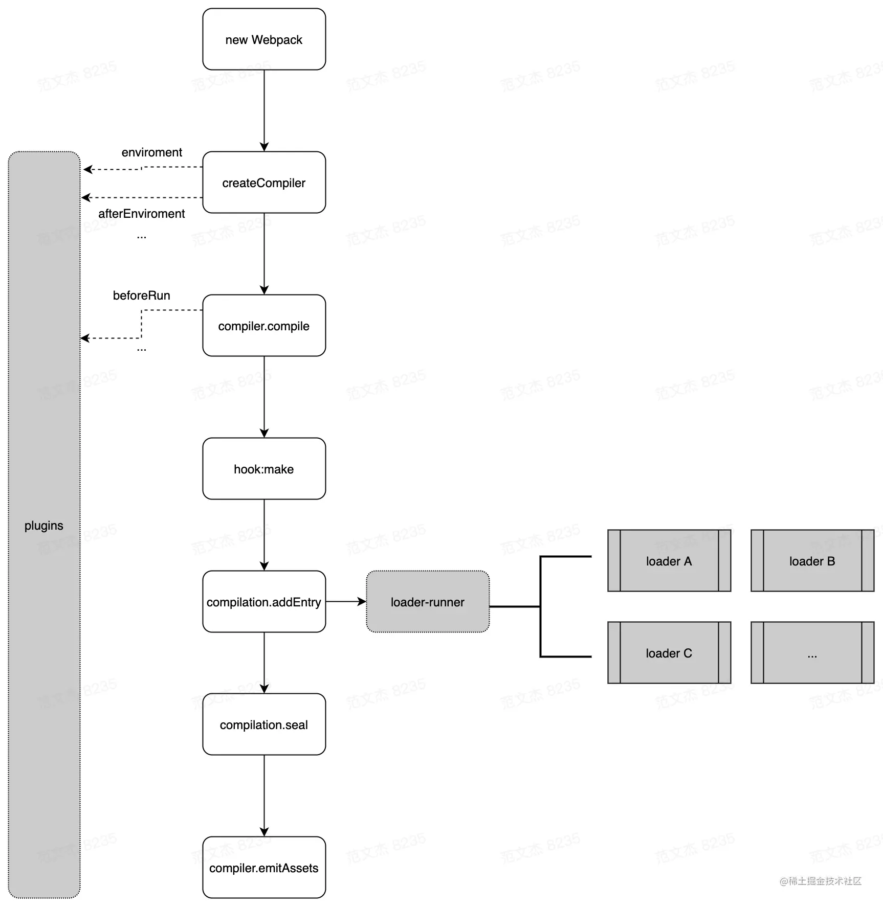
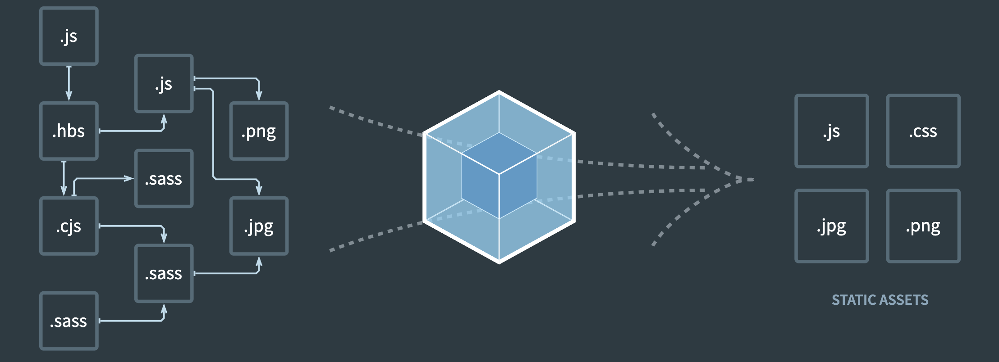
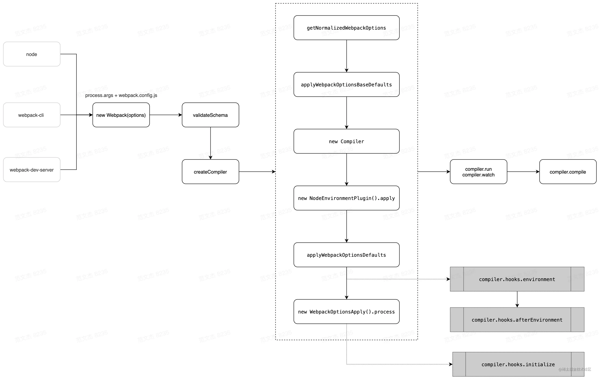
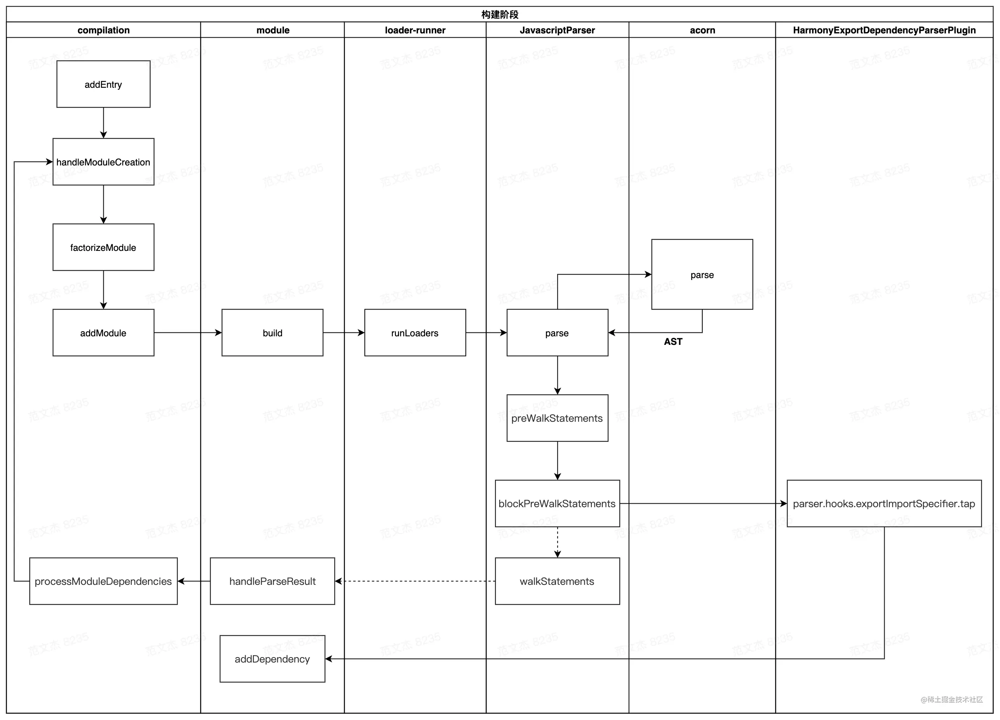

<TitleList></TitleList>

# Webpack基本知识

### 背景
5.0版本之后，webpack的功能集变得非常庞大，包括：模块打包、代码分割、按需加载、HMR、Tree-shaking、文件监听、sourcemap、Module Federation、devServer、DLL、多进程等等。为了实现这些功能，webpack 的代码量已经到了惊人的程度：
- 498 份JS文件
- 18862 行注释
- 73548 行代码
- 54 个 module 类型
- 69 个 dependency 类型
- 162 个内置插件
- 237 个hook

在这个数量级下，源码的阅读、分析、学习成本非常高，加上 webpack 官网语焉不详的文档，导致 webpack 的学习、上手成本极其高。为此，社区围绕着 Webpack 衍生出了各种手脚架，比如 vue-cli、create-react-app，解决“用”的问题。

### webpack的主体框架
- 构建的核心流程
- loader 的作用
- plugin 架构与常用套路  

以上三者协作构成webpack的主体框架：



### webpack核心流程
###### 最核心的功能
将各种类型的资源，包括`图片`、`css`、`js`等，转译、组合、拼接、<Te d>生成 JS 格式的 bundler 文件</Te>
功能如他的图片所示：

这个过程核心完成了 `内容转换` + `资源合并` 两种功能，实现上包含三个阶段：  

###### 执行的三个阶段

**<Te w>单次构建过程自上而下按顺序执行</Te>**  

- 初始化阶段
  - 「初始化参数」：从配置文件、 配置对象、Shell 参数中读取，与默认配置结合**得出最终的参数**
  - 「创建编译器对象」：用上一步得到的参数创建 <Te d>Compiler</Te> 对象
  - 「初始化编译环境」：包括注入内置插件、注册各种模块工厂、初始化 RuleSet 集合、加载配置的插件等
  - 「开始编译」：执行 compiler 对象的 <Te d>run</Te> 方法
  - 「确定入口」：根据配置中的 <Te d>entry</Te> 找出所有的入口文件，调用 <Te d>compilition.addEntry</Te> 将入口文件转换为 <Te d>dependence</Te> 对象
- 构建阶段
  - 「编译模块(make)」：根据 **entry** 对应的 **dependence** 创建 <Te d>module</Te> 对象，调用 <Te d>loader</Te> 将模块转译为标准 JS 内容，调用 JS 解释器将内容转换为 AST 对象，从中找出该模块依赖的模块，再 递归 本步骤直到所有入口依赖的文件都经过了本步骤的处理
  - 「完成模块编译」：上一步递归处理所有能触达到的模块后，得到了每个模块**被翻译后**的内容以及它们之间的 **依赖关系图**
- 生成阶段
  - 「输出资源(seal)」：根据入口和模块之间的依赖关系，组装成一个个**包含多个模块**的 <Te d>Chunk</Te>，再把每个 Chunk 转换成**一个单独的文件**加入到输出列表，这步是可以修改输出内容的最后机会
  - 「写入文件系统(emitAssets)」：在确定好输出内容后，根据配置确定输出的路径和文件名，把文件内容写入到文件系统  

###### 技术名词简介
- `Entry`：编译入口，webpack 编译的起点
- `Compiler`：编译管理器，webpack 启动后会创建 compiler 对象，该对象<Te d>一直存活</Te>直到结束退出
- `Compilation`：单次编辑过程的管理器，比如 watch = true 时，运行过程中只有一个 compiler 但每次文件变更触发重新编译时，都会创建一个新的 compilation 对象
- `Dependence`：依赖对象，webpack 基于该类型记录模块间依赖关系
- `Module`：webpack 内部所有资源都会以“module”对象形式存在，所有关于资源的操作、转译、合并都是以 “module” 为基本单位进行的
- `Chunk`：编译完成准备输出时，webpack 会将 module 按特定的规则组织成一个一个的 chunk，这些 chunk 某种程度上跟最终输出一一对应
- `Loader`：资源内容转换器，其实就是实现从内容 A 转换 B 的转换器
- `Plugin`：webpack构建过程中，会在特定的时机广播对应的事件，插件监听这些事件，在特定时间点介入编译过程  

#### 初始化阶段
###### webpack的初始化过程

**流程解释**  

- 将 `process.args` + `webpack.config.js` 合并成用户配置
- 调用 `validateSchema` 校验配置
- 调用 `getNormalizedWebpackOptions `+ `applyWebpackOptionsBaseDefaults` 合并出最终配置
- 创建 `compiler` 对象
- 遍历用户定义的 `plugins` 集合，执行插件的 `apply` 方法
- 调用 `new WebpackOptionsApply().process` 方法，加载各种内置插件  

主要逻辑集中在 `WebpackOptionsApply` 类，webpack <Te d>内置了</Te>数百个**插件**，这些插件并<Te d>不需要</Te>我们手动配置，WebpackOptionsApply 会在初始化阶段根据配置内容<Te d>动态注入</Te>对应的**插件**，包括：  
- 注入 `EntryOptionPlugin` 插件，处理 `entry` 配置
- 根据 `devtool` 值判断后续用那个**插件**处理 `sourcemap`，可选值：
  - EvalSourceMapDevToolPlugin
  - SourceMapDevToolPlugin
  - EvalDevToolModulePlugin
- 注入 RuntimePlugin ，用于根据代码内容动态注入 webpack 运行时  

到这里，`compiler` 实例就**被创建**出来了，相应的**环境参数**也预设好了，紧接着开始调用 `compiler.compile` 函数：
```js
// 取自 webpack/lib/compiler.js 
compile(callback) {
  const params = this.newCompilationParams();
  this.hooks.beforeCompile.callAsync(params, err => {
    // ...
    const compilation = this.newCompilation(params);
    this.hooks.make.callAsync(compilation, err => {
      // ...
      this.hooks.finishMake.callAsync(compilation, err => {
        // ...
        process.nextTick(() => {
          compilation.finish(err => {
            compilation.seal(err => {...});
          });
        });
      });
    });
  });
}
```
Webpack 架构很灵活，但代价是牺牲了源码的直观性，比如说上面说的**初始化流程**，从创建 `compiler` 实例到调用 `make` 钩子，逻辑链路很长：  

- 启动 webpack ，触发 lib/webpack.js 文件中 `createCompiler` 方法
- `createCompiler` 方法内部调用 `WebpackOptionsApply` 插件
- `WebpackOptionsApply` 定义在 lib/WebpackOptionsApply.js 文件，内部根据 `entry` 配置决定注入 `entry` 相关的插件，包括：`DllEntryPlugin`、`DynamicEntryPlugin`、`EntryPlugin`、`PrefetchPlugin`、`ProgressPlugin`、`ContainerPlugin`
- `Entry` 相关插件，如 lib/EntryPlugin.js 的 `EntryPlugin` 监听 `compiler.make` 钩子
- lib/compiler.js 的 `compile` 函数内调用 `this.hooks.make.callAsync`
- 触发 `EntryPlugin` 的 `make` 回调，在回调中执行 `compilation.addEntry` 函数
- `compilation.addEntry` 函数内部经过一坨与主流程无关的 `hook` 之后，再调用 `handleModuleCreate` 函数，正式开始构建内容

###### 初始化流程总结
这个过程**需要**在 webpack 初始化的时候**预埋下**各种插件，经历 4 个文件，7次跳转才开始进入主题，前置流程非常长。

#### 构建阶段
###### 思考题
- Webpack 编译过程会将源码解析为 AST 吗？webpack 与 babel 分别实现了什么？
- Webpack 编译过程中，如何识别资源对其他资源的依赖？
- 相对于 grunt、gulp 等流式构建工具，为什么 webpack 会被认为是新一代的构建工具？  

##### 基本流程
构建阶段从 `entry` 开始递归解析资源与资源的依赖，在 `compilation` 对象内逐步构建出 `module` 集合以及 `module` 之间的依赖关系  

###### 构建阶段核心流程

**流程解释**  
构建阶段从入口文件开始：  

- 调用 `handleModuleCreate` ，根据文件类型构建 `module` 子类
- 调用 `loader-runner` 仓库的 `runLoaders` 转译 `module` 内容，通常是从各类资源类型转译为 JavaScript 文本
- 调用 `acorn` 将 JS 文本解析为AST
- 遍历 AST，触发各种钩子
  - 在 `HarmonyExportDependencyParserPlugin` 插件监听 `exportImportSpecifier` 钩子，解读 JS 文本对应的资源依赖
  - 调用 `module` 对象的 `addDependency` 将依赖对象加入到 `module` 依赖列表中
- AST 遍历完毕后，调用 `module.handleParseResult` 处理模块依赖
- 对于 module 新增的依赖，调用 `handleModuleCreate` ，控制流回到第一步
- 所有依赖都解析完毕后，构建阶段结束  

这个过程中数据流  
**module => ast => dependences => module** 先转 AST 再从 AST 找依赖  

这就要求 `loaders` 处理完的最后结果必须是可以被 `acorn` 处理的**标准 JavaScript 语法**，比如说对于图片，需要从图像二进制转换成类似于 `export default "data:image/png;base64,xxx"` 这类 base64 格式或者 `export default "http://xxx"` 这类 url 格式。  

`compilation` 按这个流程递归处理，逐步解析出每个模块的内容以及 module 依赖关系，后续就可以根据这些内容打包输出。

###### 构建示例：层级递进

#### 生成阶段

### plugin插件
### loader
#### loader执行流程