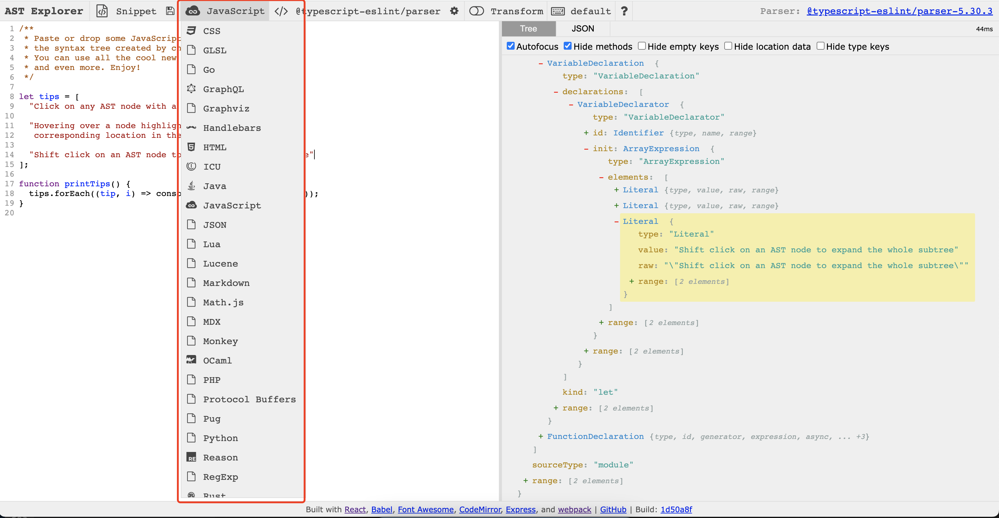

<TitleList></TitleList>

# AST抽象语法树

## 简介
AST([Abstract Syntax Tree](https://zh.wikipedia.org/wiki/%E6%8A%BD%E8%B1%A1%E8%AA%9E%E6%B3%95%E6%A8%B9))抽象语法树,或简称语法树(Syntax tree). 是源代码语法结构的一种抽象表示. 它以树状的形式表现编程语言的语法结构, 树上的每一个节点都表示源代码中的一种结构。  

AST与编程语言的种类无关，所有高级编程语言都可以使用AST来抽象表示 。

###### 在线AST工具
在线代将代码转换为可视化的AST树网址：[https://astexplorer.net/](https://astexplorer.net/)   
  
支持非常多的语言在线转换AST

###### 为什么说是抽象语法
之所以说语法是“抽象”的，是因为这里的语法并不会表示出真实语法中出现的每个细节。  
比如，`嵌套括号`被隐含在树的结构中，并没有以节点的形式呈现；而类似于 `if(){}` 这样的条件跳转语句，可以使用带有三个分支的节点来表示。  

*如图所示，没有表示出`()`和`{}`的节点，直接拆解代码逻辑*  
  

和抽象语法树相对的是具体语法树（通常称作[分析树](https://zh.wikipedia.org/wiki/%E5%88%86%E6%9E%90%E6%A0%91)）。一般的，在源代码的翻译和[编译](https://zh.wikipedia.org/wiki/%E7%B7%A8%E8%AD%AF%E5%99%A8)过程中，[语法分析器](https://zh.wikipedia.org/wiki/%E8%AF%AD%E6%B3%95%E5%88%86%E6%9E%90)创建出分析树，然后从分析树生成AST。一旦AST被创建出来，在后续的处理过程中，比如语义分析阶段，会添加一些信息。

## AST能做什么
- 语法检查、代码风格检查、格式化代码、语法高亮、错误提示、自动补全等.
- 代码混淆压缩.
- 优化变更代码,改变代码结构等.
- 代码裁剪.

## JavaScript AST
javascript parser： 把JS代码转换成 抽象语法树的解析器.  

浏览器在执行JS之前会把源码通过解析器转化成抽象语法树,再进一步转换成字节码甚至机器码.

###### 常用的javascript parser
- [Esprima](https://github.com/jquery/esprima)
- [UglifyJS2](https://github.com/mishoo/UglifyJS) webpack将这个工具作为插件(plugin)，对es5代码进行压缩。
- [Traceur](https://github.com/google/traceur-compiler)
- [Acorn](https://github.com/acornjs/acorn)
- [Espree](https://github.com/eslint/espree)
- [Shfit](https://github.com/shapesecurity/shift-parser-js)

### AST解析过程
分类两部分
- **分词**: 将整个代码字符串分割成最小**语法单元**数组
- **语法分析**: 在分词基础上建立分析**语法单元**之间的关系

###### 语法单元
**语法单元**: 被解析语法中具备实际意义的**最小单元**.  

例如:“2019年是祖国70周年”. 这句话拆成最小单元是: “2019年”,“是”,“祖国”,“70”,“周年”. 这些语法单元再进行拆分就失去了它本来要表达的意思.  

**javascript代码中的语法单元主要包含一下几种**  

- 关键字: `let`,`const`,`var`
- 标识符: 没有被括号引起的连续字符串,可能是变量,也可能是`if`,`else`这些关键字
- 数字运算符: `+`、`-`、`*`、`%`
- 数字: 十六进制、十进制、八进制等以及科学表达式等语法
- 空格: 连续的空格、换行、制表符等
- 注释: 行注释和大块的块注释作为最小的语法单元
- 其他: 大括号,小括号,分号,冒号等.

###### 语法单元示例
在线分词工具:[esprima/parser](https://esprima.org/demo/parse.html#)分析一下代码
```js
(1+2)*3;
```
通过**分词**,我们得到一下内容:


###### 语法分析
**分词**后得到一个个独立的**语法单元**, 这些语法单元需要建立其实际的关系才有意义. 建立语法单元的这个过程就是**语法分析**,这个一般是**递归**过程  

[astexplorer](https://astexplorer.net) 在线可视化 AST工具.  

`(1+2)*3;` 最后的语法分析结果是:
```js
{
  "type": "Program",
  "body": [
    {
      "type": "ExpressionStatement",
      "expression": {
        "type": "BinaryExpression",
        "operator": "*",
        "left": {
          "type": "BinaryExpression",
          "operator": "+",
          "left": {
            "type": "Literal",
            "value": 1,
            "raw": "1",
            "range": [ 1, 2 ]
          },
          "right": {
            "type": "Literal",
            "value": 2,
            "raw": "2",
            "range": [ 3, 4 ]
          },
          "range": [ 1, 4 ]
        },
        "right": {
          "type": "Literal",
          "value": 3,
          "raw": "3",
          "range": [ 6, 7 ]
        },
        "range": [ 0, 7 ]
      },
      "range": [ 0, 8 ]
    }
  ],
  "sourceType": "module",
  "range": [ 0, 8 ]
}
```
`body`表示程序体，而程序体中包含了一则表达式`ExpressionStatement`, 表达式体里包含了操作符 `*`,以及左右两边表达式，其中右边是数字`3`,而左边表达式还包含一层表达式，里面是一个`+` 操作符，以及左右两边分别为`1`和`2`的数字。  


### AST操作工具
- `@babel/core`：提供基础的转换功能
  - `transform`：传入源码，返回 `code源码`, `sourceMap代码`, `ast对象`，这个方法可以通过`option`参数的`inputSourceMap`属性，将之前的sourceMap组合成可溯源的sourceMap
  - `parse`：基本的AST解析行为，如果有babel的`presets 预设`或者`plugin 插件`，将引用他们参与解析。一般情况下也可以使用`@babel/parser`进行替代
- `@babel/parser`： 将js源码转为AST，通过配置项可支持ts，jsx，tsx等代码
- `@babel/traverse`： 深度遍历AST节点
- `@babel/generator`：将AST代码转化为js源码
- `@babel/types`：AST节点辅助工具，提供一系列的节点类型判断方法(根据AST节点的某些属性判断)，或者AST节点生成方法(通过简单的参数，可以创建符合AST规范的AST节点插入AST)  

[Babel基本知识](./babel.md)  

###### sourceMap基本知识
[JavaScript Source Map 详解](https://www.ruanyifeng.com/blog/2013/01/javascript_source_map.html)  

Source map就是一个`信息文件`，里面储存着`位置`信息。也就是说，`转换后`的代码的每一个位置，所对应的`转换前`的位置。有了它，出错的时候，除错工具将直接显示原始代码，而不是转换后的代码。  

**重点知识**：在webpack loader中，每个loader都会产生code 和 sourcemap，一般情况下，每个loader除了会接收 源码code之外，还会接收上一个loader产出的sourcemap，通过与自己产生的sourcemap `合并`，生成一个完整的sourcemap，这样，sourcemap记录的信息就可以`追溯`到上一个loader的源码位置，不断的往上溯源，即可还原最初的代码。  

webpack的`ts-loader`没有处理其他loader输出的sourcemap信息。如果要开发loader，则需要将loader放在ts-loader之后执行，否则loader修改代码之后，输出的最终sourcemap将无法准确复原源码

[webpack loader执行流程]()

###### AST修改代码流程
以`babel 7.x`为例：[babel修改代码流程图](https://docs.qq.com/flowchart/DQWJHQWpxQ1djUmxZ)


###### 流程说明
1. `@babel/core` 接收**源码 A**和之前产生的，或者其他工具产生的**sourceMap 0**信息，生成当前代码的**ast A对象**和记录`当前代码`和`前代码`的**sourceMap A**
2. `@babel/traverse` 遍历ast对象节点，并修改ast节点，产生**ast B对象**
3. `@babel/generator` 将**ast B对象**转化为**源码 B**和**sourceMap B-**(因为是不完整信息的sourceMap所以且称为B-，因为ast A中新增加的ast节点是没有位置信息的，所以直接生成的sourceMap没法映射新增的源码)
4. `@babel/core` 再次接收**源码 B**和**sourceMap A**，产生一个完整的信息**sourceMap B**，这个sourceMap B信息记录着code B的信息和code A的信息。先溯源code B 再溯源code A
