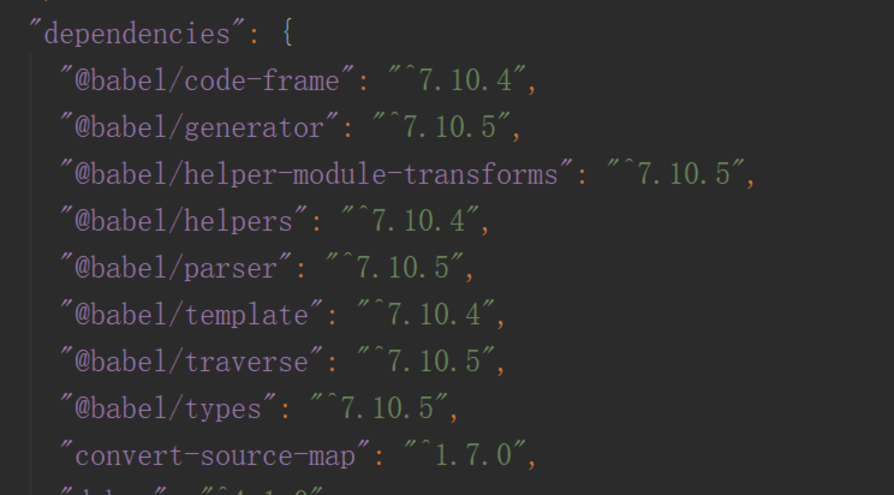
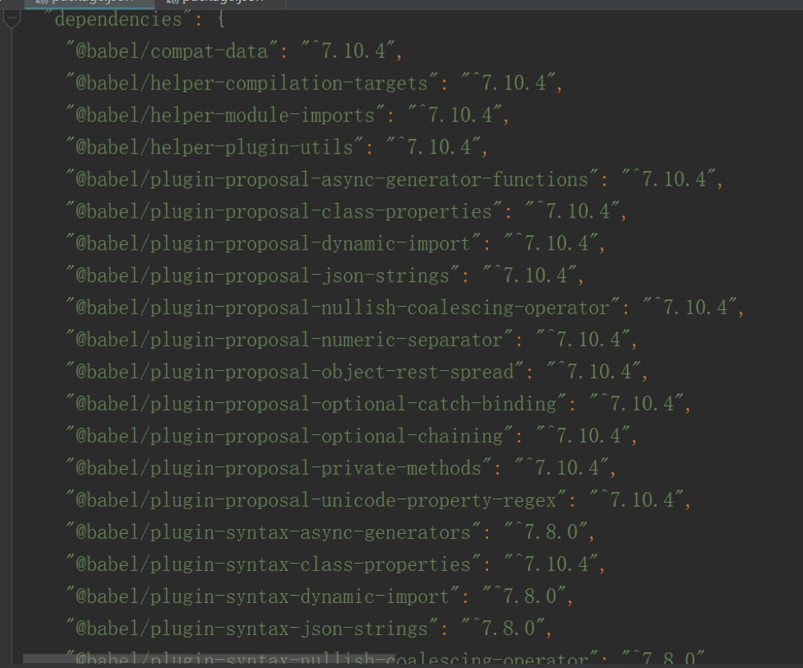

<TitleList></TitleList>

# Babel基本知识

### 什么是babel
开发过程中我们往往会选择es6、jsx、typescript进行开发，而目前浏览器并不能及时的兼容js的新语法，所以浏览器并<Te d>不能识别</Te>并执行这些代码，因此就必须将这些代码编译<Te d>转换</Te>成浏览器识别的代码  


babel是一个编译器，用于将ECMA2015+代码转换为向后兼容的javascript语法(一般转为es5语法)。  

很多项目构建工具(如：webpack)都是使用babel进行代码编译  

**工具链**：bable是一个<Te d>工具链</Te>，所谓工具链就是babel是依赖于它的<Te d>插件</Te>的(webpack也是一个工具链，依赖于loader和plugin)，只有有了插件babel才能发挥出真正的作用，没有插件的babel只是会将源码生成AST，然后在通过生成器生成和原来的源码一摸一样的代码，这样的过程是没有任何作用的。

### babel的执行过程


babel的核心就是`parse`、`transform`和`generator`三个部分  
```js
var {parse} = require('@babel/parser'); // 编译器
var {default: generate} = require('@babel/generator'); // 生成器
var code = `const name = "jyy";`; // 原始代码
var ast = parse(code);  // 源代码生成的ast
var targetCode = generate(ast); // 将ast转成目标代码
console.log(targetCode);    //{ code: 'const name = "jyy";', map: null, rawMappings: undefined }
```
以上代码缺少转换过程，所以生成的目标代码和原始代码都是一样的，只是多了属性而已，这相当于什么都没有做。  

转换过程的具体操作需要插件来实现，如果没有使用插件，最后生成的目标代码是和原始代码一样的。  

#### parser
`@babel/parser`：babel的**编译器**<Te d>插件</Te>，其作用就是将源码转换为AST，使用前需要`npm install @babel/parser`

#### transform
这个过程虽然在本文中名字叫transfom，但是事实上babel官网中并没有这个词，更没有称为转换器的结构。  

babel就是在这个过程对源码进行修改的。当源码通过parse生成了ast后，我们可以通过转换插件，对ast进行操作。比如插件`@babel/plugin-transform-react-jsx`是将react中的jsx转换为react的节点对象。

###### @babel/types
babel插件，它的作用是创建、修改、删除、查找ast节点，因为ast也是一个树状结构，我们可以像js操作dom节点一样，使用types对ast进行操作。  

这个插件往往和traverse遍历插件一起使用，因为types只能对单一节点进行操作，一般是在对节点的迭代中使用，所以这个插件的例子会放在traverse的实例中。  

###### @babel/traverse
babel插件，作用是对ast进行遍历。

#### generator
`@babel/generator`：babel的**生成器**<Te d>插件</Te>，作用就是将转换好的ast重新生成代码。这样的代码就就可以安全的在浏览器运行。

#### @babel/core
babel插件如@babel/parse、@babel/generator都是提供了代码转换的基本功能，而另外的一些工具类型的插件比如@babel/types、@babel/traverser起作用是提供操作ast节点的功能。然而在开发插件的过程中如果每个都需要去引入实在太麻烦，所以就有了`@babel/core`插件，顾名思义就是核心插件，他将底层的插件进行封装，并另外加入了其他功能，比如读取、分析配置文件。这个插件将复杂的配置过程进行简化  
```js
var babel = require("@babel/core");
var code = "<div class='c'>jyy</div>";  // 代码
babel.transform(code, {plugins: ["@babel/plugin-transform-react-jsx"],}, function(err, result) {
  console.log(result.code);
  // React.createElement("div", {
  //   class: "c"
  // }, "jyy");
});
```
transform函数的参数第一个为原始代码，第二个为用于在转换过程中对ast进行操作的插件，例子中我们使用的是转换jsx的插件，第三个参数是一个回调函数。

使用transform就可以完成整个步骤。  

我们查看core的依赖可以发现，它依赖于底层的插件并基于次进行进行封装：


### 插件
我们一般不会自己开发babel的转换插件，实际项目中往往都是直接使用现成的插件。而配置插件却时常让人很烦闷，因为有各种插件，什么stage-1、env、es2015等等，各种插件的各种配合设置给人摸不到头脑的感觉，会想问为什么不能出一个统一的插件，里面包含所有的转换功能，这样在配置的时候只需要在plugins里面放一个插件名就好了呢？这个问题主要是有以下几点原因：  
1. 因为js发展太快了，我们知道这几年js新的语法和函数不断地出现，如果把所有对最新语法的转换放在一个插件中，那么每次出现新的语法就需要不断的修改代码
2. babel不仅仅包含对ecma2015+的转换，还包括ts、flow和上面我们提到的jsx的转换，全都揉在一起的话实在是太大太乱了，不易于维护
3. 这样做可以让用户更自由地去选择，就像菜市场去买菜，我只会去买我想要买的菜。这无疑减少了项目打包时的负担，进而影响到所占用的网络的带宽。事实上这种方式广泛的存在于产品中。比如echarts，我们可以选择其中的某些图表，然后下载对应的代码，而这样做的前提就是降低模块之间的耦合。

以上的分析都是我在瞎扯淡，仅供参考，谁知道babel的开发者是怎么想的。

一般情况下，项目不需要我们去开发babel插件，因为这些插件都写好了，官网里面的插件非常多，而且有些插件貌似很小，仅仅具体到一个语法，比如`arrow-function`，这是ES2015中的箭头函数语法，下面使用这个插件`@babel/plugin-transform-arrow-functions`进行演示：
```js
var babel = require("@babel/core");
var code = `num => {
   return num ** 2;
}`;  // 代码
babel.transform(code,{plugins: ["@babel/plugin-transform-arrow-functions"]},function(err, result){
    console.log(result.code);
    // (function (num) {
    //     return num ** 2;
    // });
});
```
结果如我们预期，使用arrow-function插件后，确实将箭头函数转换为了es5的语法。但是我们还会发现代码中的`**`，`幂等运算符`是ES2016的**新特性**。这样的代码还是不能被es5识别，于是我们加入转换幂等运算符的插件`@babel/plugin-transform-exponentiation-operator`：
```js
var babel = require("@babel/core");
var code = `num => {
   return num ** 2;
}`;  // 代码
babel.transform(code,{plugins: ["@babel/plugin-transform-arrow-functions", "@babel/plugin-transform-exponentiation-operator"]},function(err, result){
    console.log(result.code);
    // (function (num) {
    //     return Math.pow(num, 2);
    // });
});
```
发现结果已经将幂等运算符进行了转换。
###### 插件配置注意事项
对于插件的配置需要记住以下几点：  
- **plugin的段名称**：配置plugin的时候，可以设置插件的短名称，可以将省略babel-plugin，例如：`["@babel/babel-plugin-name"]`和`["@babel/name"]`是等价的
- **排列顺序**：多个插件的执行顺序是按照从前到后的顺序执行，例如["@babel/name1","@babel/name2"]两个插件的执行顺序是先执行name1，然后执行name2。

### 预设(preset)
问题：新语法新特性那么多，难道我们要挨个去加吗？  

当然不是，babel已经预设了几套插件，将最新的语法进行转换，可以使用在不同的环境中，如下：
- @babel/preset-env
- @babel/preset-flow
- @babel/preset-react
- @babel/preset-typescript

从名字上就能看出他们使用的环境了，需要注意的是env，他的作用是将最新js转换为es6代码。预设是babel插件的组合，我们可以看下package.json（截取一部分）：


由此看到他组合了很多的插件，是一个官方提供的，这样我们只需要使用一个插件就可以了。那么有了这个插件，我们使用上一个例子，来测试一下：
```js
var babel = require("@babel/core");
var code = `num => {
   const offset = 23;
   return num ** 2 + offset;
}`;  // 代码
babel.transform(code,{presets: ["@babel/preset-env"]},function(err, result){
    console.log(result.code);
    // "use strict";
    // (function (num) {
    //     var offset = 23;
    //     return Math.pow(num, 2) + offset;
    // });
});
```
可以看到，代码中额外将const转为var，还加上了use strict  

需要注意的是因为`@babel/preset-env`是预设的<Te d>包含多个</Te>插件，所以不同于单一的插件，需要使用<Te d>presets</Te>参数。  

对于env插件，我们还需要知道他是以前es2015、es2016和es2017的<Te d>集合</Te>，另外他默认不支持stage-x插件。  

**stage-x（babel7已废弃)**

*那么什么是stage-x呢？state-x里面包含了当年最新规范的草案，每年更新。因为有可能项目所使用的是最新的语法，那么官方的预设插件还没有将其纳入，这时候就需要使用state-x。如下是state-x的阶段：*

- Stage 0 - 稻草人: 只是一个想法，经过 TC39 成员提出即可。
- Stage 1 - 提案: 初步尝试。
- Stage 2 - 初稿: 完成初步规范。
- Stage 3 - 候选: 完成规范和浏览器初步实现。
- Stage 4 - 完成: 将被添加到下一年度发布。

所以我们经常会在代码中看到这样的preset配置：[es2015, react, stage-0]。好在在babel7，stage-x以被废弃。  

###### preset配置注意事项
preset的配置需要记住以下几点  
- **preset可以设置短名称**：和插件一样preset也可以设置段名称。可以省略preset，例如：`presets: ["@babel/preset-env", "@babel/preset-react"]`可以省略为 `presets: ["@babel/env", "@babel/react"]`
- **排列顺序**：预设的执行顺序也同样重要，preset<Te d>在plugin之前</Te>执行，而且和plugin不同的是，preset是<Te d>从后往前</Te>执行，比如我们使用react，那么应该这么写`presets: ["@babel/env", "@babel/react"]`

### 配置
实际项目中我们不会亲自动手去调用babel的api去转换代码，而且如果我们整个项目很可能都是用es6编写，不可能手动调用babel的api去一个一个转换，我们希望使用命令行，通过传递文件夹的名称去交给babel转换。这个时候`babel-cli`就出现了，比如，我们想要转换某个文件夹下的文件，那么我们可以在控制台输入这样的命令：
```bash
babel src --out-dir lib --presets=@babel/preset-env,@babel/react
```
这段命令的意思是，将src文件夹下的所有文件使用env和react预设进行转换，并且将转换后的文件存放在lib文件夹下。  

**需要注意的是**：`babel-cli`只是一套命令，想要执行babel的转换工作，仍然需要引入`@babel/core`。  

此时仍然有个问题预设也是有**参数**的，另外还有plugins等等，当然可以将这些参数加在命令中，但是这样还是会很复杂。解决这个问题的通用方法就是在项目中创建一个配置文件，在里面配置相应的插件和预设。
#### 参数配置文件
###### .babelrc
只是项目中经常用到的方式，在项目根目录创建名为.babelrc文件，内部包括两个方面：plugins和presets
```json
{
  "presets": [...],
  "plugins": [...]
}
```
###### babel.config.js
这种方式是使用js代码编写，并导出一个和上面方式相同的对象
```js
module.exports = function () {
  const presets = [ ... ];
  const plugins = [ ... ];
  return {
    presets,
    plugins
  };
}
```
###### package.json
```json
{
  "name": "my-package-babel",
  "version": "1.0.0",
  "babel": {
    "presets": [ ... ],
    "plugins": [ ... ],
  }
}
```

这三种都是等效的，当配置完成后，可以在babel-cli的命令行中配置，比如:
```bash
babel --config-file /path/to/my/babel.config.json --out-dir dist ./src
```
真正收取并处理分析配置文件的还是@babel/core，在core源码里面对于支持的配置文件名很多，如：`babel.config.js`，`babel.config.cjs`，`babel.config.mjs`，`babel.config.json`，`.babelrc`，`.babelrc.js`，`.babelrc.cjs`，`.babelrc.mjs`，`.babelrc.json`   

babel的忽略文件：`.babelignore`

### 使用实例
下面以真实项目的搭建为例，简单介绍babel的具体使用方式。  

项目的框架使用`react`，构建工具是`webpack`。webpack有`babel-loader`的插件，加入这个loader之后表示所有打包的文件都会由babel-loader来处理(<Te d>转交给babel来处理</Te>)，同时使用到的babel插件有`@babel/core`、`@babel/preset-env`、`@babel/preset-react`。此时webpack中的配置文件关于babel的配置如下：  

**webpack.config.js**
```js
{
  test: "\.js$",
  loader: "babel-loader", // webpack在make阶段的loader处引入babel处理es6+的代码
  exclude: "/node_modules"
}
```
**.babelrc**
```json
{
  "presets": ["@babel/env", "@babel/react"],
  "plugins": ["transform-runtime"]
}
```