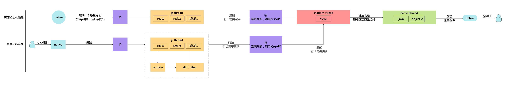
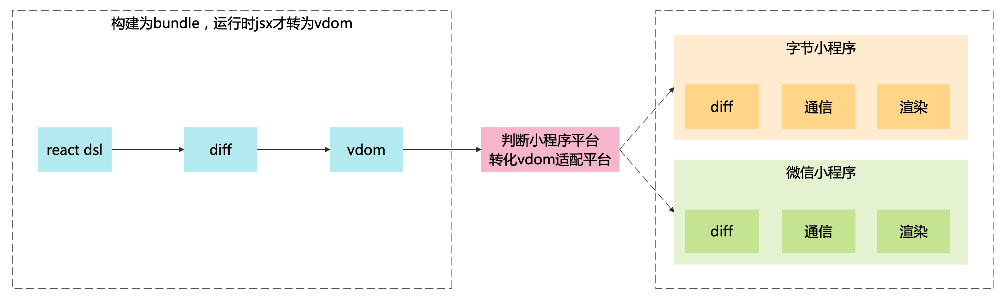

<TitleList></TitleList>

# 跨端技术的本质与现状

[聊聊跨端技术的本质与现状](https://www.51cto.com/article/702495.html)  

[跨端框架一些原理分析](https://www.gitsu.cn/article94)  

[React Native For Android 架构初探](https://zhuanlan.zhihu.com/p/20259704)

[Flutter之原理解析](https://juejin.cn/post/6871608025325502478)

## 主流跨端实现方案

#### h5 hybrid 方案
浏览器(webview)嵌入 app 中，将地址栏等内容隐藏掉，本质是浏览器。

#### 框架层+原生渲染 react-native
需要借助原生的能力来进行渲染，组件最终都会被渲染为原生组件
- 逻辑层：js代码
- UI层：原生UI (jsx被替换成原生UI)
- 通信工具：bridge (桥，使用C++实现)，异步通信，native 通知 js 用户点击事件，js 调用原生能力，js 通知需要更新 UI 等。bridge 将各个模块关联起来。

###### react native 的执行流程
 

#### 框架层+自渲染引擎 flutter
自渲染的引擎实现跨端，直接与显示器的交互事件通信，通过 skia (c++实现的跨平台的引擎) 调用的系统API，没有了native与js之间的桥，所以性能要优于RN速度更快。由于存在 skia 中间层，所以性能上<Te d>只能无限接近</Te>纯原生，无法达到真正原生

## 对比
- hybrid跨端：webview充当了桥接层的角色
- **flutter** 事件流程：
  - flutter 是 GPU -> Vsync 信号 -> dart -> Compositor 排版 -> Skia 渲染 -> GPU
  - rn 则是 GPU  -> Vsync 信号 -> native -> 桥 -> js -> 桥 -> yoga 排版 -> native 渲染 -> GPU

## 跨端小程序 
###### 本质
- 通过webview运行
- 嵌入一些原生的功能和APP宿主的功能

###### 跨端小程序原理
- 使用react 得到 virtual dom（虚拟dom）,然后传给各平台小程序进行渲染。
- 跨的是 UI 层
- 都是使用JS运行
###### 跨端小程序流程图

**<Te w>tips</Te>**: dsl 是 Domain Specific Language 的缩写，中文翻译为**领域特定语言**，react 的 UI 以及各平台的小程序 UI 写法都不相同。 各小程序的 UI 模版写法其实也是为了生成vdom, 所以可以通过 react dsl 生成符合 各小程序的规范的 vdom。  

从流程图可以看出，跨端小程序需要经历需要经历**两次diff算法**，第一次是 react 自己的 diff 算法更新数据 和 vdom，然后将数据(变量数据和vdom)传给各小程序平台之后，小程序平台又会进行一次 diff 算法，所以 **性能比原生小程序低**。 (如果知道各小程序的 diff 规则，则可以避免第二次 diff，但是目前各小程序是黑盒开发，二次 diff 无法避免)。  

**tips**：跨平台程序直接传 vdom 给各小程序平台，不需要将 react dsl vdom 转 小程序的dsl 再转小程序的 vdom。
