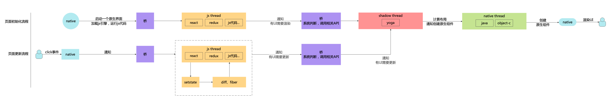

<TitleList></TitleList>

# 跨端技术的本质与现状

[聊聊跨端技术的本质与现状](https://www.51cto.com/article/702495.html)  

[跨端框架一些原理分析](https://www.gitsu.cn/article94)  

[React Native For Android 架构初探](https://zhuanlan.zhihu.com/p/20259704)

## 主流跨端实现方案

#### h5 hybrid 方案
浏览器(webview)嵌入 app 中，将地址栏等内容隐藏掉，本质是浏览器。

#### 框架层+原生渲染 react-native
需要借助原生的能力来进行渲染，组件最终都会被渲染为原生组件
- 逻辑层：js代码
- UI层：原生UI (jsx被替换成原生UI)
- 通信工具：bridge (桥，使用C++实现)，异步通信，native 通知 js 用户点击事件，js 调用原生能力，js 通知需要更新 UI 等。bridge 将各个模块关联起来。

###### react native 的执行流程
 

## 对比
- hybrid跨端：webview充当了桥接层的角色
- flutter：自渲染的引擎实现跨端，减少了native与js之间的桥，速度更快

## 跨端小程序 