<TitleList></TitleList>

# i18next

源代码目录结构图

  

[i18next架构图](https://app.diagrams.net/#G1t4mr-xTsH7L1Cfb-Irjhe6T3AZAexj8a)

## 使用demo
```js
import i18next from 'i18next';

i18next.init({
  lng: 'en', // if you're using a language detector, do not define the lng option
  debug: true,
  resources: {
    en: {
      translation: {
        "key": "hello world"
      }
    }
  }
});
// initialized and ready to go!
// i18next is already initialized, because the translation resources where passed via init function
document.getElementById('output').innerHTML = i18next.t('key'); // 显示 hello world
```

### 调用栈分析
1. 初始化I18next实例对象
   - 1-1 对 init 参数与内置的默认配置进行合并，未设置的参数则进行默认值设置
   - 1-2 绑定转换器，自带有 Formatter 类。也可以自定义，通过init传入。用于对翻译文本进行格式化的工具类
   - 1-3 初始化 语言处理工具类 LanguageUtils
   - 1-4 ResourceStore 实例初始化。用于存储和管理init参数中的resources属性中的不同语言的语言资源
   - 1-5 初始化 复数形式处理策略工具类 PluralResolver
   - 1-6 初始化 插值工具类 Interpolator
   - 1-7 【核心工具】初始化翻译工具类 Translator
2. i18next.t (是 i18next.translate 方法的别名)
   - 2-1 调用 translate 函数
   - 2-2 调用 resolve 函数，解析翻译键。给定一个翻译键和选项，它会在正确的命名空间（namespace）和语言（language）中查找该键并返回翻译结果
   - 2-3 对翻译结果进行复数转化
3. 返回最终翻译词条

## 简化源码分析
### index.js
i18next 的入口文件，主要是对外暴露 i18next 对象及对象内的常用方法

### I18n (i18next.js)
#### 构造函数
I18n的构造函数做了一系列的准备工作
```js
import baseLogger from './logger.js';
import EventEmitter from './EventEmitter.js';
import ResourceStore from './ResourceStore.js';
import Translator from './Translator.js';
import LanguageUtils from './LanguageUtils.js';
import PluralResolver from './PluralResolver.js';
import Interpolator from './Interpolator.js';
import Formatter from './Formatter.js';
import BackendConnector from './BackendConnector.js';
import { get as getDefaults, transformOptions } from './defaults.js';
import postProcessor from './postProcessor.js';
import { defer } from './utils.js';

class I18n extends EventEmitter {
  constructor(options = {}, callback) {
    super();

    this.options = transformOptions(options);
    // 存储各种服务(工具类)的对象,方便在后续的操作中调用这些服务(工具类的方法或属性)
    this.services = {};
    this.logger = baseLogger;
    this.modules = { external: [] };

    /** ... */

    this.init(options, callback);
  }
  //  初始化工作
  init(options = {}, callback) {
    if (typeof options === 'function') {
      callback = options;
      options = {};
    }

    // 缓存命名空间的默认值
    options.defaultNS = ...;

    // 缓存默认配置
    const defOpts = getDefaults();
    // 默认配置、用户配置、翻译所需要的配置合并
    this.options = { ...defOpts, ...this.options, ...transformOptions(options) };
    
    /** ... */

    // 缓存 key 分隔符 默认值
    this.options.userDefinedKeySeparator = ...;
    //  缓存 命名空间分隔符
    this.options.userDefinedNsSeparator = ...;

    /** ... */

    // init services
    if (!this.options.isClone) {
      // 初始化日志工具
      baseLogger.init(...)

      // 指定要使用的格式转换器类
      let formatter = Formatter;;

      // 语言处理工具(获取语言名称，格式化语言编码(code)、处理语言名称不完全匹配时的默认策略和语言的解析顺序)
      const lu = new LanguageUtils(this.options);
      // 用于存储和管理翻译资源的类(增删改查，数据存储在内存中)
      this.store = new ResourceStore(this.options.resources, this.options);

      // 把公共工具都存在 services中方便取
      const s = this.services;
      s.logger = baseLogger;
      s.resourceStore = this.store;
      s.languageUtils = lu;
      // 处理语言的复数形式
      s.pluralResolver = new PluralResolver(...);
      
      /** ... */

      // 用来解析翻译资源中的插值表达式的工具类
      s.interpolator = new Interpolator(this.options);
      s.utils = {
        hasLoadedNamespace: this.hasLoadedNamespace.bind(this)
      }

      // 用于连接 i18next 的后端和存储，将从远端加载的词条存储在内存中
      s.backendConnector = new BackendConnector(...);
      // pipe events from backendConnector
      s.backendConnector.on('*', (event, ...args) => {
        this.emit(event, ...args);
      });

      // 用于进行国际化翻译 的核心工具
      this.translator = new Translator(this.services, this.options);
      // pipe events from translator
      this.translator.on('*', (event, ...args) => {
        this.emit(event, ...args);
      });
    }

    /** ... */

    const deferred = defer();

    /** ... */

    return deferred;
  }

  //   加载语言资源
  loadResources(language, callback = noop) {}
  // 重新加载语言资源  
  reloadResources(lngs, ns, callback) {}
  /**
   * // 用于将插件模块添加到 i18next 实例中。通过这个方法，您可以扩展 i18next 的功能，添加自定义的功能或处理特定的任务。
   * // demo
   * import i18next from 'i18next';
   * import yourPlugin from 'your-plugin';
   * 
   * i18next.use(yourPlugin).init({
   * // 初始化选项
   * });
   */
  use(module) {}

  // 在语言切换时更新已解析的语言
  setResolvedLanguage(l) {}
  
  // 切换当前的语言
  changeLanguage(lng, callback) {}
  /**
   * // 获取一个固定的翻译函数
   * // demo
   * const fixedT = i18next.getFixedT('en', 'common', 'prefix');
   * // 使用固定的翻译函数进行翻译
   * const translatedText = fixedT('hello'); // 使用键 'prefix.hello' 进行翻译
   * console.log(translatedText); // 输出翻译后的文本
   */
  getFixedT(lng, ns, keyPrefix) {}

  // translate 方法的别名
  t(...args) {
    return this.translator && this.translator.translate(...args);
  }
  // translator.exists 方法的别名
  exists(...args) {
    return this.translator && this.translator.exists(...args);
  }

  setDefaultNamespace(ns) {
    this.options.defaultNS = ns;
  }

  // 检查给定的命名空间是否已被加载或预加载
  hasLoadedNamespace(ns, options = {}) {}
  // 异步加载指定的命名空间
  loadNamespaces(ns, callback) {}
  // 异步加载语言资源
  loadLanguages(lngs, callback) {}
  // 根据传入的语言代码 lng，i18next.dir(lng) 方法会返回一个表示文本方向的字符串，可以是 "ltr"（从左到右）或 "rtl"（从右到左）。
  dir(lng) {}
  // 创建I18n实例
  static createInstance = (options = {}, callback) => new I18n(options, callback)
  // 拷贝I18n实例 
  cloneInstance(options = {}, callback = noop) {}
  // I18n实例要序列化的数据
  toJSON() {}
}

const instance = I18n.createInstance();
instance.createInstance = I18n.createInstance;

export default instance;
```
##### services
存储各种服务(工具类)的对象,方便在后续的操作中调用这些服务(工具类的方法或属性)
##### logger
logger，日志插件，必须符合Logger的定义。在程序中打印日志
##### modules 
用于存储和管理 i18next 扩展模块。

### Translator.js
i18next 的翻译器，负责将语言资源翻译成指定语言的文本，并使用指定的选项进行格式化和插值。
```js
import baseLogger from './logger.js';
import EventEmitter from './EventEmitter.js';
import postProcessor from './postProcessor.js';
import * as utils from './utils.js';

class Translator extends EventEmitter {
    // 更改当前语言。
    changeLanguage(lng){}
    /**
     * 用于检查指定的语言资源是否存在。
     * @param {*} key - 要检查的语言资源键
     * @returns boolean
     */
    exists(key, options = { interpolation: {} }) {}
    // 用于从指定的语言资源键（key）中提取命名空间（namespace）和语言资源的名称（keyWithoutNs）
    extractFromKey(key, options) {}
    // 核心函数，用于将指定的语言资源翻译成当前想要的语言，并使用指定的选项进行格式化和插值。外部常调用的别名是 i18next.t()
    translate(keys, options, lastKey) {}
    /**
     * 该函数的作用是在运行时扩展语言资源。在进行扩展时，该函数会将 key 参数解析为命名空间和语言资源的名称，然后将指定的语言资源添加到 res 对象中。
     * @param {*} res - 要扩展的语言资源对象
     * @param {*} key - 要扩展的语言资源键
     * @param {*} options - 要添加的语言资源
     * @param {*} resolved - 一个可选对象，包含运行时解析的键和值
     * @param {*} lastKey - 用于指定上一个翻译键的参数，可以用于实现嵌套翻译
     * @returns 
     */
    extendTranslation(res, key, options, resolved, lastKey) {}
    /**
     * 用于解析翻译键（translation key）。给定一个翻译键和选项，它会在正确的命名空间（namespace）和语言（language）中查找该键并返回翻译结果
     * @param {*} keys - 要解析的翻译键（可以是字符串或字符串数组）
     * @param {*} options 一个选项对象，包含以下属性：
     *          -  count：用于复数形式的计数（可选）。
     *          -  context：用于上下文翻译的上下文字符串（可选）。
     *          -  lngs：要使用的语言列表（可选）。
     *          -  ordinal：是否使用序数复数形式（可选）。
     * @returns 返回一个对象，包含以下属性:
     *          - res：解析出的资源。
     *          -  usedKey：用于解析的最终翻译键。
     *          -  exactUsedKey：用于解析的最终翻译键（包括上下文和复数形式）。
     *          -  usedLng：用于解析的语言。
     *          -  usedNS：用于解析的命名空间。
     */
    resolve(keys, options = {}) {}
    // 检查res的值是否有效，用意是检查是否已找到有效的翻译资源
    isValidLookup(res) {}
    // 用于获取指定语言、命名空间和翻译键对应的翻译资源。
    getResource(code, ns, key, options = {}) {}
    // 用于检查选项对象中是否设置了defaultValue属性
    static hasDefaultValue(options) {}
}
```

### Interpolator.js
用于对语言资源中的变量进行替换。主要的 API 包括 interpolate() 和 nest()。
```js
import * as utils from './utils.js';
import baseLogger from './logger.js';

/**
 * Finds a value in data object using a key and returns it.
 * If the value is not found, it uses defaultData to find the value.
 * If ignoreJSONStructure is true, it ignores the JSON structure of the data object.
 */
function deepFindWithDefaults(data, defaultData, key, keySeparator = '.', ignoreJSONStructure = true) {}

/**
 * @class Interpolator 用来解析翻译资源中的插值表达式的工具类
 * 在 i18next 中，插值表达式用花括号 {} 包裹变量和占位符，例如 {name} 或 {count, plural, one{# dog} other{# dogs}}。Interpolator 类会将这些插值表达式解析为实际的值，并将其插入到翻译资源中生成最终的翻译结果。
 */
class Interpolator {
  constructor(options = {}) {}

  /* eslint no-param-reassign: 0 */
  /**
   * 初始化插值器。
   * @param {Object} options - 选项对象。
   * @param {string} options.interpolationPrefix - 插值器前缀，默认为'{{'。
   * @param {string} options.interpolationSuffix - 插值器后缀，默认为'}}'。
   * @param {Object} options.interpolation - 插值器设置。
   * @param {string} options.interpolation.escapeValue - 转义函数，默认为false。
   * @param {string} options.interpolation.nestSeparator - 嵌套分隔符，默认为'.'。
   */
  init(options = {}) {}
  // 重置选项
  reset() {
    if (this.options) this.init(this.options);
  }
  // 重置匹配规则
  resetRegExp() {}

  /**
   * 对给定的字符串进行插值操作
   * @param {*} str 字符串模版
   * @param {*} data 要插入的对象值
   * @param {*} lng 语言
   * @param {*} options 
   * @returns 
   */
  interpolate(str, data, lng, options) {}

  /**
   * 将字符串中的嵌套值替换为给定对象的值
   * @param {string} str - 要替换的字符串模版
   * @param {Function} fc - 用于获取嵌套属性的值的函数。该函数主要接受一个参数，即嵌套属性的名称，返回该属性的值(另外一个参数只是options的一部分)
   */
  nest(str, fc, options = {}) {}
}

export default Interpolator;
```

### PluralResolver.js
处理复数形式的工具类，它提供了一个方法 getSuffix，用来根据语言标签和数量计算复数形式的后缀。

内置了很多语言的处理规则， 主要的 API 包括 getSuffix() 和 get()。

use demo
```js
// 初始化 i18next 库
i18next.init({
  lng: 'en',
  resources: {
    en: {
      translation: {
        dogs: '{{count}} dog',
        dogs_plural: '{{count}} dogs',
      },
    },
  },
  // 配置 PluralResolver 类
  pluralResolver: {
    // 英语的复数形式后缀为 "_plural"
    suffix: '_plural',
    // 英语的复数形式规则为 "1" 表示单数，其他情况为复数
    rules: {
      plural: function(n) { return n !== 1; },
    },
  },
});

// 定义一个函数，用于获取翻译结果
function t(key, count, options) {
  // 调用 PluralResolver 类的 getSuffix 方法，获取复数形式的后缀
  var suffix = i18next.services.pluralResolver.getSuffix('en', count);
  // 使用 i18next 库的 t 函数获取翻译结果
  return i18next.t(key + suffix, { count: count }, options);
}

// 测试 t 函数
console.log(t('dogs', 0)); // 输出 "0 dogs"
console.log(t('dogs', 1)); // 输出 "1 dog"
console.log(t('dogs', 2)); // 输出 "2 dogs"
```
在 t 函数中，我们调用 getSuffix 方法来获取复数形式的后缀，然后将其与翻译资源的键值拼接在一起，使用 i18next 库的 t 函数来获取翻译结果。最后，我们测试了 t 函数，分别传入了 0、1 和 2 三个参数。根据英语的复数形式规则，当 count 为 1 时，应该使用单数形式，否则应该使用复数形式。

### LanguageUtils.js
获取语言，格式化语言编码(code)、处理语言不完全匹配时的默认策略和解析顺序

> 语言代码是一种用于表示语言和地区的标识符。它通常由两个或三个部分组成，每个部分之间用连字符分隔。例如，"en" 表示英语，"en-US" 表示美式英语，"zh-Hans-CN" 表示简体中文（中国大陆）。
>
> 语言代码的命名规则由 IETF 标准化组织定义，它定义了一套语言标签规范，用于标识语言、方言和地区。语言标签由一个或多个子标记（subtags）组成，每个子标记表示一个特定的语言、方言或地区。子标记之间用连字符 "-" 分隔。
>
> 例如，"en-US" 表示英语（en）和美国（US）地区的结合，而 "zh-Hans-CN" 表示简体中文（zh）和中国大陆（CN）地区的结合，其中 "Hans" 表示简体中文的一种书写形式。
>
> 在语言代码的处理中，需要考虑到多种情况，例如大小写、特殊代码（如 "hans"、"hant"、"latn"、"cyrl"、"cans"、"mong"、"arab"）和三位代码（如 "zh-Hans-CN"）等。因此，对于语言代码的处理需要使用一些专门的工具和方法，以便能够对不同的情况进行适当的处理和转换。

```js
class LanguageUtil {
  constructor(options) {}

  /**
   * 从指定的语言代码中获取脚本部分，例如 "zh-Hans-CN" 中的 "Hans"
   * i18next是完全遵循了BCP47的标准来格式化语言标记，也就是code，语言编码
   */
  getScriptPartFromCode(code) {}

  /**
   * 从指定的语言代码中获取语言部分，例如 "zh-Hans-CN" 中的 "zh"。
   */
  getLanguagePartFromCode(code) {}

  /**
   * 格式化指定的语言代码，例如 "zh-Hans-CN" 字符串传进来时大小写不规范转为固定规范
   * 如果传入的参数不是字符串类型或者不包含连字符（-），则直接返回原始参数值。
   * 如果传入的参数包含连字符（-），则按照以下规则进行格式化：
   *  如果使用了 lowerCaseLng 选项，则将语言代码和国家代码部分都转换为小写。
   *  如果语言代码只有两个部分，则将第一个部分转换为小写，第二个部分转换为大写，并将一些特殊的代码（如 "hans"、"hant"、"latn"、"cyrl"、"cans"、"mong"、"arab"）转换为首字母大写的形式。
   *  如果语言代码有三个部分，则将第一个部分转换为小写，第二个和第三个部分分别转换为大写，并将一些特殊的代码转换为首字母大写的形式。
   * 最后，将处理后的语言代码的各个部分用连字符连接起来，并返回结果。
   * 需要注意的是，formatLanguageCode 方法并不会对语言代码的合法性进行检查，因此在使用该方法时需要确保传入的参数是符合语言代码规范的。
   */
  formatLanguageCode(code) {}

  /**
   * isSupportedCode 函数用于检查指定的语言代码是否被支持
   * 该函数接受一个语言代码字符串作为参数，返回一个布尔值，表示指定的语言代码是否被支持
   * 如果 load 选项设置为 "languageOnly" 或者 nonExplicitSupportedLngs 选项为真，则将传入的语言代码转换成只包含语言部分的形式。
   * 如果 supportedLngs 选项没有设置或者为空数组，则认为支持所有语言代码，直接返回 true。
   * 否则，检查传入的语言代码是否在 supportedLngs 列表中出现，如果出现则返回 true，否则返回 false。
   */
  isSupportedCode(code) {}

  /**
   * 函数用于从给定的语言代码列表中获取最佳匹配的语言代码。该函数接受一个语言代码列表作为参数，返回一个语言代码字符串，表示最佳匹配的语言代码。具体实现如下：
   * 如果传入的语言代码列表为空，则直接返回 null。
   * 遍历传入的语言代码列表，对于每个语言代码，首先将其格式化为规范形式（使用 formatLanguageCode 方法）。然后检查该语言代码是否被支持（使用 isSupportedCode 方法）。如果该语言代码被支持，则将其设为找到的最佳匹配，并终止循环。
   * 如果上述步骤没有找到任何匹配的语言代码，并且 supportedLngs 选项已设置，则尝试查找类似的语言代码。具体来说，对于每个语言代码，首先获取其语言部分（使用 getLanguagePartFromCode 方法），然后检查该语言部分是否被支持。如果被支持，则将其设为找到的最佳匹配，并终止循环。否则，使用 supportedLngs 列表中的语言代码进行匹配。具体来说，遍历 supportedLngs 列表，对于每个语言代码，如果它和语言部分相同，则将其设为找到的最佳匹配，并终止循环。
   * 如果上述步骤没有找到任何匹配的语言代码，则使用 fallbackLng 选项中指定的语言代码作为最佳匹配。
   * 最后，返回找到的最佳匹配语言代码。
   * 需要注意的是，该函数实现了一个简单的算法，用于从给定的语言代码列表中获取最佳匹配的语言代码。它首先尝试找到一个被支持的语言代码，如果找不到，则尝试找到一个类似的语言代码，并使用该语言代码作为最佳匹配。如果还是找不到，则使用 fallbackLng 选项中指定的语言代码作为最佳匹配。但是，该算法并不一定能够找到最合适的语言代码，因此在实际使用中，可能需要根据具体需求进行调整或者改进。
   * 
   * // use demo
   * 
   * import i18next from 'i18next';

   * i18next.init({
   *  lng: 'en',
   *  supportedLngs: ['en', 'fr', 'es', 'zh'],
   *  fallbackLng: 'en',
   *});
   *
   * const codes = ['zh-CN', 'fr-CA', 'ja-JP'];
   * const bestMatch = i18next.getBestMatchFromCodes(codes);
   * console.log(bestMatch); // "fr"
   * // 设置了支持的语言列表和默认语言等选项。然后定义了一个语言代码列表 codes，包含三个语言代码：zh-CN、fr-CA 和 ja-JP。最后调用 getBestMatchFromCodes 函数，传入语言代码列表 codes，获取最佳匹配的语言代码。在这个例子中，最佳匹配的语言代码是 fr，因为它是在 supportedLngs 列表中最先出现的被支持的语言代码。
   */
  getBestMatchFromCodes(codes) {}

  /**
   * getFallbackCodes 函数用于获取给定语言代码的后备语言代码列表。该函数接受两个参数：fallbacks 和 code，其中 fallbacks 表示后备语言代码的定义，可以是一个字符串、一个函数或者一个包含后备语言代码定义的对象；code 表示要获取后备语言代码的语言代码。具体实现如下：
   * 
   * 如果 fallbacks 为空或者未定义，则返回空数组。
   * 
   * 如果 fallbacks 是一个函数，则调用该函数，并将 code 作为参数传递给它，获取后备语言代码列表。
   * 
   * 如果 fallbacks 是一个字符串，则将其转换为包含该字符串的数组。
   * 
   * 如果 fallbacks 是一个数组，则直接返回该数组。
   * 
   * 如果 fallbacks 是一个对象，则尝试根据 code 获取后备语言代码。具体来说，依次尝试使用以下四个方法获取后备语言代码：
   * 
   * 使用 code 作为键获取后备语言代码。
   * 使用 code 的脚本部分作为键获取后备语言代码。
   * 使用 code 的语言部分作为键获取后备语言代码。
   * 使用 default 作为键获取后备语言代码。
   * 如果上述方法都没有找到后备语言代码，则返回空数组。
   * 
   * 最后，返回找到的后备语言代码列表。
   * 
   * 需要注意的是，getFallbackCodes 函数并不会自动获取任何后备语言代码，而是根据传入的 fallbacks 和 code 参数，返回相应的后备语言代码列表。在实际使用中，需要根据具体需求定义后备语言代码，并传递给 fallbacks 参数。
   * 
   * //use demo
   * 
   * import i18next from 'i18next';
   * 
   * i18next.init({
   *    lng: 'en',
   *    fallbackLng: 'en',
   *    fallbacks: {
   *      en: ['en-US', 'en-GB'],
   *      fr: ['fr-FR'],
   *    },
   *  });
   * 
   *  const code = 'en-CA';
   *  const fallbackCodes = i18next.getFallbackCodes(i18next.options.fallbacks, code);
   *  console.log(fallbackCodes); // ["en-US", "en-GB", "en"]
   * 
   *  // 在上面的示例中，我们首先初始化了 i18next 库，设置了默认语言和后备语言等选项。然后定义了一个语言代码 code，表示要获取后备语言代码的语言代码。最后调用 getFallbackCodes 函数，传入后备语言代码定义和要获取后备语言代码的语言代码，获取后备语言代码列表。在这个例子中，后备语言代码列表为 ["en-US", "en-GB", "en"]，因为 code 的语言部分是 en，对应的后备语言代码定义为 ["en-US", "en-GB"]，并且 en 也是默认的后备语言代码。
   */
  getFallbackCodes(fallbacks, code) {}

  /**
   * 用于获取给定语言代码的解析层次列表
   * 函数用于获取给定语言代码的解析层次列表。该函数接受两个参数：code 和 fallbackCode，其中 code 表示要获取解析层次列表的语言代码；fallbackCode 表示后备语言代码，如果未指定，则使用默认后备语言代码。具体实现如下：
   * 
   * 首先，根据传入的 fallbackCode 和默认后备语言代码，获取后备语言代码列表。
   * 
   * 然后，定义一个空数组 codes，用于存放语言代码列表。同时定义一个 addCode 函数，用于将语言代码添加到 codes 列表中。
   * 
   * 接下来，根据传入的 code 参数，依次尝试获取解析层次列表。具体来说，如果 code 是一个带有区域子标签的语言代码，依次尝试使用以下三种方法获取解析层次列表：
   * 
   * 使用 code 的格式化语言代码作为解析层次。
   * 如果 options.load 不是 languageOnly，使用 code 的脚本部分作为解析层次。
   * 如果 options.load 不是 currentOnly，使用 code 的语言部分作为解析层次。
   * 如果 code 是一个不带区域子标签的语言代码，直接使用 code 的格式化语言代码作为解析层次。
   * 
   * 接下来，依次将后备语言代码列表中的语言代码添加到 codes 列表中，如果语言代码已经存在，则不重复添加。
   * 
   * 最后，返回解析层次列表 codes。
   * // use demo 
   * import i18next from 'i18next';
   * 
   * i18next.init({
   * lng: 'en-US',
   * fallbackLng: 'en',
   * supportedLngs: ['en', 'fr', 'es', 'zh'],
   * });
   * 
   * const code = 'zh-CN';
   * const fallbackCode = 'zh';
   * const resolveHierarchy = i18next.toResolveHierarchy(code, fallbackCode);
   * console.log(resolveHierarchy); // ["zh-CN", "zh"]
   * 
   * // 在上面的示例中，我们首先初始化了 i18next 库，设置了默认语言、后备语言和支持的语言列表等选项。然后定义了一个语言代码 code，表示要获取解析层次列表的语言代码，以及一个后备语言代码 fallbackCode。最后调用 toResolveHierarchy 函数，传入语言代码和后备语言代码，获取解析层次列表。在这个例子中，解析层次列表为 ["zh-CN", "zh"]，因为 code 是 zh-CN，依次尝试使用 zh-CN、zh 作为解析层次，而 zh-CN 存在于支持的语言列表中，因此作为第一个解析层次，而 zh 不在支持的语言列表中，因此作为后备语言代码，作为第二个解析层次。
   */
  toResolveHierarchy(code, fallbackCode) {}
}

export default LanguageUtil;
```
###### 什么是 解析层次列表
i18next 的解析层次列表是指根据给定的语言代码和后备语言代码，从更具体的到更一般的顺序，列出所有应该用来查找语言资源的语言代码列表。解析层次列表的顺序通常是按照以下顺序：

      给定的语言代码本身
      给定语言代码的后备语言代码
      后备语言代码的后备语言代码
      默认后备语言代码
      例如，对于语言代码 en-US，默认的后备语言代码为 en，则其解析层次列表为：

      en-US
      en
      默认后备语言代码
      这意味着，在查找语言资源时，i18next 会先尝试使用 en-US 作为语言代码查找语言资源，如果找不到，则使用 en 作为语言代码查找语言资源，如果还找不到，则使用默认后备语言代码查找语言资源。如果在某个层次上找到了对应的语言资源，则不再继续查找其他层次。

      解析层次列表的作用在于，当某个语言资源不存在时，i18next 可以自动尝试使用后备语言代码查找语言资源，以提供更好的用户体验。通过定义不同的后备语言代码，可以增强应用程序的国际化和本地化能力。
### Utils.js
提供了一些辅助方法，如浅复制、深复制、数组合并等。

### PostProcessor.js
在翻译文本被插值或格式化之后对其进行进一步的处理的工具类。它可以用于对翻译结果进行后处理，例如添加额外的文本、转换文本格式等。

只有 addPostProcessor 和 handle 两个方法

- addPostProcessor：将后处理器模块添加到处理器列表
- handle：使用指定的处理器处理给定的值

demo
```js
// 导入必要的依赖
import i18next from 'i18next';

// 自定义的PostProcessor类
class MyPostProcessor {
  // postProcess方法接收三个参数：value是翻译结果的字符串，key是翻译键，options是传递给翻译方法的选项对象
  postProcess(value, key, options) {
    // 在翻译结果后添加一段额外的文本
    return `${value} - 这是额外的文本`;
  }
}

// 将自定义的PostProcessor注册到i18next实例中
i18next.use(new MyPostProcessor());

// 初始化i18next实例
i18next.init({
  // 配置选项...
});

// 使用i18next进行翻译
i18next.t('translationKey');
```

### Formatter.js
用于对翻译文本进行格式化的工具类。它允许你定义自定义的格式化函数，以便在翻译文本中插入变量或进行其他格式化操作。

demo
```js
// 导入必要的依赖
import i18next from 'i18next';

// 自定义的Formatter类
class MyFormatter {
  // format方法接收三个参数：value是翻译结果的字符串，format是格式化函数的名称，lng是当前的语言代码
  format(value, format, lng) {
    // 在这里根据format参数进行相应的格式化操作
    if (format === 'uppercase') {
      return value.toUpperCase();
    } else if (format === 'lowercase') {
      return value.toLowerCase();
    }
    return value;
  }
}
```
### BackendConnector.js
用于连接 i18next 的后端和存储，以便在应用程序中进行国际化。将从远端加载的词条存储在内存中。
```js
class Connector extends EventEmitter {
  /**
   * 
   * @param {*} backend - 参数是用于加载和解析语言资源的后端。
   * @param {*} store - 参数是用于将语言资源存储在内存中以供后续使用的存储库。
   * @param {*} services - 参数是一组服务，它们提供了一些 i18next 功能的实现，例如事件处理和日志记录。
   * @param {*} options - 参数是一个可选对象，其中包含用于配置 Connector 实例的选项。
   */
  constructor(backend, store, services, options = {}) {}

  // 加载队列
  queueLoad(languages, namespaces, options, callback) {}

  // 从后端加载指定的语言资源，加载完成后调用回调函数
  loaded(name, err, data) {}

  // 预加载
  prepareLoading(languages, namespaces, options = {}, callback) {}

  // 在存储库中创建一个新的条目来存储缺少的语言资源。
  saveMissing(languages, namespace, key, fallbackValue, isUpdate, options = {}, clb = () => {}) {}
}

export default Connector;
```
### ResourceStore.js
语言资源存储器，用于存储和管理不同语言的语言资源。主要的 API 包括 addResourceBundle() 和 getResource()。

```js
class ResourceStore extends EventEmitter {
  constructor(data, options = { ns: ['translation'], defaultNS: 'translation' }) {}

  // 添加命名空间
  addNamespaces(ns) {}

  // 移除命名空间
  removeNamespaces(ns) {}

  // 获取翻译资源
  getResource(lng, ns, key, options = {}) {}

  /**
   * 添加单个翻译资源
   * 该函数会将 { key: value } 的形式的翻译资源添加到 this.store.data[lng][ns] 中。如果 options.silent 为 true，则不会抛出错误，而是返回错误信息。否则，如果添加翻译资源出现错误，则会抛出错误。
   * @param {*} lng 
   * @param {*} ns 
   * @param {*} key 翻译资源的键值 
   * @param {*} value 要添加的翻译资源的值 
   * @param {*} options 
   */
  addResource(lng, ns, key, value, options = { silent: false }) {}

  // 添加多个翻译资源
  addResources(lng, ns, resources, options = { silent: false }) {}

  /**
   * 添加翻译资源
   * @param {*} lng 语言 
   * @param {*} ns 命名空间 
   * @param {*} resources 翻译资源对象 
   * @param {*} deep 是否深度覆盖已有的翻译资源对象 
   * @param {*} overwrite 是否覆盖已有的翻译资源 
   * @param {*} options 
   */
  addResourceBundle(lng, ns, resources, deep, overwrite, options = { silent: false }) {}

  // 删除指定语言和命名空间的所有翻译资源
  removeResourceBundle(lng, ns) {}

  // 判断指定语言和命名空间下是否有翻译资源
  hasResourceBundle(lng, ns) {}

  // 获取指定语言和命名空间的所有翻译资源
  getResourceBundle(lng, ns) {}

  // 获取指定语言下所有命名空间的翻译资源
  getDataByLanguage(lng) {}

  // 判断指定语言下是否有翻译资源
  hasLanguageSomeTranslations(lng) {}
  // 需要序列化的实例数据
  toJSON() {}
}

export default ResourceStore;
```

### EventEmitter.js
EventEmitter是一个发布订阅者模式的封装，是前端环境中很常见的On，Emit结构。  

从这个设计来说，I18next是不想依赖于浏览器端的dom和event。所以自己引入了一个EventEmitter类。这个类和其他的框架中的一些EventEmitter没有太大的区别。  

因为不依赖于具体环境的On Emit设计。i18next的适应范围不限于前端环境。通过不同插件的组合，可以适应于前端和后端代码。

## I18next 初始化参数词典
### init params
- lng：默认语言代码，表示应用程序的当前语言。默认值为 'en'。
- fallbackLng：默认后备语言代码，表示当当前语言找不到对应的语言资源时，应该使用哪个语言作为后备语言。可以使用字符串、数组或一个函数来定义后备语言代码。默认值为 'dev'。
- fallbackNS：默认后备命名空间，表示当当前命名空间找不到对应的语言资源时，应该使用哪个命名空间作为后备命名空间。可以使用字符串、数组或一个函数来定义后备命名空间。默认值为 false。
- defaultNS：默认命名空间，表示应用程序默认使用的命名空间。默认值为 'translation'。
- resources：语言资源对象，用于指定应用程序支持的语言和其对应的语言资源。可以是一个对象，也可以是一个函数。默认值为 undefined。
- ns：命名空间列表，用于指定应用程序支持的命名空间。可以是一个字符串或字符串数组。默认值为 [defaultNS]。
- defaultNS：默认命名空间，表示应用程序默认使用的命名空间。默认值为 'translation'。
- fallbackNS：默认后备命名空间，表示当当前命名空间找不到对应的语言资源时，应该使用哪个命名空间作为后备命名空间。可以使用字符串、数组或一个函数来定义后备命名空间。默认值为 false。
- debug：是否启用调试模式。如果设置为 true，则会输出调试信息。默认值为 false。
- preload：是否预加载语言资源。如果设置为 true，则会在初始化时自动加载所有语言资源。如果设置为 'current'，则只会加载当前语言的语言资源。默认值为 false。
- keySeparator：命名空间和键之间的分隔符。默认值为 '.'。
- nsSeparator：命名空间之间的分隔符。默认值为 ':'。
- pluralSeparator：复数形式关键字和数量之间的分隔符。默认值为 '_'。
- contextSeparator：上下文关键字和键之间的分隔符。默认值为 '_'。
- interpolation：变量插值选项，用于指定变量插值的开始和结束标记。默认值为 {}。
- returnNull：是否返回 null，如果找不到对应的语言资源。如果设置为 true，则会返回 null。默认值为 false。
- returnEmptyString：是否返回空字符串，如果找不到对应的语言资源。如果设置为 true，则会返回空字符串。默认值为 false。
- returnObjects：是否返回对象，如果找不到对应的语言资源。如果设置为 true，则会返回一个包含键和命名空间的对象。默认值为 false。
- joinArrays：是否将多个翻译结果合并为一个字符串。如果设置为 true，则会将多个翻译结果用逗号分隔并合并为一个字符串。默认值为 false。
- partialBundledLanguages：是否启用部分加载语言资源。如果启用，将只加载应用程序需要的语言资源，而不是全部加载。默认值为 false。
- saveMissing：是否记录缺失的翻译。如果设置为 true，则会记录缺失的翻译，并在下一次加载相应的语言资源时进行更新。默认值为 false。
- missingKeyHandler：缺失翻译的处理程序，可以是一个函数或一个字符串。如果是一个函数，则会在缺失翻译时调用该函数，传入缺失的键和命名空间。如果是一个字符串，则会作为一个 URL，用于将缺失的翻译发送到服务器进行记录或处理。默认值为 undefined。
- parseMissingKeyHandler：解析缺失翻译的处理程序，可以是一个函数或一个字符串。如果是一个函数，则会在解析缺失翻译时调用该函数，传入缺失的键和命名空间。如果是一个字符串，则会作为一个 URL，用于将解析缺失的翻译发送到服务器进行记录或处理。默认值为 undefined。
- appendNamespaceToMissingKey：是否在缺失翻译时添加命名空间前缀。如果设置为 true，则会在缺失的翻译键前添加命名空间前缀。默认值为 false。
- appendNamespaceToCIMode：是否在 CI 模式下添加命名空间前缀。如果设置为 true，则会在 CI 模式下添加命名空间前缀。默认值为 false。
- postProcess：后处理选项，用于指定后处理函数或后处理函数数组。后处理函数用于对翻译结果进行额外处理，例如格式化、修改等等。默认值为 undefined。
- postProcessPassResolved：是否将解析后的值传递给后处理函数。如果设置为 true，则会将解析后的值传递给后处理函数。默认值为 false。
- preprocess：预处理选项，用于指定预处理函数或预处理函数数组。预处理函数用于在翻译之前对键和值进行额外处理，例如转换大小写、转义字符等等。默认值为 undefined。
- detection：语言检测选项，用于指定语言检测器。可以是一个对象或一个函数。默认值为 {}。
- backend：后端选项，用于指定后端。可以是一个对象或一个数组。默认值为 undefined。
- cache：缓存选项，用于指定缓存机制。可以是一个对象或一个数组。默认值为 undefined。
- editor：编辑器选项，用于指定编辑器配置。可以是一个对象或一个数组。默认值为 undefined。
- initImmediate：是否立即初始化 i18next 库。如果设置为 true，则会立即初始化 i18next 库。如果设置为 false，则需要手动调用 i18next.init 函数来初始化 i18next 库。默认值为 true。

### backend 
i18next 的 backend（后端）是指用于加载和存储语言资源的一种组件或插件。i18next 库本身不包含任何加载和存储语言资源的功能，而是通过 backend 来实现这些功能。backend 可以是一个 npm 模块或一个自定义模块，可以通过 i18next 的 use 方法来注册和使用。

i18next 支持多种类型的 backend，包括：

- i18next-fs-backend：使用文件系统来加载和存储语言资源。
- i18next-xhr-backend：使用 AJAX 请求来加载和存储语言资源。
- i18next-http-backend：使用 HTTP 请求来加载和存储语言资源。
- i18next-localstorage-backend：使用浏览器本地存储来存储语言资源。
- i18next-chained-backend：将多个 backend 链接在一起，以实现多级缓存和备份策略。
- i18next-cache-backend：使用内存缓存来加载和存储语言资源。
- i18next-sprintf-postprocessor：使用 sprintf 函数来格式化变量插值。


使用 backend 可以方便地将语言资源存储在不同的位置，并且能够根据需要进行动态加载和缓存。例如，可以将语言资源存储在远程服务器上，使用 AJAX 请求进行加载，也可以将语言资源存储在本地浏览器中，使用浏览器本地存储进行缓存。同时，i18next 还支持多级缓存和备份策略，以确保语言资源的可靠性和可用性。

### this.services
this.services 是 i18next 库内部用来存储各种服务的对象。例如，i18next.init 方法会将各种服务（如 BackendService、LanguageUtils、Logger 等）存储在 this.services 中，以便在后续的操作中使用这些服务。  

this.services 可以被视为 i18next 库的“底层”，它提供了各种服务来支持翻译资源的加载、解析、管理和输出。在使用 i18next 库时，通常不需要直接操作 this.services，而是通过 i18next 提供的各种方法来访问这些服务。但是，如果需要扩展 i18next 库的功能或自定义某些行为，可以通过操作 this.services 来实现。  

在 i18next 库中，this.services 包含以下服务：

- i18nFormat：负责格式化翻译资源中的变量和占位符。
- interpolator：负责解析翻译资源中的插值表达式。
- backendConnector：负责与后端服务交互以加载翻译资源。
- backend：与 backendConnector 配合使用，负责实际加载翻译资源。
- cache：负责缓存已加载的翻译资源。
- languageUtils：提供一些工具方法，用来处理语言标签和区域设置。
- pluralResolver：负责根据语言标签和数量计算复数形式。
- resourceStore：负责管理翻译资源。
- resourceStoreData：与 resourceStore 配合使用，表示翻译资源的内部数据结构。
- toMomentFormat：负责将 Moment.js 的日期格式转换为 i18next 的日期格式。
- logger：负责记录日志。