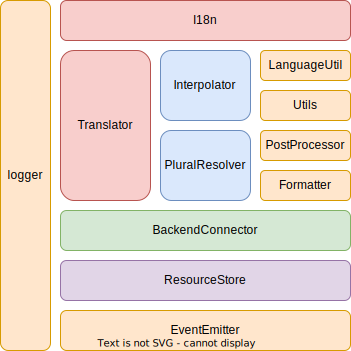

<TitleList></TitleList>

# i18next

源代码目录结构图

  

[i18next架构图](https://app.diagrams.net/#G1t4mr-xTsH7L1Cfb-Irjhe6T3AZAexj8a)
## index.js
i18next 的入口文件，主要是对外暴露 i18next 对象及其 API

## I18n (i18next.js)

### 构造函数
#### services
#### logger
logger，日志插件，必须符合Logger的定义。在程序中打印日志
#### modules 

## Translator.js
i18next 的翻译器，负责将语言资源翻译成指定语言的文本。主要的 API 包括 translate() 和 t()，用于进行翻译。

## Interpolator.js
用于对语言资源中的变量进行替换。主要的 API 包括 interpolate() 和 nest()。

## PluralResolver.js
用于处理复数形式。主要的 API 包括 getSuffix() 和 get()。

## LanguageUtils.js
实现了 i18next 的语言工具

## Utils.js
提供了一些辅助方法，如浅复制、深复制、数组合并等。

## PostProcessor.js

## Formatter.js

## BackendConnector.js
## ResourceStore.js
语言资源存储器，用于存储和管理不同语言的语言资源。主要的 API 包括 addResourceBundle() 和 getResource()。

## EventEmitter.js
EventEmitter是一个发布订阅者模式的封装，是前端环境中很常见的On，Emit结构。  

从这个设计来说，I18next是不想依赖于浏览器端的dom和event。所以自己引入了一个EventEmitter类。这个类和其他的框架中的一些EventEmitter没有太大的区别。  

因为不依赖于具体环境的On Emit设计。i18next的适应范围不限于前端环境。通过不同插件的组合，可以适应于前端和后端代码。

