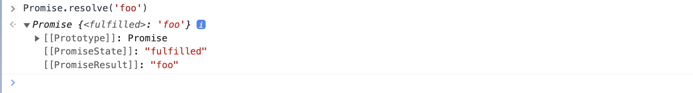

<TitleList></TitleList>

# promise执行流程
让promise对象一直处于pending 状态即可
```js
function foo(){
  return new Promise((resolve, reject)=>{
    // 不执行 resolve 和 reject 
  })
}
foo().then(()=>{console.log("这里将永远不会执行，一直处于pending状态")})
```

### 终止 promise

### 终止 async await
[async await 执行流程](./async.md)

### promise状态
Promise对象代表一个异步操作，有三种状态：<Te d>pending（进行中）</Te>、<Te d>fulfilled（已成功）</Te>和<Te d>rejected（已失败）</Te>。  

一旦状态改变，就不会再变，任何时候都可以得到这个结果。Promise对象的状态改变，**只有两种可能**：从pending变为fulfilled和从pending变为rejected。只要这两种情况发生，状态就<Te d>凝固</Te>了，不会再变了，会一直保持这个结果，这时就称为 resolved（已定型）。

### promise的执行流程

#### Promise.prototype.then()
`then`方法是定义在原型对象Promise.prototype上的。它的作用是为 Promise 实例添加状态改变时的<Te d>回调函数</Te>。  

then方法<Te d>返回</Te>的是一个<Te d>新的</Te>Promise实例（**注意，不是原来那个Promise实例**）  

###### then的回调函数流程
[异步的 Promise的 then 方法的回调是何时被添加到microtasks queue中的?](https://www.zhihu.com/question/62305365)  

**个人理解**  

- promise 是 <Te d>pending</Te> 状态时，则实例的 then 的 回调方法会放入 promise 的 [[PromiseFulfill/RejectReactions]] 列表里(找个地方把回调函数先<Te d>缓存</Te>起来)
- 当 promise 为 <Te d>fulfilled</Te> 状态时 会将 then 的回调函数放入 PromiseJobs(将回调函数放入<Te d>微任务队列</Te>，并将`resolve("参数A")`的`参数A`作为回调函数的实参)
- 如果没有执行 resolve 则 promise 的状态将<Te d>一直处于 pending 状态</Te>，直到 resolve 执行时，promise 才会改变状态。

使用两个示例辅助理解  

###### resolve改变状态示例1
代码示例1  
```js
function a() {
  console.log(1); // 同步执行
   const p1 = new Promise((resolve, reject) => {
    console.log(2); // 同步执行
    setTimeout(() => {
      console.log("setTimeout1"); // 宏任务中执行
      resolve(4); // 改变 p1 的状态 从 pending -> fulfilled ，然后创建微任务： 将p1.then 的回调函数加入微任务队列，将 4 作为回调函数实参
    }, 1000);
    setTimeout(() => {
      console.log("setTimeout2"); // 宏任务中执行
    }, 1000);
  });
  return p1
}

a()
  .then((val) => {
    console.log('then 1', val);  // return undefined 
  })
  .then((val) => {
    console.log('then 2', val); // 所以 val === undefined 
  });

// 拆解为以下代码，因为 then 方法返回一个新的promise实例，then 的回调方法返回的value值作为下一个then回调的入参
// const p1 = a();
// const p2 = p1.then((val) => {
//   console.log('then 1', val);  // return undefined 
// });
// p2.then((val) => {
//   console.log('then 2', val);  // 所以 val === undefined 
// });
```
结果：  
1  
2  
setTimeout1    
then 1 4  
then 2 undefined  
setTimeout2  // 优先执行微任务，所有宏任务setTimeout2  最后执行

**注意**：  
- 因为 <Te d>then 方法</Te>返回一个<Te d>新的promise实例</Te>，所以从拆解代码部分可以看出，p1 , p2 不是同一个实例。
- then 的<Te d>回调方法</Te>返回的value值作为下一个then回调的<Te d>入参</Te>。p1.then的回调函数返回的是 undefined 所以p2.then的回调函数的入参是 undefined。  

###### resolve改变状态示例2
代码示例2  
```js
function a() {
  console.log(1); // 同步执行
  const p1 = new Promise((resolve, reject) => {
    console.log(2); // 同步执行
    setTimeout(() => {
      console.log('setTimeout1'); // 宏任务中执行
      // resolve(4); // 改变 p1 的状态 从 pending -> fulfilled ，然后创建微任务： 将p1.then 的回调函数加入微任务队列，将 4 作为回调函数实参
    }, 1000);
    setTimeout(() => {
      console.log('setTimeout2'); // 宏任务中执行
    }, 1000);
  });
  return p1;
}

const p1 = a();
p1.then((val) => {
  console.log('a then', val);
});
console.log(p1)
```
以上代码与示例1代码是一样的，不同之处在于 `resolve(4);` <Te d>被注释了</Te>
执行结果：  
1  
2  
[object Promise] {  
  [[Prototype]]: Promise,  
  [[PromiseState]]: "pending",  
  [[PromiseResult]]: undefined  
}  
setTimeout1  
setTimeout2  

由结果可知，缺少了 `resolve` 后 p1 将一直处于 **<Te d>pending</Te>** 状态，所以 p1.then的回调函数不会被加入微任务中执行。

#### Promise.prototype.catch() 
`Promise.prototype.catch()`方法是`.then(null, rejection)`或`.then(undefined, rejection)`的<Te d>别名</Te>，用于指定发生错误时的回调函数。  

如果异步操作抛出错误，状态就会变为rejected，就会调用catch()方法指定的回调函数，处理这个错误。  

另外，then()方法指定的回调函数，如果<Te d>运行中抛出错误</Te>，也会被catch()方法捕获  

#### Promise.resolve()
Promise.resolve()等价于下面的写法。
```js
Promise.resolve('foo')
// 等价于
new Promise(resolve => resolve('foo'))
```

Promise.resolve('foo') 的 promise 状态立马为 <Te d>"fulfilled"</Te>  

###### 参数是一个 Promise 实例
如果参数是 Promise 实例，那么Promise.resolve将<Te d>不做任何修改、原封不动</Te>  地返回这个实例。
###### 参数是一个thenable对象
thenable对象指的是具有then方法的对象，比如下面这个对象。
```js
let thenable = {
  then: function(resolve, reject) {
    resolve(42);
  }
};
```
Promise.resolve()方法会将这个对象**转为 Promise 对象**，然后就立即执行thenable对象的then()方法。
```js
let thenable = {
  then: function(resolve, reject) {
    resolve(42);
  }
};

let p1 = Promise.resolve(thenable);
p1.then(function (value) {
  console.log(value);  // 42
});
```
上面代码中，thenable对象的then()方法执行后，对象p1的状态就变为resolved，从而立即执行最后那个then()方法指定的回调函数，输出42。  

###### 参数不是具有then()方法的对象
参数不是具有then()方法的对象，或根本就不是对象  

如果参数是一个原始值，或者是一个不具有then()方法的对象，则Promise.resolve()方法返回一个新的 Promise 对象，状态为resolved。

```js
const p = Promise.resolve('Hello');

p.then(function (s) {
  console.log(s)
});
// Hello
```
上面代码生成一个新的 Promise 对象的实例p。由于字符串Hello不属于异步操作（判断方法是字符串对象不具有 then 方法），返回 Promise 实例的状态从一生成就是resolved，所以回调函数会立即执行。Promise.resolve()方法的参数，会同时传给回调函数。  

###### 不带有任何参数
Promise.resolve()方法允许调用时不带参数，直接返回一个resolved状态的 Promise 对象。

##### Promise.resolve()执行顺序
```js
setTimeout(function () {
  console.log('three');
}, 0);

Promise.resolve().then(function () {
  console.log('two');
});

console.log('one');

// one
// two
// three
```
- setTimeout(fn, 0)在下一轮“事件循环”开始时执行，
- Promise.resolve()在本轮“事件循环”结束时执行 (微任务，比setTimeout优先执行，又因为在执行事将promise状态变为了fulfilled，所以then的回调函数被添加到了微任务里面，所以 two 比 three 更快打印)
- console.log('one')则是立即执行，因此最先输出

### promise流程流转完整示例
```js
function a() {
  console.log(1); // 同步执行
  const p1 = new Promise((resolve, reject) => {
    console.log(2); // 同步执行
    setTimeout(() => {
      console.log('setTimeout1'); // 宏任务中执行
      resolve(4); // 改变 p1 的状态 从 pending -> fulfilled 时，创建微任务： 将p1.then 的回调函数加入微任务队列
    }, 1000);
    setTimeout(() => {
      console.log('setTimeout2'); // 宏任务中执行
    }, 1000);
  });
  return p1;
}

function b() {
  console.log(4);
  const p2 = new Promise((resolve, reject) => {
    const p1 = a();
    const p3 = p1.then(() => {
      // resolve(7); // 改变 p2 的状态 从 pending -> fulfilled ，然后创建微任务： 将p2.then 的回调函数加入微任务队列，将 3 作为回调函数实参
      // reject(71); // 改变 p2 的状态 从 pending -> rejected ，然后创建微任务： 将p2.then 的回调函数加入微任务队列，将 71 作为回调函数实参
      // 没有执行 resolve 或者 reject， p2 将一直处于 pending 状态
      
      // Promise.resolve(73).then((val) => { console.log(val); }); // 创建了 一个 匿名的 promise ,然后不做任何处理，函数默认 return undefined
      // return Promise.resolve(73).then((val) => { console.log(val);}); // 创建了 一个 匿名的 promise ,并返回该实例作为p3.then的回调函数的入参, 匿名实例的then回调入参是undefind
      // return Promise.resolve(73).then((val) => { console.log(val); return 10; }); // 创建了 一个 匿名的 promise ,并返回该实例作为p3.then的回调函数的入参, 匿名的 promise 实例的 then 回调入参是 10
      // return 10; // 改变 p3 的状态 从 pending -> fulfilled ，然后创建微任务： 将p3.then 的回调函数加入微任务队列，将 3 作为回调函数实参
      // throw 7; // 改变 p3 的状态 从 pending -> rejected ，然后创建微任务： 将p3.catch 的回调函数加入微任务队列，将 7 作为回调函数实参
    });
    p3.then((val) => {
      console.log('p3 then', val);
    });
    p3.catch((e) => {
      console.log(6);
      console.log(e);
    });
  });
  return p2;
}
const d = b();
```