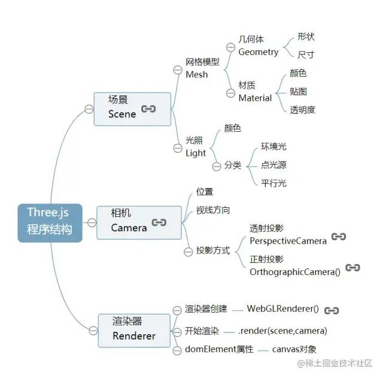

# three.js

### 程序结构

概念解释  
- `场景` 一个空间，里面可以放置各种物体`模型`(像地球一样)，还有`光`照进这个空间
  - `环境光` 
  - `点光源` 从一个点向周围发出的光(灯泡，太阳)
  - `平行光` 空间的每个地方光照强度都一样(就像太阳从很远的地方照到地球，地球同一时间同一地点的光照相同)
- `相机` 在场景之外的一个物体，将场景拍摄进来，录入的画面(就像眼睛站看到远处的某个场景的画面感一样)，可以调节相机的位置和角度，从而横看成岭侧成峰的效果。
  - 不同的相机拍摄出的画面不同
- `渲染器`
  - 将webgl代码在GPU上执行
  - js代码在CPU上执行
  - 将相机拍摄到的画面渲染到canvas