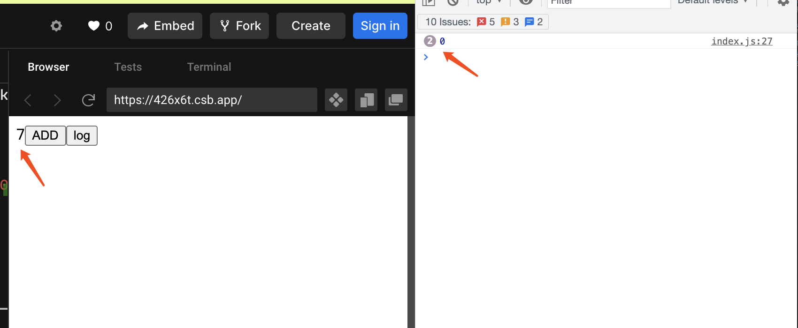

<TitleList></TitleList>

# 组件函数的闭包陷阱

### 问题代码1
[try it in codesandbox](https://codesandbox.io/s/sv1eq?file=/src/index.js)
```js
import React, { useState, useEffect } from 'react';
import ReactDOM from 'react-dom';

const App = ()=>{
  const [count,setCount] = useState(0);

  useEffect(()=>{
    const timeId = setInterval(()=>{
      console.log(count);
    },1000);
    return ()=>{clearInterval(timeId)}
  },[]);

  return (
    <div>
    	<span>{count}</span>
      <button onClick={()=>{setCount(count+1)}}>ADD</button>
    </div>
  );
}

const rootElement = document.getElementById("root");
ReactDOM.render(<App />, rootElement);
```
当 add 按钮点击时，UI上的数据能得到**正确的更新**，而定时器上的 console.log 打印的值却一直是初始化的值，**没有正确的更新**。

这种现象称为**闭包陷阱**  

### 原因分析
上述代码使用`useEffect(effectFn, deps)` 时，deps 是空数组，所以 effectFn 只会执行一次，但是 effectFn 中的定时执行函数引用了外部的count，形成了**闭包**，并且会执行多次，但却**引用的是第一次执行栈的上下文（词法环境）**。  

函数的执行过程

effectFn 函数定义会存在  app fiber 的属性上，只在App第一次执行之后被定义，并且因为 effect 函数内部直接引用了外部的count 所以形成了闭包，而 setInterval 的回调函数则形成了闭包中的闭包，但是引用的直接是最外层的App函数的域中的内容，所以，第一次的App函数栈一直都不会内存回收 **（第一次 词法环境 一直存在）**。

### 代码问题2
```js
import React, { useState, useCallback } from 'react';
import ReactDOM from 'react-dom';

const App = ()=>{
  const [count,setCount] = useState(0);

  const log = useCallback(()=>{
    console.log(count);
  },[]);

  return (
    <div>
    	<span>{count}</span>
      <button onClick={()=>{setCount(count+1)}}>ADD</button>
      <button onClick={()=>{log()}}>log</button>
    </div>
  );
}

const rootElement = document.getElementById("root");
ReactDOM.render(<App />, rootElement);
```
上面代码无论 count 变化多少次，log 打印出来的都是 0，这就是闭包陷阱。

因为 `useCallback` 中定义的参数会在App第一次执行时，函数体被保存在 App 的 fiber 属性上，同时，不管 App 执行多少次，因为 useCallback 的 deps 是空数组，所以 log 都只会拿到 App 第一次执行时所缓存下来的函数，并且这个函数的上下问一直指向的是第一个 App 栈(因为闭包的原因，第一个栈就不会被销毁)。如果我们将 count 放入 deps中 `useCallback(fn, [count])`，则在 count 发生变化时，App fiber 所缓存的函数就会被替换掉新定义的 fn, 此时新的 fn 的词法环境(上下文)就会指向最新的 count 了，此时就可以打印正确。

### hook 的闭包陷阱
这个陷阱在`useEffect`、`useCallback`、`useMemo`、`memo`等都存在，如果他们的 fn 参数直接调用外部上下文的变量，则会形成闭包，他们的deps依赖参数为空，则fn函数只会被创建一次，并且引用的外部变量是第一次创建是引用的那个上下文，之后无论执行多少次，都只会引用第一次执行栈的上下文。如果 deps 监听了某个变量，则会在变量变化时，更新上下文的调用栈。