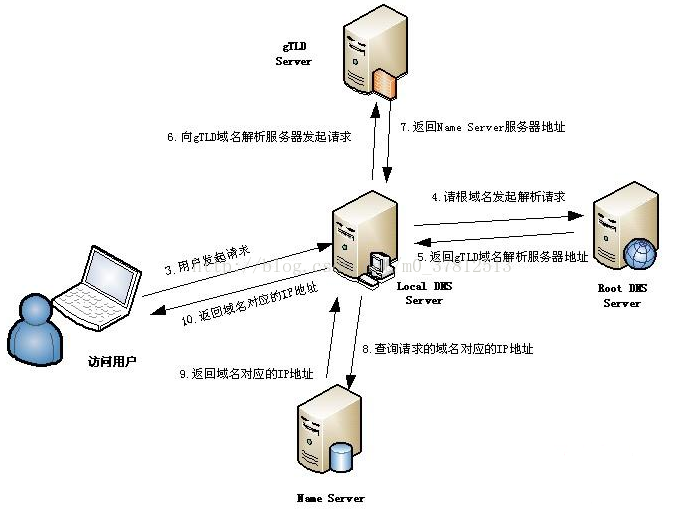

# DNS解析过程

## 过程分析
根据上图，当一个用户在地址栏输入 **www.taobao.com** 时，DNS解析有大致十个过程，如下：  

1. **浏览器**先检查**自身缓存**中有没有被解析过的这个**域名**对应的 **ip 地址**，如果有，解析结束。同时**域名被缓存的时间**也可通过 TTL 属性来设置。
2. 如果浏览器缓存中没有（专业点叫还没命中），**浏览器**会检查**操作系统缓存**中有没有对应的已解析过的结果。而操作系统也有一个域名解析的过程。在 windows 中可通过 c 盘里一个叫 **hosts** 的文件来设置，如果你在这里指定了一个域名对应的 ip 地址，那浏览器会首先使用这个 ip 地址。

但是这种操作系统级别的域名解析规程也被很多黑客利用，通过修改你的hosts文件里的内容把特定的域名解析到他指定的ip地址上，造成所谓的域名劫持。所以在windows7中将hosts文件设置成了readonly，防止被恶意篡改。  

3. 如果至此还没有命中域名，才会真正的请求**本地域名服务器**（LDNS）来解析这个域名，这台服务器一般在你的城市的某个角落，距离你不会很远，并且这台服务器的性能都很好，一般都会缓存域名解析结果，大约80%的域名解析到这里就完成了。
4. 如果 LDNS 仍然没有命中，就直接跳到 **Root Server** 域名服务器请求解析
5. 根域名服务器**返回**给LDNS一个所查询域的**主域名服务器**（gTLD Server，国际顶尖域名服务器，如.com .cn .org等）**地址**
6. 此时LDNS**再发送**请求给上一步返回的gTLD
7. 接受请求的gTLD**查找并返回**这个域名对应的Name Server的地址，这个Name Server就是网站注册的域名服务器
8. Name Server根据**映射关系表**找到目标ip，返回给LDNS
9. LDNS**缓存**这个域名和对应的ip
10. LDNS把解析的结果返回给用户，用户根据TTL值缓存到本地系统缓存中，域名解析过程至此结束

## DNS协议
DNS占用**53**号端口，同时使用**TCP**和**UDP**协议。那么DNS在什么情况下使用这两种协议？  

DNS在**区域传输**的时候使用**TCP**协议，其他时候使用**UDP**协议。  

DNS**区域传输**的时候使用**TCP**协议：  

1. 辅域名服务器会定时（一般3小时）向主域名服务器进行查询以便了解数据是否有变动。如有变动，会执行一次区域传送，进行数据同步。区域传送使用TCP而不是UDP，因为数据同步传送的数据量比一个请求应答的数据量要多得多。
2. TCP是一种可靠连接，保证了数据的准确性。

**域名解析**时使用**UDP**协议：    

客户端向DNS服务器查询域名，一般返回的内容都不超过512字节，用UDP传输即可。不用经过三次握手，这样DNS服务器负载更低，响应更快。
