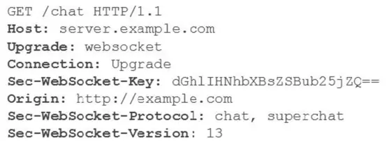
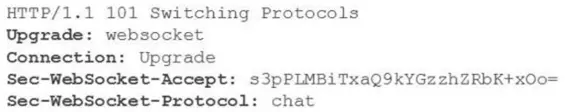

<TitleList></TitleList>

# HTTP长连接、短连接和websocket

[HTTP长连接和短连接](https://www.cnblogs.com/0201zcr/p/4694945.html)

###### 课外知识
- HTTP 使用短连接
- 数据库连接使用长连接

### 短连接
每次Http请求都会建立Tcp连接，管理容易

### 长连接
只需要建立一次Tcp连接，以后Http请求重复使用同一个Tcp连接，管理难

### 特点
服务端可设置连接的保活时间，在保活时间内，如果再次发起连接会复用连接。服务端主动告诉客服端超时时间。如果服务器没有告诉客户端超时时间也没关系，服务端可能主动发起四次挥手断开TCP连接，客户端能够知道该TCP连接已经无效；另外TCP还有心跳包来检测当前连接是否还活着，方法很多，避免浪费资源。 

长连接和短连接的产生在于client和server采取的关闭策略

## 短连接和长连接区别
短连接和长连接有本质区别。长、短连接是客户端与服务端建立和保持TCP连接的机制；而长、短轮询是指客户端请求服务端，服务端给予应答的方式。
- **短轮询**：重复发送Http请求，查询目标事件是否完成，优点：编写简单，缺点：浪费带宽和服务器资源
- **长轮询**：在服务端hold住Http请求（死循环或者sleep等等方式），等到目标时间发生(保持这个请求等待数据到来或者恰当的超时)，返回Http响应。优点：在无消息的情况下不会频繁的请求，缺点：编写复杂

## WebSocket和HTTP长连接区别
- HTTP1.1通过使用Connection:keep-alive进行长连接，HTTP 1.1默认进行持久连接。在一次 TCP 连接中可以完成多个 HTTP 请求，但是对每个请求仍然要单独发 header，Keep-Alive不会永久保持连接，它有一个保持时间，可以在不同的服务器软件（如Apache）中设定这个时间。
- websocket的长连接，是一个<Te d>真的全双工</Te>，第一次tcp链路建立之后，后续数据可以双方都进行发送，不需要发送请求头，并且这个连接会持续存在直到客户端或者服务器端的某一方主动关闭连接，<Te d>与HTTP长连接不同，WebSocket可以更灵活的控制连接关闭的时机，而不是HTTP协议的Keep-Alive一到，服务端立马就关闭</Te>（这样很不人性化）

### WebSocket连接建立
建立WebSocket连接时，需要通过客户端或者浏览器发出握手请求，请求消息示例如图：
  

服务端返回给客户端的应答消息如图：
  

为了建立一个WebSocket连接，客户端浏览器首先要向服务器发起一个HTTP请求，这个请求和通常的HTTP请求不同，包含了一些附加头信息，其中附加头信息“Upgrade: WebSocket”表明这是一个申请协议升级的HTTP请求。服务器端解析这些附加的头信息，然后生成应答信息返回给客户端，客户端和服务器端的WebSocket连接就建立起来了，双方可以通过这个连接通道自由地传递信息，并且这个连接会持续存在直到客户端或者服务器端的某一方主动关闭连接。  

请求消息中的“Sec-WebSocket-Key”是随机的，服务器端会用这些数据来构造出一个SHA-1的信息摘要，把“Sec-WebSocket-Key”加上一个魔幻字符串“258EAFA5-E914- 47DA-95CA-C5AB0DC85B11”。使用SHA-1加密，然后进行BASE-64编码，将结果做为“Sec-WebSocket-Accept”头的值，返回给客户端。

