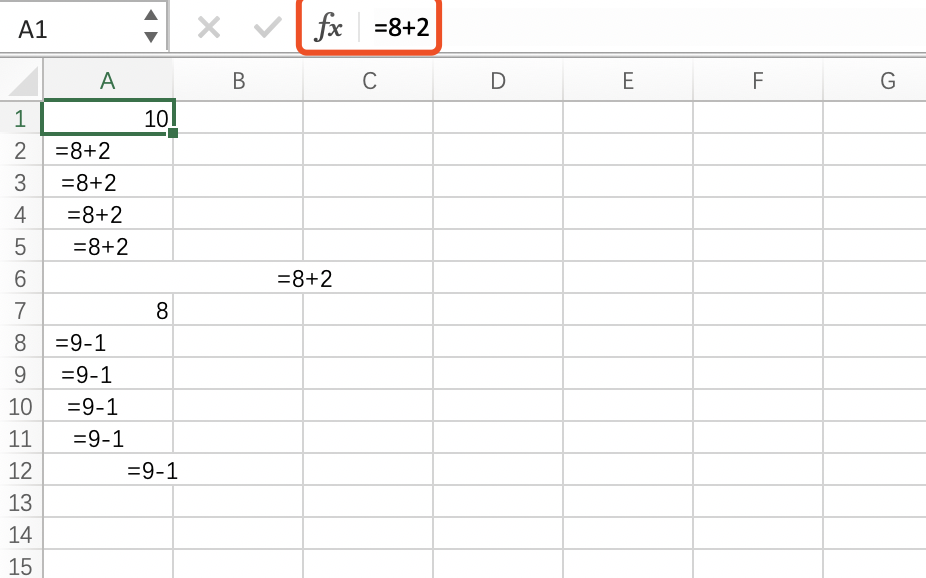

# 前端安全—csv防注入

csv使用Excel打开时，由于Excel 单元格遇到“=、-、+、@等”开头的数据时，会以一个表达式的形式被处理，即自动运行计算。

如图所示，第一行的数据时 =8+2,会被自动计算成10展示。  

这是很危险的，因为表达式就是可执行的代码。  

黑客可以通过IMPORT方法让Excel自动请求远端数据或者自动下载病毒文件，而用户却不知道。  

## 预防

在生成csv文件之前对数据进行检查，对数据开头含有“=、-、+、@等”excel表格会自动运行的符号时，在该数据前面插入tab。  

tab在excel展示时不可见（亲测，可见，只不过占用的可观察空间很小，一个tab时不明显，多个tab时很明显。），但是是真实存在的字符，可以阻止excel进行自动执行。建议：tab的数量最好定义一个数量n（也可tab+空格的自定义等，不影响查看即可），在该excel表进行导入时可用于作为校验标记。  

如果该导出的excel表格只用于查看，则不作任何修改。  

如果该导出的excel表格需要再导入，则对表格字段进行检查，截取字段前n（预先约定好）个字符，检验这些字符是否全部为tab，是则删除再入库。  

#### 提前安全预防
在数据入库时，先确定好开头为“=、-、+、@等”的字段是否为非法字段，或者入库之前先插入tab或者空格。