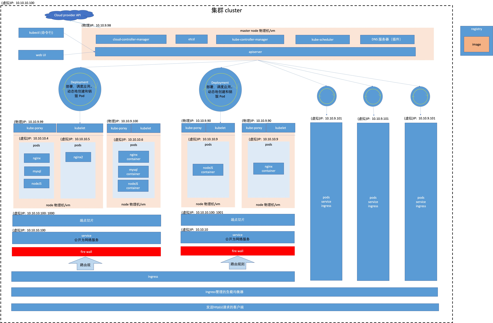
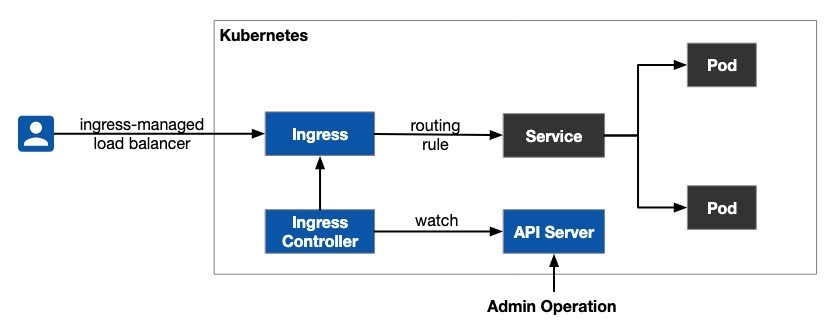
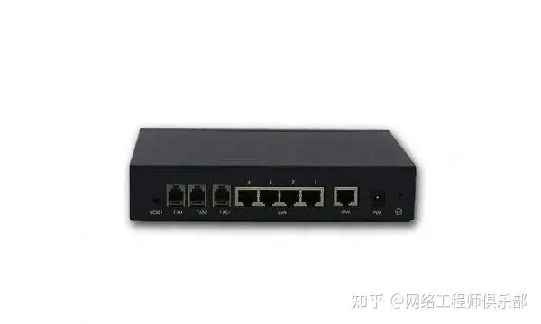
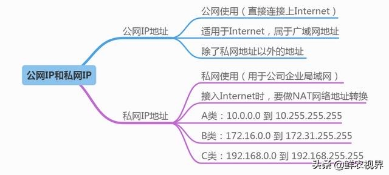

<TitleList></TitleList>

# Kubernetes

## 架构图

<!-- <Office src="https://zjl-coder.github.io/blog/images/k8s.xlsx" /> -->

## Kubernetes 组件

1. 节点: 物理机或虚拟机(VMware)
2. 集群
3. Pod: Kubernetes 的原子对象，集群中每一个 Pod 都会获得自己的、 独一无二的 IP 地址，称为“一个 Pod 一个 IP”模型，Pod 可以被视作虚拟机或者物理主机。
   1. Pod 能够与所有其他节点上的 Pod 通信， 且不需要网络地址转译（NAT）
   2. 节点上的代理（比如：系统守护进程、kubelet）可以和节点上的所有 Pod 通信
   3. Pod 内的容器都可以通过 localhost 到达对方端口。
4. Node 组件
5. 容器（Container）: 容器中的文件在磁盘上是临时存放的，这给在容器中运行较重要的应用带来一些问题。 当容器崩溃或停止时会出现一个问题。此时容器状态未保存， 因此在容器生命周期内创建或修改的所有文件都将丢失。 在崩溃期间，kubelet 会以干净的状态重新启动容器。 
6. kube-apiserver
7. etcd 存储 : etcd 是 一致且高可用的键值存储，用作 Kubernetes 所有集群数据的后台数据库。（类似 redis，被 k8s 用来存储信息）
8. kube-controller-manager:
9. cloud-controller-manager 云控制器管理器
10. kube-scheduler
11. DNS 服务器（插件）: 域名系统
12. kubelet
13. kube-porxy
14. container
15. storage : 存储 [Kubernetes中存储中有四个重要的概念：Volume、PersistentVolume PV、PersistentVolumeClaim PVC、StorageClass。](https://www.cnblogs.com/cocowool/p/kubernetes_storage.html)
16. registry : Registry 是一个无状态的、可伸缩的服务器端应用程序，用于存储和分发Docker映像。
17. Deployment (部署，调度): 可以动态地创建和销毁 Pod
18. Job
19. service
20. Resource 资源 后端
21. ingress (入口) :  Ingress 不是一种服务类型，但它充当集群的入口点，它可以将路由规则整合到一个资源中，因为它可以在同一 IP 地址下公开多个服务。(配置路由规则，分发到不同的 service)。ingress 与 负载均衡同样，只是起客户端与服务互相匹配的作用，即 客户点发起的服务连接，经过 ingress 分发之后，由对应的服务与客户端建立连接。所以，只有一个服务的情况下，并不需要 ingress 。或者有多个相同的服务，则只需要负载均衡。(分布式是指将不同的业务分布在不同的地方；而集群指的是将几台服务器集中在一起，实现同一业务。 分布式中的每一个节点，都可以做集群。 而集群并不一定就是分布式的。)
22. Ingress 控制器 : 控制 Ingress 工作的功能
23. Gateway API （网关） : 
24. Endpoints (端点) : 端点是一种资源，它获得一个或多个pod的IP地址，以及一个端口动态分配给它。 一个 serveice 通过 端点 维护着一群 pod，pod 通过 端点向服务暴露 自己，端点 是介于 服务 和 pod 之间的抽象层。我们需要端点作为抽象层，因为kubernetes中的 "服务 "作为协调的一部分，确保流量分配到pod（包括只向健康的pod发送流量）。例如，如果一个pod死了，就会产生一个替换的pod，有一个新的IP地址。从概念上讲，死亡的pod IP将被从端点对象中删除，而新创建的pod的IP将被添加，这样服务就会被更新，并 "知道 "要连接到哪些pod。一个 服务 只保存 一个 端点，一个端点管理着 服务下的所有 pods 如果频繁进行扩缩容，会导致 端点 内部的信息要频繁发生变化，并且 向外通知service，向内通知其他 pod。此时资源开销很大(需要通知的数据是全量pod信息，和service，以及统一端点下的所有 pod)，于是有了 **端点切片**
25. EndpointSlice API (端点切片) : 一个端点切片 维护多个 pod，一个 service 关联 多个 端点切片，切片内进行扩缩容时，所需要通知的数据量(pods的相关信息，如 ip 等)变小，通知对象(service, 其他 pods)也变少很多。
26. 网络策略 : 如果你希望在 IP 地址或端口层面（OSI 第 3 层或第 4 层）控制网络流量， 则你可以考虑为集群中特定应用使用 Kubernetes 网络策略（NetworkPolicy）

## pods
使用pod，相当与一个逻辑主机，还记得创建一个vm，在vm上运行几个进程么，其实道理是一样的，pod的存在主要是让几个紧密连接的几个容器之间共享资源，例如ip地址，共享存储等信息。如果直接调度容器的话，那么几个容器可能运行在不同的主机上，这样就增加了系统的复杂性。

## 集群
在集群当中，创建的ip地址等资源，只有在同一个集群中才能访问，每个pod也有独一的ip地址，当有多个pod提供相同的服务的时候，就需要有负载均衡的能力，从而这里就涉及到一个概念就是service，专门用来提供服务的。

#### 优点  

使用集群，create cluster是为了掩盖底层的无能，在各种环境中，底层的硬件各不相同，有的是各种低廉的服务器，有的各种云环境，有的是各种vm，有的各种host machine，要想屏蔽底层的细节，增强可靠性和稳定性，从而需要创建集群。  

创建集群的好处就是，统一对外提供接口，无须进行各种复杂的调用；提供更好的可靠性，服务器宕机那么频繁，物理磁盘那么容易损坏，无须担心，集群统一进行调配；提供更好的性能，组合集群中各个机器的计算存储网络资源，提供更好的TPS和PS；提供横向扩容的能力，在进行横向扩容的时候，性能基本上能呈线性增长。

## service （服务）
服务主要是用来提供外界访问的接口，服务可以关联一组pod，这些pod的ip地址各不相同，而service相当于一个复杂均衡的vip，用来指向各个pod，当pod的ip地址发生改变之后，也能做到自动进行负载均衡，在关联的时候，service和pod之间主要通过label来关联，也就是标签（-l表示为label）。

### pods 已经有唯一ip了，为什么还需要一层 service

**tips**：每个 Pod 获取其自己的 IP 地址。 对于集群中给定的 Deployment，这一刻运行的这组 Pod 可能不同于下一刻运行应用程序的那组 Pod。

**问题**：如果一组 Pod（称为“后端”）为集群内的其他 Pod（称为“前端”）提供功能， 那么前端如何找出并跟踪要连接的 IP 地址，以便前端可以使用提供工作负载的后端部分？

**方案**：通过 service 固定可访问的 ip(虚拟IP)，service 后面的 pod 变化，前端或者调用方就可以不用关心了，程序服务解耦。

Service 的控制器不断扫描与其选择算符匹配的 Pod，然后对 Service 的 EndpointSlices 集合执行所有必要的更新。

### pods 是如何得到IP的

## ingress
如果你的工作负载以 HTTP 通信，你可能会选择使用 Ingress 来控制 Web 流量如何到达该工作负载。Ingress 不是一种 Service，但它可用作集群的入口点。 Ingress 能让你将路由规则整合到单个资源，这样你就能在单个侦听器之后暴露工作负载的多个组件，在集群中分别运行这些组件。

**三次握手四次挥手**  客户端直接与ingress 建立三次握手四次挥手，service 对于客户端是完全黑盒状态。客户端发送给 service 的数据，ingress 全知道。

# [大规模集群的注意事项](https://kubernetes.io/zh-cn/docs/setup/best-practices/cluster-large/)

## Kubernetes 架构
[Kubernetes 架构](https://lib.jimmysong.io/kubernetes-handbook/architecture/)

## Gateway API 网关
[Gateway API](https://gateway-api.sigs.k8s.io/)
[Gateway API 中文](https://lib.jimmysong.io/kubernetes-handbook/service-discovery/gateway/)

与我们通常讲的网关(物理网关)概念不同，因工作流程类似，所以被叫 网关 API。物理网关 针对 ip 级别，是 tcp/ip 层。  网关 API 是协议级别(http ws)，是应用层。

#### 暴露 service 的几种方式
|方式|控制器|功能|
|--|--|--|
|NodePort/LoadBalancer|Kubernetes|负载均衡|
|Kubernetes Ingress|Ingress Controller|负载均衡、TLS、虚拟主机、流量路由|
|Istio Gateway|Istio|负载均衡、TLS、虚拟主机、高级流量路由、其他 Istio 的高级功能|
|API 网关|API Gateway|负载均衡、TLS、虚拟主机、流量路由、API 生命周期管理、权限认证、数据聚合、账单和速率限制|

###### 使用 Kubernetes Ingress 暴露服务 原理图

###### 使用 API 网关暴露服务
API 网关是位于客户端和后端服务之间的 **API 管理工具**，一种将客户端接口与后端实现分离的方式，在微服务中得到了广泛的应用。当客户端发出请求时，API 网关会将其分解为多个请求，然后将它们路由到正确的位置，生成响应，并跟踪所有内容。

[如何理解 Istio Ingress， 它与 API Gateway 有什么区别？](https://jimmysong.io/blog/istio-servicemesh-api-gateway/)

**tips**
- 只有一个 service 可以不需要 ingress 之类的分发，直接暴露即可
- ingress 和 gateway API 是相同的可替代的中间件，gatewaty API 功能更多一些
## 网关
**官方解释**：[网关(Gateway)又称网间连接器、协议转换器](https://baike.baidu.com/item/%E7%BD%91%E5%85%B3/98992)。

这个长得和路由器差不多的东西就是网关(Gateway，物理设备,ip 192.168.1.1 是它的局域网地址)，目前很多路由器都有网关的功能。

网关是对两个网络段中，使用的不同传输协议的数据进行互相翻译转换的设备。

**举例**：
**网络A**的IP地址范围为“192.168.1.1~192. 168.1.254”，子网掩255.255.255.0；**网络B**的IP地址范为“192.168.2.1~192.168.2.254”，子网掩码255.255.255.0。在没有路由器的情况下，两个网络之间是不能进行TCP/IP通信的，即使是两个网络连接在同一台交换机（或集线器）上也不行。
而要**实现这两个网络之间的通信**，则必须通过网关。如果网络A中的主机发现数据包的目的主机不在本地网络中，就把数据包转发给它自己的网关，再由网关转发给网络B的网关，网络B的网关再转发给网络B的某个主机。这就是网络A向网络B转发数据包的过程。   

流程如下：
**网络A -> A网关 ----> B网关 -> 网络B**
- A 网关(物理设备，起协议转换等作用) ip 地址一般设置为 192.168.1.1
- B 网关(物理设备，起协议转换等作用) ip 地址一般设置为 192.168.2.1 (也可以 192.168.1.1)
###### 为什么常见路由器的网关默认IP都是192.168.1.1 ?
因为192.168.0.0-192.168.255.255是属于私有的IP地址，路由器网关设置192.168.1.1其实是一种约定成俗的习惯。  

192.168.1.1其实是属于私有的IP地址  

在IPv4地址协议中预留了3个IP地址段，作为私有地址，供组织机构内部使用。分别是A类10段，B类172段，C类192段。由于网络位的限制，三个网段对应的主机数范围如下。  
- 10：10.0.0.0-10.255.255.255
- 172：172.16.0.0-172.31.255.255
- 192：192.168.0.0-192.168.255.255

## 防火墙

**定义** 防火墙（英语：Firewall）在计算机科学领域中是一个架设在互联网与内网之间的**信息安全系统**，根据持有者预定的策略来**监控**往来的传输。

**运行环境**：
- 防火墙可能是一台专属的网络设备(单独一台电脑)
- 也可执行于主机之上(跟其他系统一起运行在一台电脑上)
  
**目的**：以检查各个网络接口的网络传输。它是目前最重要的一种网络防护设备，从专业角度来说，防火墙是位于两个或以上网络间，实行网络间访问或控制的一组组件集合之硬件或软件。防火墙最基本的功能就是隔离网络，透过将网络划分成不同的区域（通常情况下称为ZONE），制定出不同区域之间的访问控制策略来控制不同**信任程度**区域间传送的数据流。例如互联网是不可信任的区域，而内部网络是高度信任的区域。以避免安全策略中禁止的一些通信。它有控制信息基本的任务在不同信任的区域。 典型信任的区域包括互联网(一个没有信任的区域) 和一个内部网络(一个高信任的区域) 。 最终目标是: 根据最小特权原则，在不同水平的**信任区域**，透过连通安全政策的运行，提供**受控制的连通性**。

#### 子网分割
计算机和其他端点设备使用网络来访问互联网和相互访问。然而出于安全和隐私的考虑，互联网被分割成子网。基本子网段如下：
1. **外部公共网络**通常是指公共/全球互联网或各种外部网。
2. **内部专用网络**定义为家庭网络、公司内部网和其他“封闭”网络。
3. **边界网络**由**堡垒主机**组成，堡垒主机是安全性经过强化的计算机主机，可以有效抵御外部攻击。作为内部网络和外部网络之间的安全缓冲区，边界网络也可用于容纳内部网络提供的任何面向外部的服务（即用于 Web、邮件、FTP、VoIP 等的服务器）。这些边界网络的安全性高于外部网络，但不

[什么是防火墙？定义和解释](https://www.kaspersky.com.cn/resource-center/definitions/firewall)  
